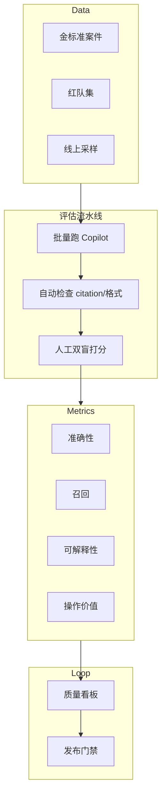
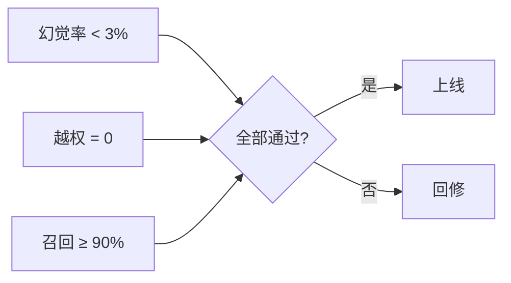

# AI 反馈质量评估 — 参考答案

**Track：** AI Agent 风控与调查助手  
**学习任务：** 设计一套案件摘要和风险建议的评估指标。  
**复盘问题：** 覆盖准确性、召回、可解释性、操作价值。

---

## 一、评估指标表

| 维度 | 指标 | 计算方式 | 目标 |
|------|------|----------|------|
| **准确性** | 事实准确率 | 人工标注可验证陈述中正确比例 | ≥95% |
| **准确性** | 幻觉率 | 无 citation 且错误的陈述占比 | <3% |
| **召回** | 关键信号召回 | 应提及信号中被覆盖比例 | ≥90% |
| **可解释性** | 引用覆盖率 | 带 tx/rule/标签引用的结论占比 | 100% 高影响项 |
| **操作价值** | 建议采纳率 | 分析师采纳建议 / 总建议 | ≥60% |
| **操作价值** | 调查耗时下降 | 有/无 Copilot 案件处理时长 | -30% |
| **安全** | 越权建议率 | 建议自动封禁等红线次数 | 0 |
| **体验** | 摘要满意度 | 1–5 分人工评分 | ≥4.0 |

### 评估数据集

- **金标准集**：50–100 个历史脱敏案件，双人标注  
- **红队集**：20 个对抗样本  
- **回归集**：每次模型/提示词变更必跑

---

## 二、架构图

### 发布门禁

---

## 三、面试回答（1 分钟）

> 合规 Agent 不能只看 BLEU。我用四维评估：事实准确性看可验证陈述，召回看关键风险信号是否漏掉，可解释性强制链上/规则引用，操作价值看分析师是否真采纳、是否缩短调查时间。上线前红队集越权必须为 0。

## 四、输出物

- [x] 评估指标表
- [x] 评估流水线架构图
