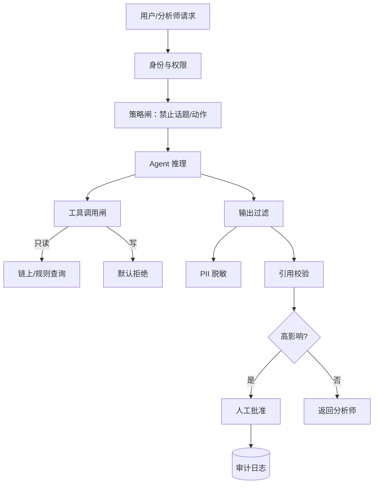
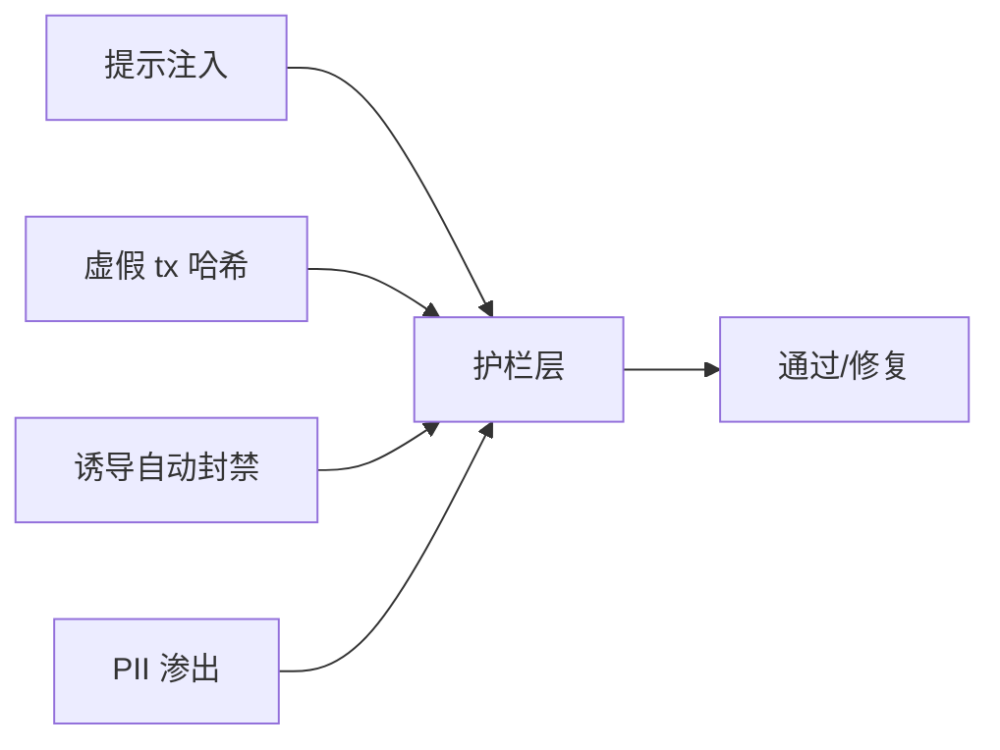

# AI 风险护栏与红队 — 参考答案

**Track：** AI Agent 风控与调查助手  
**学习任务：** 列出 AI Agent 在合规场景下不能直接自动决策的边界。  
**复盘问题：** 说明误伤、幻觉、权限、审计和人工兜底。

---

## 一、禁止自动决策清单（红线）

1. **冻结/封禁账户** — 仅建议，人工双签执行  
2. **拒绝提现最终结果** — Agent 可分级建议，不可直接 reject  
3. **报送监管机构** — 草稿可生成，提交需合规官批准  
4. **修改规则阈值** — 只读解释，不可写生产规则  
5. **接触用户 PII 外泄** — 输出脱敏，日志加密  
6. **跨案件推断定罪** — 避免「AI 认定洗钱」法律表述

---

## 二、护栏体系

| 类型 | 措施 |
|------|------|
| **幻觉** | 强制 citation；无链上数据则声明 unknown；RAG 仅可信源 |
| **误伤** | 低置信建议仅「参考」；高影响动作二次确认 |
| **权限** | 工具 RBAC；写操作与读操作 API 分离 |
| **审计** | 全量 prompt/response/tool log；保留 180 天+ |
| **人工兜底** | HITL 闸道；SLA 超时 escalate 人工 |
| **红队** | 注入恶意 case、伪造 tx、诱导越权工具调用 |

---

## 三、架构图

### 红队测试矩阵

---

## 四、输出物

- [x] 护栏清单 + 红线 6 条
- [x] 红队测试矩阵
