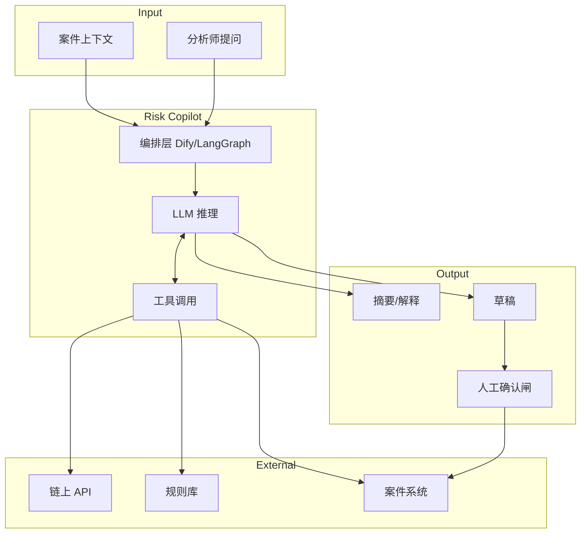
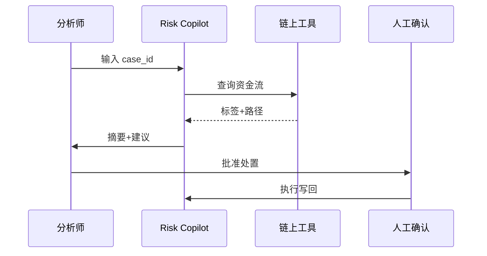

# Risk Copilot 产品形态 — 参考答案

**Track：** AI Agent 风控与调查助手  
**学习任务：** 定义一个合规调查 AI Agent 的输入、工具和输出。  
**复盘问题：** 覆盖案件摘要、链上查询、规则解释、人工确认。

---

## 一、产品定义

### 1.1 输入（Input Schema）

```json
{
  "case_id": "AML-2026-001",
  "user_id": "U123",
  "trigger": "withdrawal_kyt_alert",
  "tx_hashes": ["0x..."],
  "addresses": ["0xabc..."],
  "amount_usd": 50000,
  "rule_hits": [{"rule_id": "R-42", "signals": ["mixer_near"]}],
  "analyst_notes": ""
}
```

### 1.2 工具（Tools）

| 工具 | 功能 | 权限 |
|------|------|------|
| `chain_lookup` | 查 tx、标签、N-hop 邻居 | 只读 |
| `rule_explainer` | 解释规则逻辑与阈值 | 只读 |
| `case_history` | 拉取用户历史案件 | 只读 |
| `draft_sar` | 生成报送草稿 | 需人工批准 |
| `suggest_action` | 建议冻结/放行/升级 | **不可自动执行** |

### 1.3 输出（Output Schema）

```json
{
  "summary": "案件一句话摘要",
  "timeline": ["T0 充值", "T1 Mixer", "T2 提现"],
  "risk_explanation": "为何命中、关键信号",
  "missing_evidence": ["需确认 UBO", "需链上 3-hop"],
  "suggested_actions": ["人工复核", "延迟提现"],
  "confidence": 0.82,
  "citations": ["tx:0x...", "rule:R-42"]
}
```

**硬约束**：任何账户处置必须 `human_approved: true`。

---

## 二、架构图



### 人机协同序列



---

## 三、输出物

- [x] 产品 PRD 骨架（输入/工具/输出）
- [ ] Dify 最小工作流 POC
