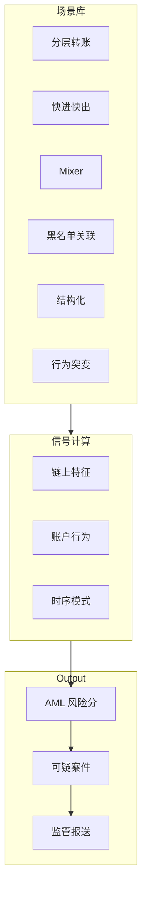

# AML 可疑场景建模 — 参考答案

**Track：** 合规 AML / KYC / KYT  
**学习任务：** 写出 6 类可疑交易模式和对应信号。  
**复盘问题：** 结合分层转账、快速进出、Mixer、黑名单地址。

---

## 一、六类可疑模式

| # | 模式 | 描述 | 关键信号 | 风险等级 |
|---|------|------|----------|----------|
| 1 | **分层转账 Layering** | 多跳小额快速转移掩盖来源 | hop>5、单笔均匀拆分、短时间多地址 | 高 |
| 2 | **快进快出** | 充值后极少交易即提现 | 停留时间 < T、金额匹配度高 | 中高 |
| 3 | **Mixer 使用** | 资金进出混币器 | Tornado 等合约交互、前后金额相近 | 高 |
| 4 | **黑名单地址关联** | 与已知盗币/制裁地址 N-hop 内 | 图距离、共同对手方 | 高 |
| 5 | **结构化交易 Smurfing** | 刻意低于申报阈值 | 多笔略低于限额、多子账户 | 中 |
| 6 | **地理/行为突变** | 长期休眠后大额跨境式流转 | IP/VPN 突变 + 大额 + 新地址 | 中 |

### 规则示例（伪代码）

```
IF mixer_interaction AND within_24h(deposit, withdraw) THEN score += 40
IF blacklist_distance <= 2 THEN score += 35
IF peel_chain_detected THEN score += 25
IF score >= 70 THEN create_SAR_case()
```

---

## 二、架构图



### Layering 示意


---

## 三、输出物

- [x] 场景库（6 类）
- [x] 信号表
