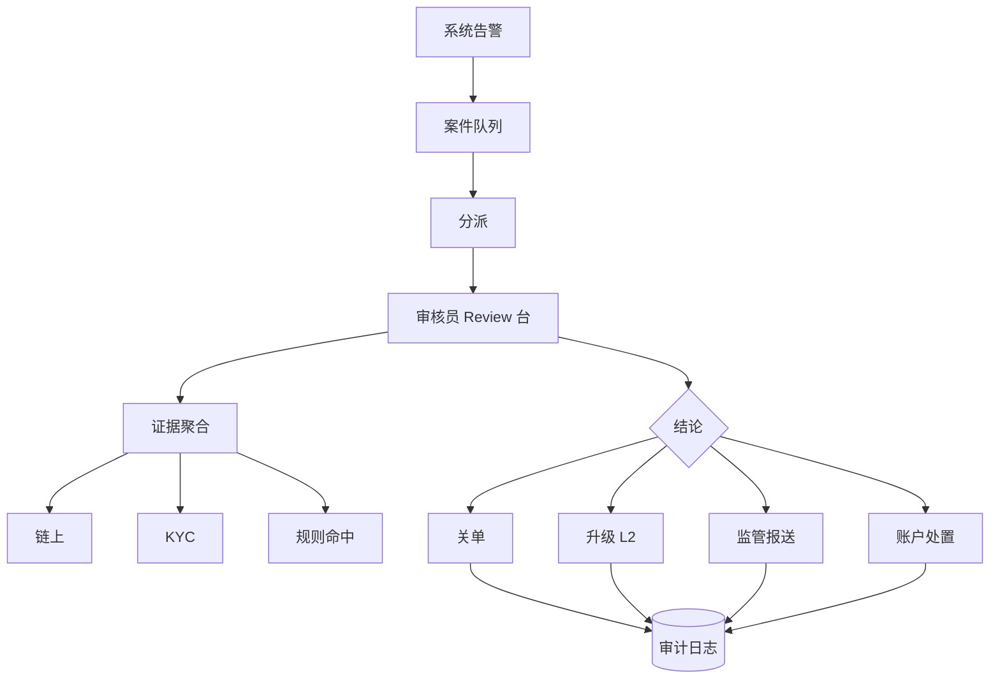
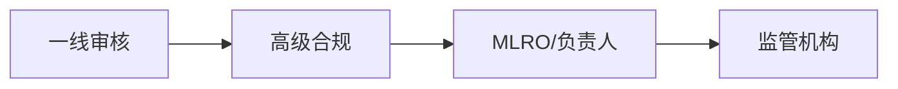

# 案件审核与处置工作流 — 参考答案

**Track：** 合规 AML / KYC / KYT  
**学习任务：** 设计一个合规案件 review 台的字段和操作。  
**复盘问题：** 说明证据、审核结论、升级路径和审计留痕。

---

## 一、Review 台核心字段

### 案件头信息

| 字段 | 说明 |
|------|------|
| case_id | 唯一 ID |
| case_type | AML / KYT / 盗币关联 / 制裁 |
| priority | P0–P3 |
| status | OPEN / IN_REVIEW / ESCALATED / CLOSED |
| assignee | 审核员 |
| sla_due | SLA 截止时间 |
| user_id / entity_id | 关联客户 |
| amount_usd | 涉及金额 |
| risk_score | 系统分 |

### 证据面板

- 链上交易列表（hash、from/to、标签、时间）  
- 资金流简图（自动生成）  
- KYC 快照、历史案件  
- 规则命中明细（rule_id、信号、置信度）  
- 用户申诉材料（如有）

### 结论与处置

| 结论 | 后续动作 |
|------|----------|
| FALSE_POSITIVE | 关单 + 白名单建议 |
| SUSPICIOUS | 升级合规官 |
| CONFIRMED | 冻结账户、报送 STR |
| NEED_INFO | 挂起、向用户索取材料 |

**审计**：每次状态变更记录 operator、timestamp、comment、before/after。

---

## 二、架构图

### 升级路径

---

## 三、迁移对照

内容安全 **审核台**（队列、证据、结论、质检）与合规案件台 **同构**；增量是 **链上证据组件** 与 **KYT 图谱嵌入**。

## 四、输出物

- [x] Review 台字段设计
- [x] 流程图
