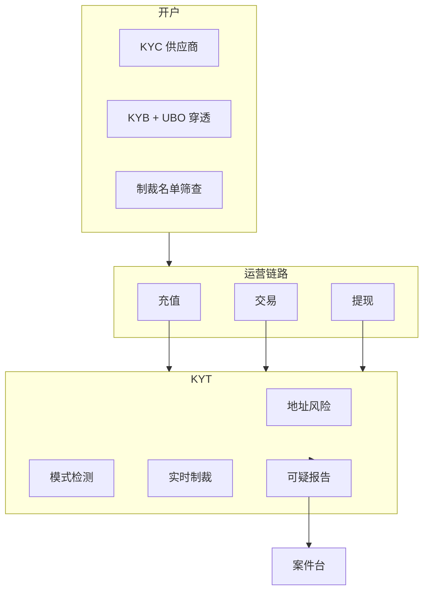
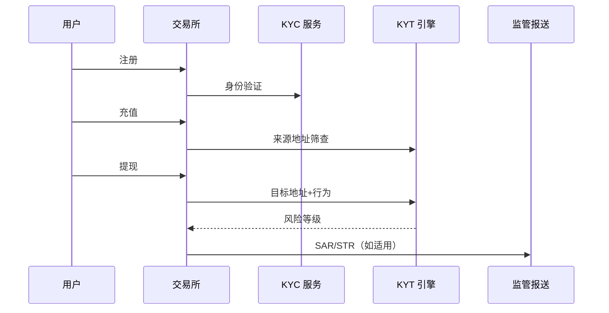

# KYC / KYB / KYT 基础 — 参考答案

**Track：** 合规 AML / KYC / KYT  
**学习任务：** 整理交易所开户到提现全链路的合规检查点。  
**复盘问题：** 覆盖身份、企业、交易、地址和制裁筛查。

---

## 一、全链路合规检查点

| 阶段 | KYC（个人） | KYB（机构） | KYT（交易/地址） |
|------|-------------|-------------|------------------|
| **注册** | 手机/邮箱、设备指纹 | 企业邮箱域 | — |
| **开户 L1** | 证件 OCR、活体 | 营业执照、UBO | — |
| **开户 L2** | 地址证明、增强尽职 | 董事/受益人 KYC | — |
| **充值前** | 限额策略 | 限额策略 | 来源地址筛查、制裁 |
| **交易** | 异常行为 | 机构交易模式 | 大额/快进快出 |
| **提现** | 受益人匹配 | 授权签字人 | 目标地址 KYT、旅行规则 |
| **持续** | 定期复核 PEP | 年审 | 地址标签更新 |

### 制裁筛查触发点

- 开户：姓名/证件/国籍  
- 充值：from 地址  
- 提现：to 地址  
- 内部转账：对手方若链上可见

---

## 二、架构图

### 合规数据流

---

## 三、面试问答

**Q：KYC 和 KYT 技术边界？**  
A：KYC 解决「你是谁」，KYT 解决「钱从哪来、到哪去、是否可疑」— 链上透明使 KYT 权重更高。

## 四、输出物

- [x] 检查点清单（表一）
- [x] 架构图
