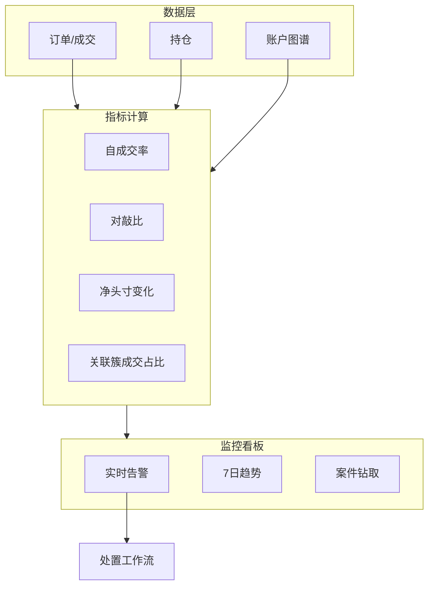
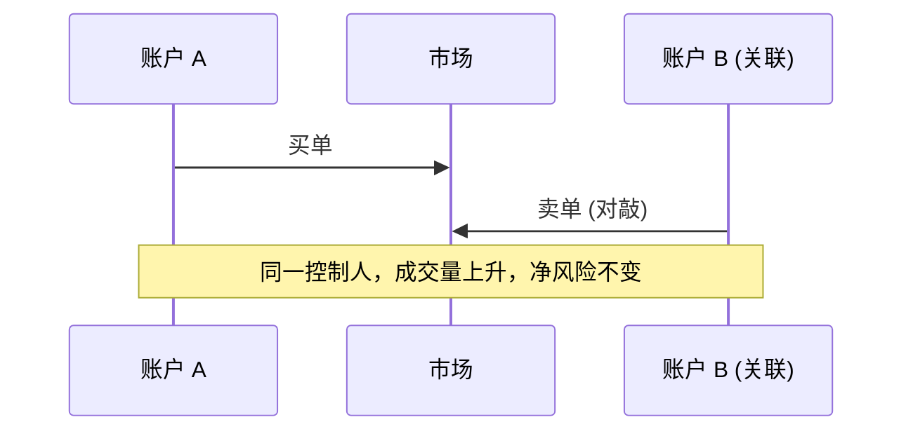

# Wash Trading 与市场操纵 — 参考答案

**Track：** 交易所风控与反欺诈  
**学习任务：** 设计一张异常交易监控看板的核心指标。  
**复盘问题：** 解释 wash trading、成交量异常、关联账户和风控处置。

---

## 一、完整解答

### 1.1 Wash Trading 定义

同一主体或串通多方，在同一市场 **同时买卖** 同一资产，制造虚假流动性或交易量，影响排名、做市奖励或用户认知 — **无真实经济风险转移**。

### 1.2 核心监控指标

| 指标 | 计算思路 | 异常阈值示例 |
|------|----------|--------------|
| **自成交率** | 买卖双方关联同一簇的成交占比 | 单日 > X% |
| **对敲比** | A↔B 往返交易 / 总成交量 | 持续高位 |
| **净持仓变化** | 高频成交但净头寸≈0 | 接近 0 且量大 |
| **价差异常** | 成交价偏离 oracle/中价 | 持续偏离 |
| **成交量突增** | 相对 7 日均值倍数 | > 5σ |
| **关联账户簇** | 充提地址、设备、邀请链同簇 | 簇内互成交 |
| **订单簿失衡度** | 虚假挂单快速撤单 | 高撤单低成交 |
| **做市奖励敏感度** | 成交集中在奖励时段 | 策略性刷量 |

### 1.3 处置流程

1. **告警** → 风控值班确认  
2. **临时措施**：取消做市奖励、限制 API、提高手续费  
3. **调查**：调订单日志、链上关联（若涉及链上 DEX）  
4. **处罚**：冻结、下架交易对、通报合规  
5. **复盘**：规则/模型更新，案例入库

---

## 二、架构图

### Wash Trading 典型模式

---

## 三、面试要点

- 区分 **做市合法对冲** vs **虚假刷量** — 看净经济暴露与关联关系。
- 结合阿里交易风控：**异常成交模式识别** 方法论一致，Crypto 增加 **链上 DEX 刷量** 情报参考。

## 四、输出物

- [x] 看板指标表（8 项）
- [x] 处置流程（1.3）
