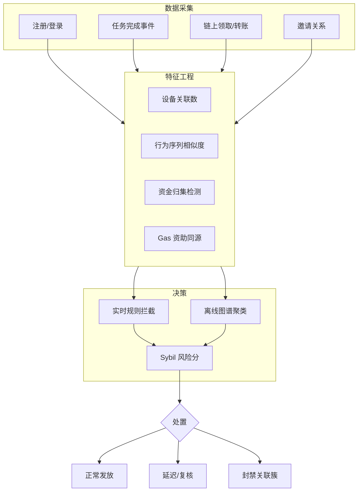
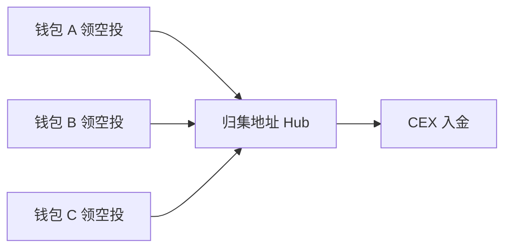

# 羊毛党、Sybil 与活动套利 — 参考答案

**Track：** 交易所风控与反欺诈  
**学习任务：** 把传统活动风控规则改写成 Web3 空投/返佣滥用识别方案。  
**复盘问题：** 说明多账号、设备、资金归集和行为相似度信号。

---

## 一、完整解答

### 1.1 Web3 活动滥用形态

| 形态 | 描述 | 与传统活动风控对照 |
|------|------|-------------------|
| **多账号 Sybil** | 一人控制 N 个钱包/CEX 账户领空投 | 多账号领券 |
| **资金归集** | 分散领取后归集到主地址出金 | 羊毛资金归集 |
| **行为克隆** | 脚本完成相同任务路径 | 机器行为相似度 |
| **返佣套利** | 自邀自充刷返佣 | 邀请链路作弊 |
| **女巫+链上** | 同一设备多钱包链上交互伪装独立 | 设备农场 |

### 1.2 信号体系

**强信号（高置信）**

- 同一设备指纹 / IP / 邮箱域批量注册
- 领取后固定时间窗口内归集到同一地址
- 链上 gas 来源相同（同一主钱包资助 gas）
- KYC 证件重复或人脸重复

**弱信号（需组合）**

- 任务完成时间分布过于一致
- 地址交互图谱高度同构（同一批合约、同一顺序）
- 使用相同 CEX 出金地址充值

### 1.3 处置策略

1. **预防**：邀请码限额、任务随机化、人机验证、链上资格（持仓时长、链上年龄）。
2. **识别**：实时规则 + T+1 图谱聚类（Louvain / 连通分量）。
3. **处置**：取消资格、延迟发放、封禁关联账户、已发放追偿。

---

## 二、架构图

### 资金归集检测逻辑

---

## 三、迁移对照

小红书 **活动风控 / 多账号识别** 可直接映射；Web3 增量是 **链上地址簇 + Gas 资助链 + 合约交互同构**。

## 四、输出物

- [x] 策略文档（信号+处置）
- [x] 指标看板草案：Sybil 簇数、拦截率、误伤申诉率、追偿金额
