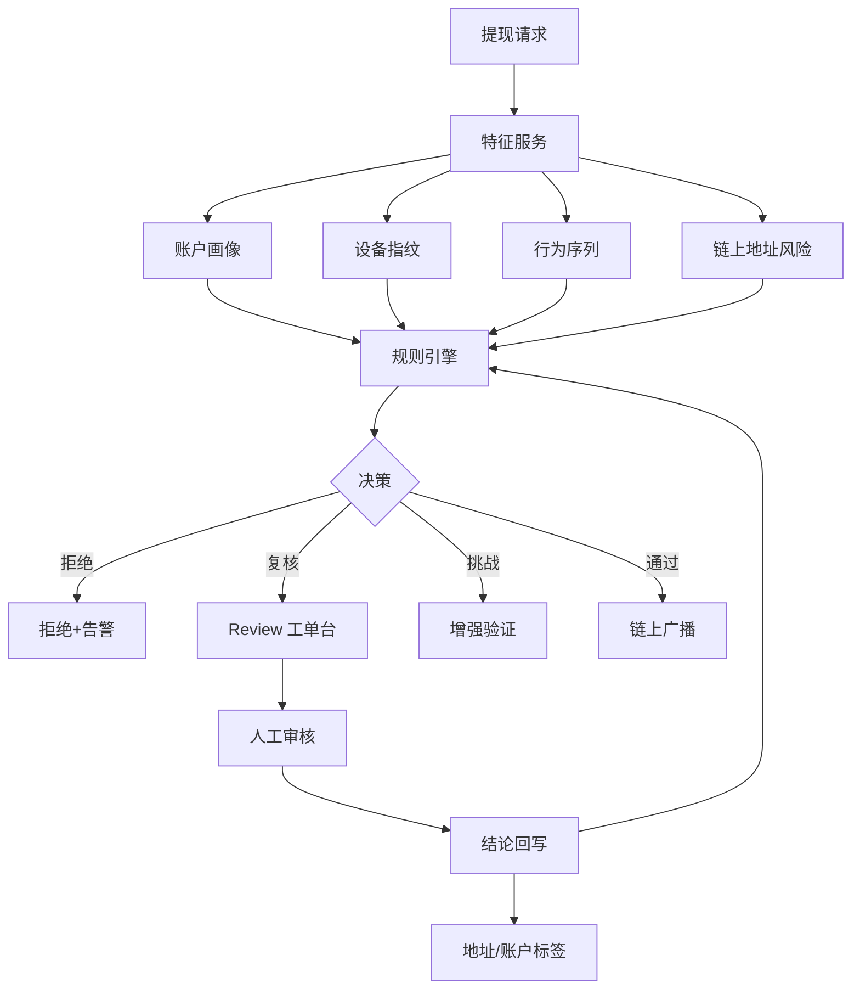

# 提现风控决策链路 — 参考答案

**Track：** 交易所风控与反欺诈  
**学习任务：** 设计一套提现前置拦截与人工复核策略。  
**复盘问题：** 覆盖账户、设备、链上地址、交易行为和人工复核闭环。

---

## 一、完整解答

### 1.1 设计原则

1. **分层决策**：规则引擎快速拒绝/放行，灰区进人工。
2. **可解释**：每条拦截带规则 ID、命中信号、置信度。
3. **闭环**：人工结论回写标签，用于规则校准与模型迭代。
4. **体验平衡**：误伤控制 — 白名单、渐进式验证（2FA、活体、延迟）。

### 1.2 四类信号与示例规则

| 信号域 | 示例特征 | 示例动作 |
|--------|----------|----------|
| **账户** | 新改密、新绑 API、异地登录、VIP 等级 | 提额限制 |
| **设备** | 新设备、模拟器、设备农场指纹 | 人工复核 |
| **链上地址** | 制裁名单、Mixer 下游、盗币热钱包关联 | 硬拦截 |
| **交易行为** | 短时大额、打破历史模式、羊毛后立刻提现 | 延迟+复核 |

### 1.3 决策链路（文字版）

`提现请求` → `同步特征加载（账户/设备/行为/地址）` → `规则引擎（优先级排序）` → 分支：

- **REJECT**：明确黑名单 / 制裁 → 拒绝并记录
- **REVIEW**：灰区 → 工单台排队，SLA 内人工处理
- **CHALLENGE**：加强验证（2FA/邮件/活体）
- **APPROVE**：自动放行 → 链上广播 → 事后抽检

人工复核后：`确认盗号` → 冻结账户 + 链上追踪；`误伤` → 白名单 + 规则降级。

---

## 二、架构图

### 规则优先级示意

---

## 三、面试 STAR 素材（提纲）

- **S**：小红书/阿里提现或活动套利提现峰值场景  
- **A**：多信号规则 + 人工台 SLA + 误伤申诉闭环  
- **R**：拦截率、误伤率、资损避免金额（用区间表述）  
- **迁移**：链上地址层是 **新增维度**，账户/设备/行为逻辑可复用

## 四、输出物

- [x] 规则清单框架（四类信号表）
- [x] 系统设计稿（架构图）
- [ ] 细化 12 条规则及阈值
