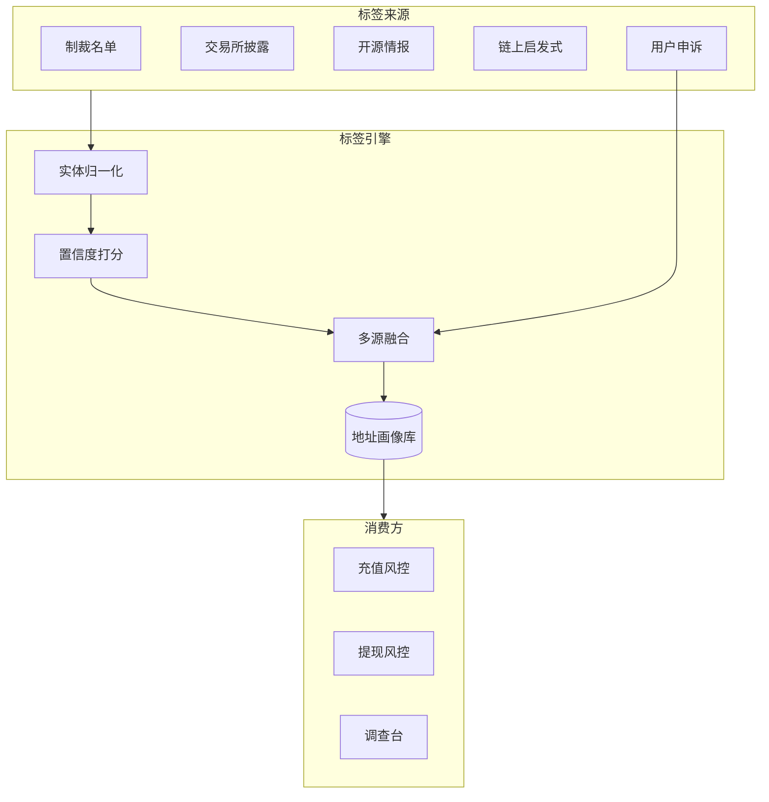
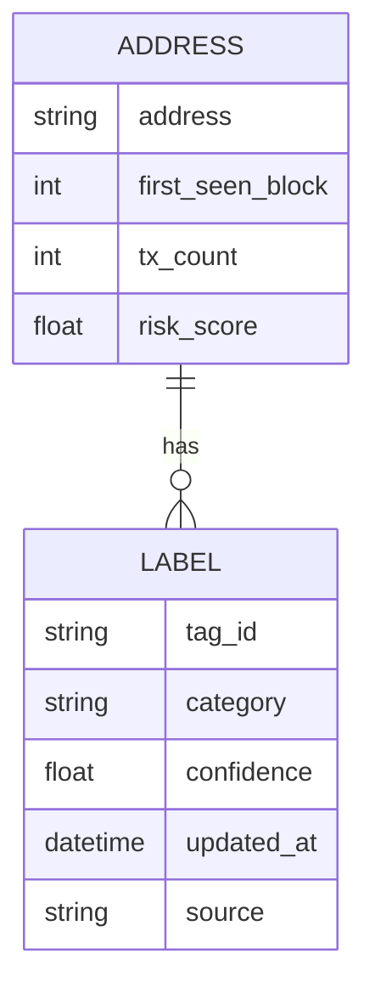

# 地址标签与风险画像 — 参考答案

**Track：** 链上数据与风险智能  
**学习任务：** 定义一套地址风险标签体系。  
**复盘问题：** 说明标签来源、置信度、更新机制和误伤处理。

---

## 一、标签体系设计

### 1.1 标签分层

| 层级 | 示例 | 来源 |
|------|------|------|
| **实体标签** | Binance Hot Wallet, Uniswap Router | 官方公告、链上启发式 |
| **行为标签** | Mixer User, Airdrop Farmer | 交易模式统计 |
| **风险标签** | Scam, Sanctioned, Stolen Funds | 情报商、受害者报告、执法 |
| **关系标签** | Hub Address, Peel Chain | 图谱分析 |

### 1.2 置信度模型

- **L1 确认**（0.95+）：制裁名单、交易所官方热钱包  
- **L2 高**（0.8–0.95）：多源情报一致、链上强特征  
- **L3 中**（0.5–0.8）：启发式推断（如 Tornado 交互）  
- **L4 低**（<0.5）：仅单次弱特征 — **不单独触发硬拦截**

### 1.3 更新与误伤

- **更新**：情报 API 日更 + 链上实时事件（新合约交互）触发增量  
- **衰减**：长期无风险行为，行为标签权重衰减  
- **误伤**：用户申诉 → 人工核验 → 白名单 + 规则例外 + 案例标注  
- **审计**：每次自动拦截记录标签版本、规则 ID

---

## 二、架构图

### 单地址画像结构

---

## 三、面试要点

- 强调 **不依赖单标签自动封禁** — 组合策略 + 人工复核。  
- 作品集 Demo：选 1 个链 + 1 类标签（如 Mixer 下游）做 MVP。

## 四、输出物

- [x] 标签体系四层表
- [x] 置信度与误伤 SOP
