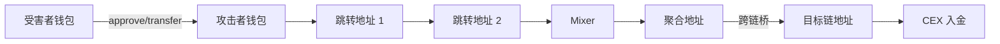
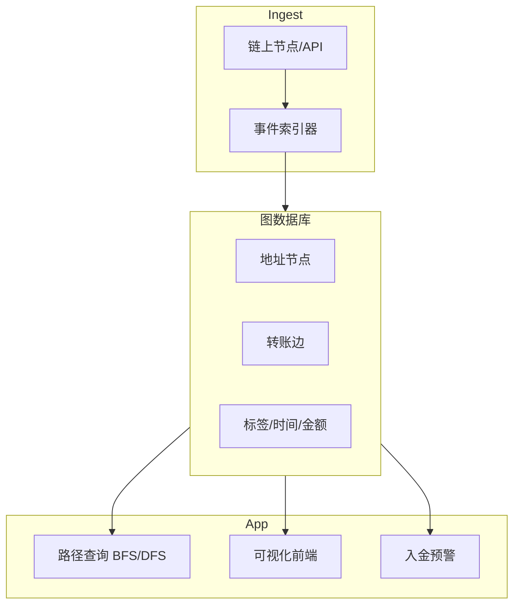
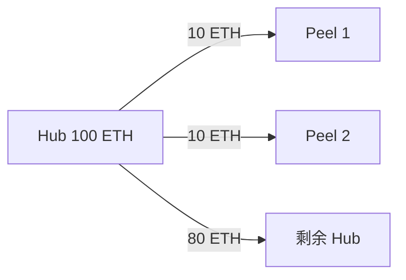

# 资金流追踪与可视化 — 参考答案

**Track：** 链上数据与风险智能  
**学习任务：** 画出黑产资金从受害者到交易所入金的路径。  
**复盘问题：** 描述资金流、跳转地址、Mixer、交易所入金节点。

---

## 一、典型盗币资金流路径

1. **受害者 EOA** 被钓鱼授权 / 私钥泄露  
2. **被盗资产** 转入 **攻击者热钱包 A**  
3. **跳转地址** B₁…Bₙ（peel chain，小额多次剥离）  
4. **Mixer**（如 Tornado）打破溯源  
5. **聚合地址 C** 整合「干净」份额  
6. **跨链桥** 换链（可选）  
7. **CEX 入金地址 D** — KYT 告警节点

**调查目标**：在步骤 2–6 尽可能挂标签；步骤 7 触发 **交易所冻结/报送**。

---

## 二、架构图

### 2.1 资金流路径（案例）

### 2.2 追踪系统架构

### 2.3 Peel Chain 示意

---

## 三、调查员操作清单

1. 输入受害者 tx 哈希，向后追踪 3–5 hop  
2. 标记 Mixer 入口/出口（时间窗口关联）  
3. 匹配 CEX 热钱包入金 — 生成 SAR 材料  
4. 可视化导出 PDF 供合规案件

## 四、输出物

- [x] 路径图（Mermaid）
- [ ] Demo：Etherscan + 自建 CSV 图导入 Neo4j
