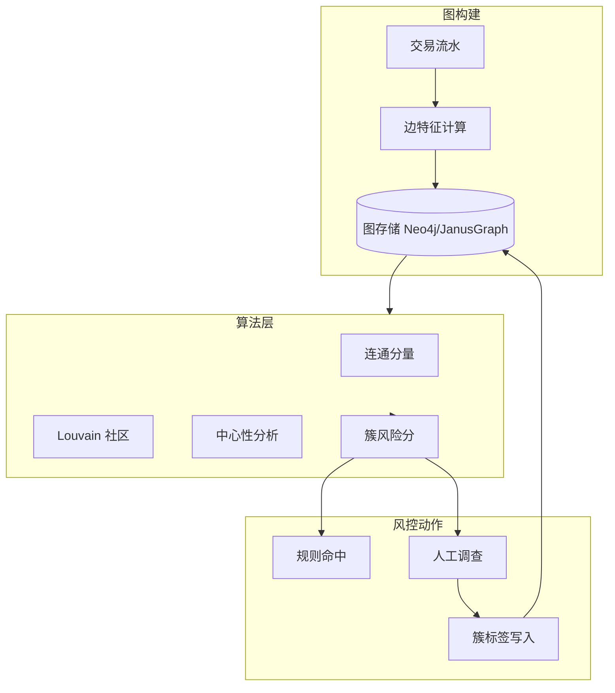
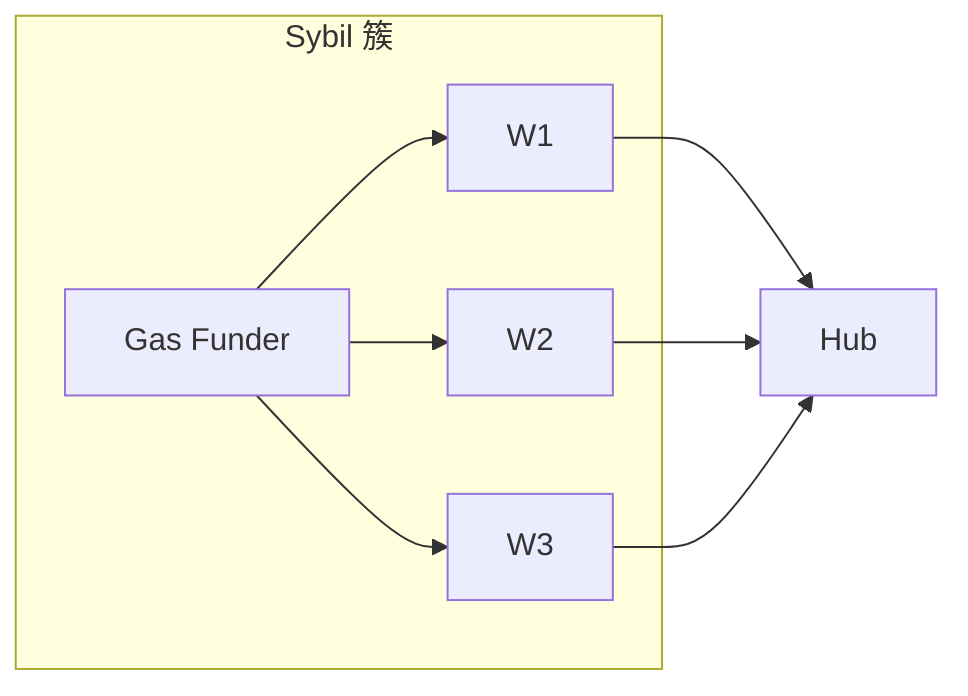

# 图谱风控与关联发现 — 参考答案

**Track：** 链上数据与风险智能  
**学习任务：** 把传统设备关联图迁移成链上地址关联图方案。  
**复盘问题：** 解释节点、边、权重、聚类和风控动作。

---

## 一、完整解答

### 1.1 从设备图到地址图

| 设备风控 | 链上图谱 |
|----------|----------|
| 设备 ID 为节点 | 地址为节点 |
| 同设备登录多账号 | 同 Gas 资助、同 CEX 出入金 |
| 边权重=共现次数 | 边权重=转账金额/次数/时间近度 |
| 社区发现抓羊毛簇 | 聚类抓 Sybil / 洗钱网络 |

### 1.2 图模型

- **节点**：EOA、合约（可选分层）、CEX 集群  
- **边类型**：`TRANSFER`、`APPROVE`、`SHARED_GAS_FUNDER`、`SHARED_COUNTERPARTY`  
- **权重**：`w = α·amount + β·count + γ·time_decay`  
- **聚类**：Connected Components（快）、Louvain（社区）、Label Propagation

### 1.3 风控动作

| 图谱信号 | 动作 |
|----------|------|
| 受害者地址 N-hop 内 | 充值延迟 |
| 与制裁簇连通 | 硬拦截 |
| 新注册簇批量互转 | 活动资格取消 |
| 高 betweenness 枢纽 | 加强 KYT |

---

## 二、架构图

### 关联发现示例

---

## 三、迁移对照

阿里/小红书 **设备关联、团伙识别** → 链上 **Gas 资助树 + 对手方重叠度**；调查台 UI 可复用「关联实体展开」交互。

## 四、输出物

- [x] 图谱方案（节点/边/权重）
- [x] 面试系统设计提纲
