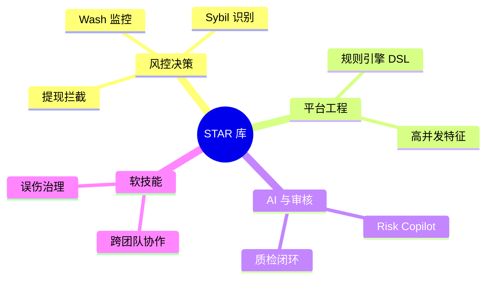
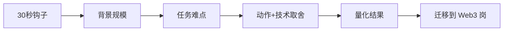

# 面试故事库 — 参考答案

**Track：** 作品集与求职转化  
**学习任务：** 沉淀 8 个 STAR 案例，覆盖风控、内容安全、AI Agent 和系统设计。  
**复盘问题：** 说明背景、动作、技术取舍、结果和可迁移价值。

---

## 一、8 个 STAR 案例提纲

### 1. 提现/交易高峰风控（阿里系）

- **S**：大促峰值，提现/交易 QPS 翻数倍，误伤投诉上升  
- **T**：在不扩人力前提下保稳定、降资损  
- **A**：分级规则、动态阈值、异步复核队列、热点账户缓存特征  
- **R**：拦截率↑、误伤↓、P99 延迟达标  
- **迁移**：= CEX 提现风控链路设计经验

### 2. 活动 Sybil 团伙识别（小红书/阿里）

- **S**：活动套利团伙多账号刷奖励  
- **T**：识别团伙并控制资损  
- **A**：设备+行为序列相似度+资金归集图；T+1 聚类回扫  
- **R**：追回/阻断金额，规则沉淀 20+ 条  
- **迁移**：= Web3 空投 Sybil 方案

### 3. 内容安全机审+人审协同

- **S**：违规内容变种快，纯人工跟不上  
- **T**：提升审核效率与一致性  
- **A**：多模型 ensemble、优先级队列、质检回流  
- **R**：人效提升 X%，漏放率下降  
- **迁移**：= 合规案件 Review 台与 SLA

### 4. AI 辅助审核/agent 试点

- **S**：审核员需快速理解长上下文案件  
- **T**：引入 AI 但不增加幻觉风险  
- **A**：RAG 限定知识库、仅草稿建议、人工必审、全量审计  
- **R**：单案处理时长下降，质检通过率上升  
- **迁移**：= Risk Copilot 护栏设计

### 5. 规则引擎架构升级

- **S**：规则硬编码，发布慢，冲突难排查  
- **T**：可配置、可灰度、可解释  
- **A**：DSL + 优先级 + 仿真回放 + 影子模式  
- **R**：规则上线从周级到天级  
- **迁移**：= Crypto 提现规则引擎作品集

### 6. 误伤申诉与闭环

- **S**：误拦截引发客诉与监管关注风险  
- **T**：建立可信申诉与策略回写  
- **A**：申诉工单、证据上传、白名单策略、规则降级审批  
- **R**：申诉 SLA、复犯率下降  
- **迁移**：= KYT 误伤处理 SOP

### 7. 跨团队协作（风控+产品+法务）

- **S**：新上业务线风控方案争议  
- **T**：平衡体验与安全  
- **A**：风险评审模板、灰度指标、联合 sign-off  
- **R**：业务上线零重大资损事件  
- **迁移**：= 合规/风控/产品三角协作

### 8. Web3 转型作品集（个人）

- **S**：目标 Web3 Risk AI 岗，缺乏 on-chain 项目  
- **T**：3 个月内建立可演示证据  
- **A**：链上看板 + 规则引擎 MVP + Dify Agent；系统学习 6 Track  
- **R**：完成 Demo 与文档，获面试反馈（待填）  
- **迁移**：展示主动性与学习曲线

---

## 二、架构图：故事 → 岗位能力

### 面试讲述流程

---

## 三、讲述模板（2 分钟）

> 【钩子】我在小红书/阿里负责 XX，峰值日决策 X 万笔。  
> 【难点】问题是 …  
> 【动作】我做了 …（技术：规则/图/Agent）  
> 【结果】指标 …  
> 【迁移】这套方法在 Crypto 场景对应 …

## 四、输出物

- [x] 8 个 STAR 提纲
- [ ] 每个扩展为完整 2 分钟稿并录音练习
