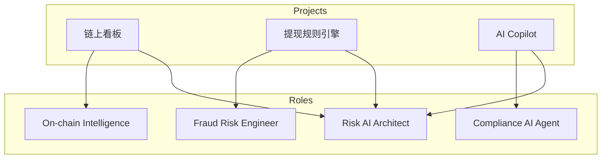
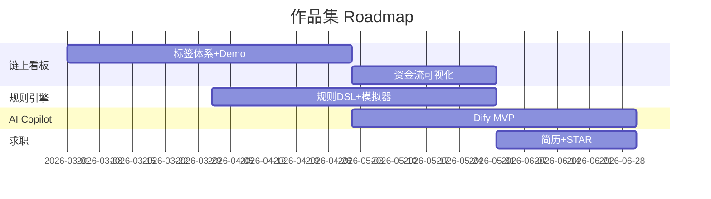

# 作品集选题矩阵 — 参考答案

**Track：** 作品集与求职转化  
**学习任务：** 选择两个主项目：链上风险看板与 AI 调查助手。  
**复盘问题：** 说明每个项目对应哪个目标岗位和业务价值。

---

## 一、选题矩阵

| 项目 | 目标岗位 | 业务价值 | 技术栈 | 优先级 |
|------|----------|----------|--------|--------|
| **链上地址风险画像看板** | On-chain Risk Intelligence Engineer | 证明链上调查与可视化能力 | Python, 图 DB, 链上 API, 前端 | P0 |
| **Crypto 提现风控规则引擎** | Crypto Fraud Risk Engineer | 证明 CEX 核心风控决策能力 | Java/Python, 规则引擎, 实时特征 | P0 |
| **AI 合规调查助手** | Compliance AI Agent Engineer | 证明 Agent+护栏+人机协同 | Dify, Python, 工具调用 | P0 |
| Hardhat Greeter（已有） | 工程基础佐证 | 证明能读合约、懂链上基础 | Hardhat, Solidity | P1 |

**主投组合**：看板 + 规则引擎 + Agent 三选二深入，第三个做 MVP。

---

## 二、架构图

### 2.1 作品集与岗位映射

### 2.2 6 个月 Roadmap

---

## 三、每个项目的「面试官一句话」

- **看板**：「我能把链上地址变成可调查的风险画像，并解释误伤与置信度。」  
- **规则引擎**：「我能设计可解释的提现拦截链路，并有人工复核闭环。」  
- **Agent**：「我做的是辅助调查，不是自动判罚，且有完整护栏与评估。」

## 四、输出物

- [x] 选题矩阵
- [x] Roadmap 图
