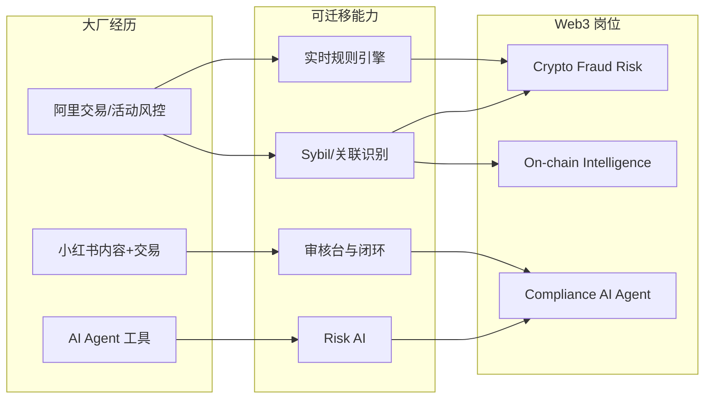

# 简历 Web3 化 — 参考答案

**Track：** 作品集与求职转化  
**学习任务：** 把阿里/小红书风控经历改写成 Web3 风控语言。  
**复盘问题：** 突出规模、实时性、策略闭环、AI 工具和风险结果。

---

## 一、改写原则

| 原表述（传统） | Web3 化表述 |
|----------------|-------------|
| 活动反作弊 | CEX 活动/空投 Sybil 与返佣套利防控 |
| 交易风控 | 现货/合约异常交易与 wash trading 监控 |
| 内容安全审核 | Trust & Safety + 链上钓鱼/恶意链接情报协作 |
| 规则引擎 | 实时风控决策引擎（可对接链上地址特征） |
| AI 审核 | Risk AI / 合规调查 Copilot 质检与摘要 |

**量化要素**：QPS、规则数、拦截率、误伤率、资损避免、SLA、覆盖业务线数。

---

## 二、示例 Bullet（可直接改数字）

### 阿里巴巴 · 高级风控开发（示例）

- 负责 **交易与活动风控规则引擎**，日均决策 **X 万笔**，实时特征 **<50ms**，规则热更新零停机。  
- 设计 **多账号/Sybil 识别** 特征体系，设备+行为+资金归集组合策略，活动资损下降 **Y%**。  
- 搭建 **人工复核工单台** 与策略回写闭环，误伤申诉处理 SLA **<4h**。  
- **迁移 Web3**：方法论适用于 **CEX 提现/空投风控** 与 **链上地址关联分析**。

### 小红书 · 风控技术（示例）

- 负责 **内容安全与交易风控** 交叉场景，机审+人审链路，日均审核 **X 万** 条。  
- 推动 **AI 辅助审核**（摘要、相似案例推荐），人效提升 **Y%**，质检一致性提升。  
- **迁移 Web3**：对应 **Compliance AI Agent** 与 **案件 Review 台** 产品设计。

---

## 三、架构图：经历 → 能力 → 岗位

---

## 四、简历结构建议

1. **Summary**（3 行）：12 年工程 · 大厂风控 · 转向 Web3 Risk AI  
2. **Core Competencies**：CEX 风控 / KYT / 规则引擎 / Agent  
3. **Experience**：Web3 化 bullet  
4. **Projects**：3 个作品集链接  
5. **Education**：北理工 985 本硕

## 五、输出物

- [x] 改写原则与示例 bullet
- [ ] 填入真实量化数字的最终版简历
