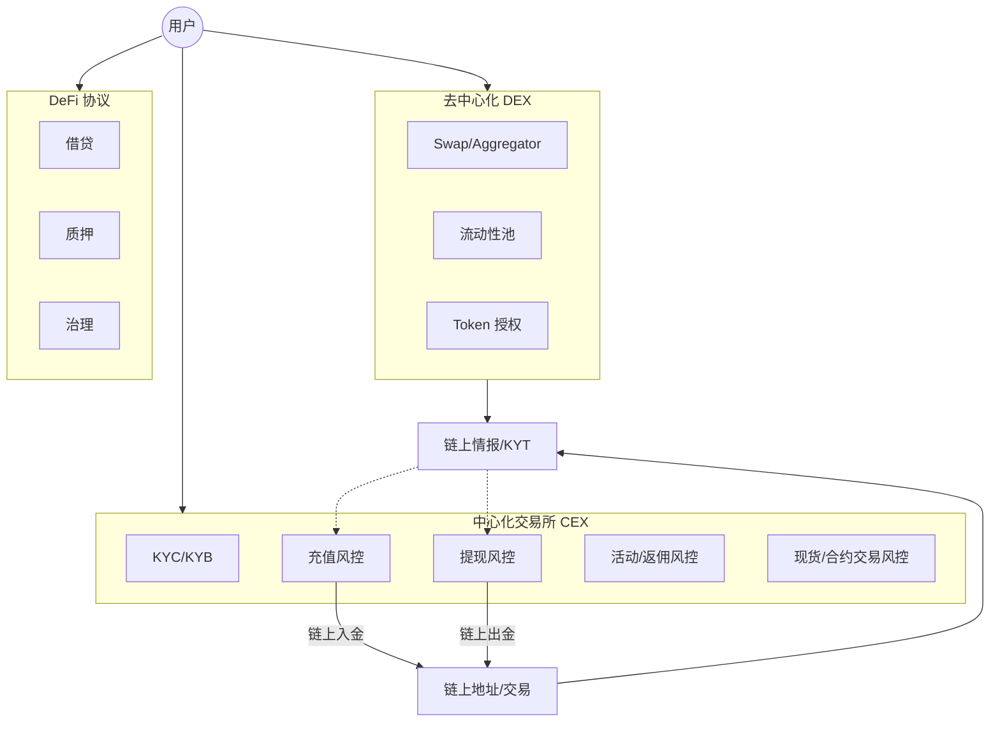
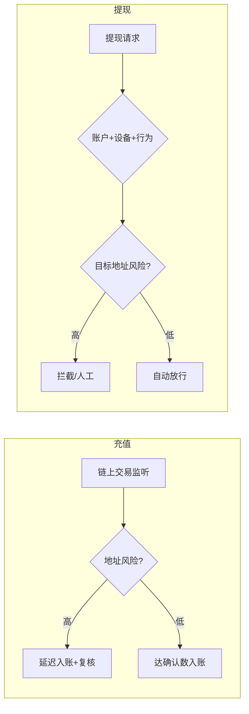

# CEX / DEX / DeFi 业务地图 — 参考答案

**Track：** Web3 基础与交易所语境  
**学习任务：** 对比 CEX 充值提现风控与 DEX 交易风险的差异。  
**复盘问题：** 说明中心化账户风控和链上协议风险的边界。

---

## 一、完整解答

### 1.1 三类业态一句话

| 业态 | 账户模型 | 风控主战场 |
|------|----------|------------|
| **CEX** | 中心化账本，用户余额在平台 | 开户 KYC、充值溯源、提现拦截、内部账本欺诈 |
| **DEX** | 非托管，用户自签 swap | 恶意合约、滑点/MEV、授权钓鱼、假池子 |
| **DeFi 协议** | 智能合约托管资产 | 合约漏洞、治理攻击、闪电贷、预言机操纵 |

### 1.2 CEX 充值 / 提现 vs DEX 交易风险对比

| 维度 | CEX 充值 | CEX 提现 | DEX Swap |
|------|----------|----------|----------|
| **身份** | 已知用户 ID | 已知用户 ID | 通常仅地址 |
| **主要风险** | 黑钱入金、假充值 | 盗号提现、洗钱出金 | 合约恶意、MEV、授权盗币 |
| **关键信号** | 来源地址标签、确认数 | 设备/IP、行为、目标地址 | 合约审计、池子深度、价格偏离 |
| **处置** | 延迟入账、人工复核 | 拦截、限额、二次验证 | 钱包提示、链上监控（平台外） |
| **合规** | KYT/AML 强 | KYT/旅行规则 | 弱身份，依赖链上分析 |

### 1.3 中心化 vs 链上风险边界

- **CEX 风控**：管的是「平台账户 + 法币/加密货币出入金」— 有 KYC、有客服、可冻结。
- **链上协议风险**：发生在链上合约层 — CEX 无法直接「封合约」，只能通过 **不上币、警告用户、地址标记** 间接处置。
- **交界场景**：CEX 上架 DeFi 代币、提供 Web3 钱包、Launchpad — 需 **产品风控 + 链上情报** 双线。

---

## 二、架构图

### 2.1 Web3 风控业务地图

### 2.2 CEX 充值 vs 提现风控决策流对比

---

## 三、面试要点

- 用一张图说清 **用户资金在哪一层被谁控制**。
- 强调你从 **阿里/小红书账户风控** 迁移到 **CEX 账本 + 链上地址** 的双层模型。
- DeFi 风险不要讲成「CEX 能封禁合约」— 讲 **情报、上架策略、用户教育**。

## 四、输出物

- [x] 业务地图（架构图 2.1）
- [x] CEX vs DEX 对比表
- [ ] 手绘一版带自己项目标注的地图
