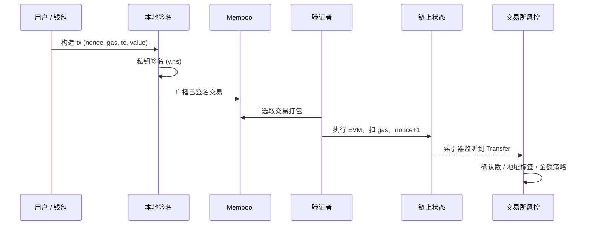
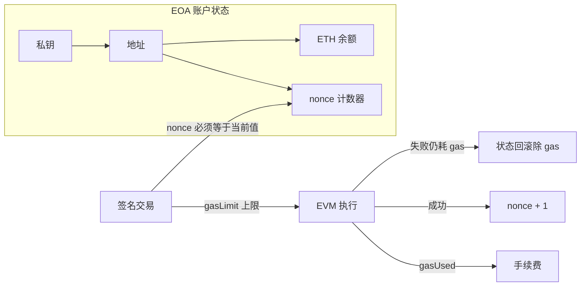

# Ethereum 账户、交易与 Gas — 参考答案

**Track：** Web3 基础与交易所语境  
**学习任务：** 用自己的话画出 EOA 发起一笔交易到链上确认的流程。  
**复盘问题：** 解释账户、nonce、gas、签名、区块确认之间的关系。

---

## 一、完整解答

### 1.1 核心概念关系

| 概念 | 含义 | 风控关联 |
|------|------|----------|
| **账户（Account）** | EOA 由私钥控制；合约账户由代码控制 | 链上实体 ID，地址画像的基础 |
| **Nonce** | 某 EOA 已发出交易计数，必须严格递增 | 防重放；异常 nonce 跳变可能是被盗或脚本攻击 |
| **Gas** | 执行计算与存储的资源单位；`gasUsed × gasPrice` 为手续费 | 异常高 gas 竞价可能是抢跑（MEV）或紧急转出 |
| **签名** | 私钥对交易哈希签名，证明授权 | 无私钥签名不能动账；钓鱼骗取签名是主要盗币路径 |
| **区块确认** | 交易被打包进区块，后续区块叠加形成最终性 | 充值确认数不足时入账 = CEX 经典风控点 |

### 1.2 EOA 发起交易到确认的逐步流程

1. **构造交易**：`from`（EOA）、`to`、`value`、`data`（调用合约时）、`nonce`、`gasLimit`、`gasPrice` 或 EIP-1559 的 `maxFeePerGas` / `maxPriorityFeePerGas`。
2. **本地签名**：钱包用私钥对 RLP 编码后的交易哈希签名，得到 `v, r, s`。
3. **广播**：签名交易进入 mempool，由节点传播。
4. **矿工/验证者打包**：按 gas 竞价等策略选入区块。
5. **执行**：EVM 执行转账或合约调用；消耗 gas，更新状态（余额、nonce、存储）。
6. **确认**：每多 1 个后续区块，重组概率下降；CEX 通常要求 N 个确认后才入账。

### 1.3 面试口述稿（2 分钟版）

> 以太坊上有 EOA 和合约账户。用户用 EOA 发起转账时，钱包用私钥对交易签名，交易里带 nonce 防重放，带 gas 限制和费率作为执行成本。交易进入 mempool 后被验证者打包，执行后 nonce 加一、状态更新。交易所风控关心的是：充值交易是否达到足够确认数、转出地址是否有风险标签、以及是否存在异常 gas 或合约调用（如授权）。

---

## 二、架构图

### 2.1 EOA 交易生命周期

### 2.2 账户、Nonce、Gas 与状态机

---

## 三、输出物清单

- [x] 流程笔记（上文 1.2）
- [x] 面试口述稿（上文 1.3）
- [ ] 自绘手绘图（建议临摹架构图加深记忆）

## 四、迁移对照

阿里/小红书**交易风控**中的「订单状态机 + 幂等键」≈ 链上 **nonce + 交易哈希**；**实时入账前的 pending 审核** ≈ CEX 对确认数与链上风险的充值 gate。
