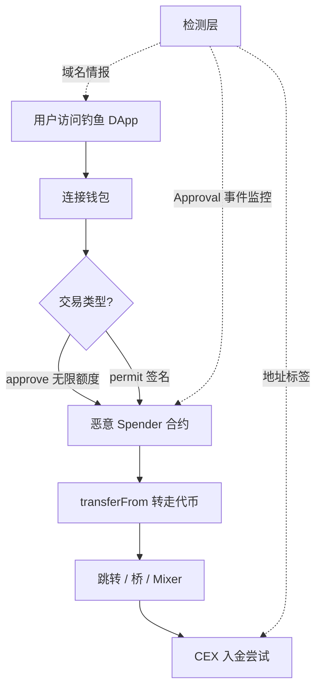
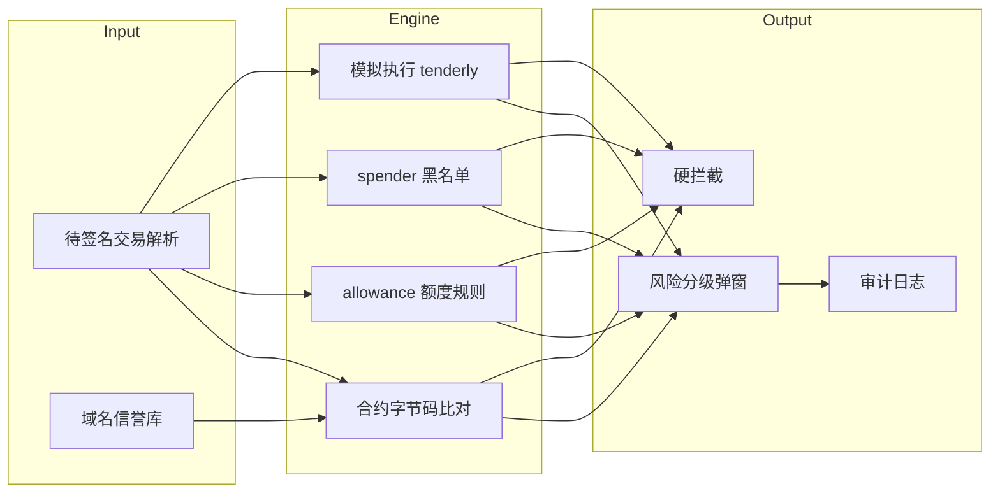

# 钱包、私钥、授权与钓鱼入口 — 参考答案

**Track：** Web3 基础与交易所语境  
**学习任务：** 整理 5 种用户资产被盗的入口，并标出可检测信号。  
**复盘问题：** 描述钱包授权、恶意链接、approval scam 的风险链路。

---

## 一、五种盗币入口与检测信号

| # | 入口 | 攻击链路 | 可检测信号 |
|---|------|----------|------------|
| 1 | **钓鱼网站 + 假签名** | 仿造 DApp，诱导 Sign/Message 或恶意 tx | 新注册域名、相似域名、钱包弹窗 `data` 含无限授权 |
| 2 | **Token Approval 滥用** | 用户 approve 恶意合约无限额度，攻击者 `transferFrom` | 授权对象为非知名合约；`allowance` 极大值；授权后短时转出 |
| 3 | **Permit / EIP-2612 离线签名** | 无 on-chain approve，一条签名即授权 | 签名类型为 Permit；spender 为黑名单地址 |
| 4 | **恶意空投 + 诱导交互** | 空投垃圾 Token，引导打开「领取」触发恶意调用 | 未知合约空投；领取需 `setApprovalForAll` |
| 5 | **助记词 / 私钥泄露** | 假客服、木马、剪贴板替换 | 多链同时转出；转出后立刻混币/跨链；设备异常 |

---

## 二、Approval Scam 风险链路（完整叙述）

1. 用户在钓鱼站点连接 MetaMask，页面请求 `approve(spender, type(uint256).max)`。
2. 用户误以为「验证身份」而确认 — **链上不可逆**。
3. 攻击者合约（spender）调用 `transferFrom(victim, attacker, balance)` 转走代币。
4. 资金经跳转地址、跨链桥或 Mixer 洗出。
5. **CEX 侧**：赃款最终可能入金到交易所账户 — KYT 需标记链路终端。

**风控动作**：钱包/SDK 层授权风险提示；链上监控异常 `Approval` 事件；CEX 入金地址关联已知恶意 spender。

---

## 三、架构图

### 3.1 授权盗币链路

### 3.2 钱包安全检测架构（交易所 / 钱包方可参考）

---

## 四、面试要点

- 区分 **签名消息** vs **链上交易** vs **Permit 离线授权** 三类用户授权。
- 强调 **用户教育不足** 时，Trust & Safety 与链上监控需联动。
- 可结合内容安全经验：钓鱼页检测 ≈ 恶意 URL/仿站识别。

## 五、输出物

- [x] 风险入口清单（表一）
- [x] 检测信号表（表一第三列）
- [ ] 扩展：对接 [Chainalysis/Etherscan API] 的 spender 黑名单 POC
