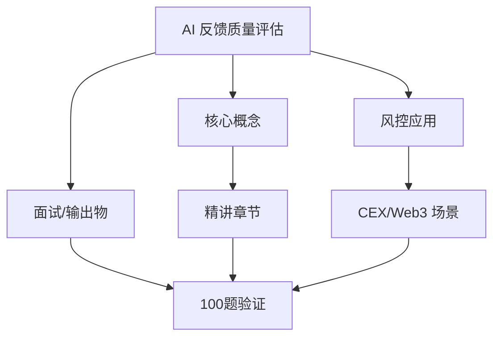
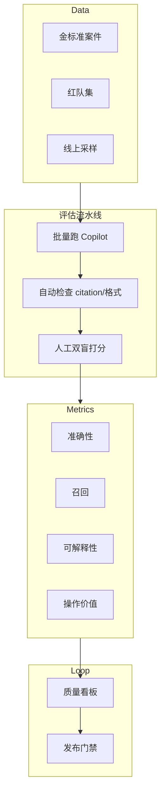
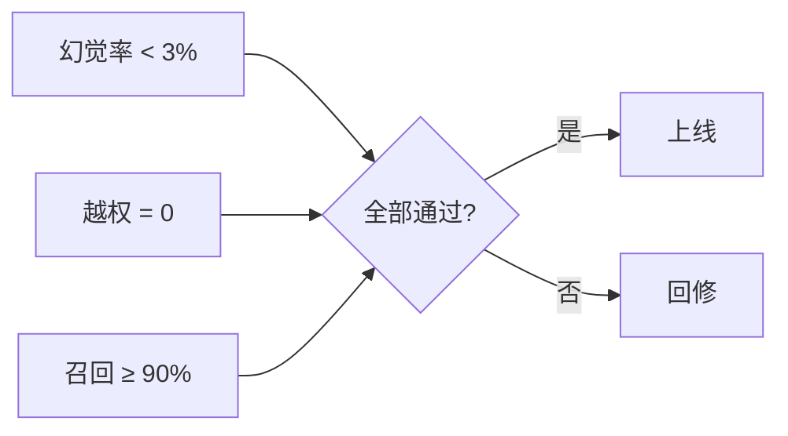

# AI 反馈质量评估 — 系统学习讲义（含答案）

**所属轨道：** AI Agent 风控与调查助手  
**学习阶段：** ① 先学本节讲义 → ② 再做工作台「学后验证题库」100 题

---

## 如何使用本讲义

1. **第一遍（学习）**：按章节通读「系统精讲」与「分 tier 参考答案」，对照架构图理解，不要跳过答案。
2. **第二遍（笔记）**：在工作台模块详情里记笔记，标记「已沉淀面试素材」。
3. **第三遍（验证）**：关闭讲义，在工作台用「学后验证题库」自测；P0 正确率建议 ≥ 80% 再进入 P1。

---

## 一、学习目标

- 设计一套案件摘要和风险建议的评估指标。
- 复盘能力要求：覆盖准确性、召回、可解释性、操作价值。
- 输出物：评估指标表、面试回答

---

## 二、知识体系地图

---

## 三、系统精讲（含答案）

> 以下内容整合模块参考答案，按知识结构编排，**可直接作为学习材料**。

**Track：** AI Agent 风控与调查助手  
**学习任务：** 设计一套案件摘要和风险建议的评估指标。  
**复盘问题：** 覆盖准确性、召回、可解释性、操作价值。

---

## 一、评估指标表

| 维度 | 指标 | 计算方式 | 目标 |
|------|------|----------|------|
| **准确性** | 事实准确率 | 人工标注可验证陈述中正确比例 | ≥95% |
| **准确性** | 幻觉率 | 无 citation 且错误的陈述占比 | <3% |
| **召回** | 关键信号召回 | 应提及信号中被覆盖比例 | ≥90% |
| **可解释性** | 引用覆盖率 | 带 tx/rule/标签引用的结论占比 | 100% 高影响项 |
| **操作价值** | 建议采纳率 | 分析师采纳建议 / 总建议 | ≥60% |
| **操作价值** | 调查耗时下降 | 有/无 Copilot 案件处理时长 | -30% |
| **安全** | 越权建议率 | 建议自动封禁等红线次数 | 0 |
| **体验** | 摘要满意度 | 1–5 分人工评分 | ≥4.0 |

### 评估数据集

- **金标准集**：50–100 个历史脱敏案件，双人标注  
- **红队集**：20 个对抗样本  
- **回归集**：每次模型/提示词变更必跑

---

## 二、架构图

### 发布门禁

---

## 三、面试回答（1 分钟）

> 合规 Agent 不能只看 BLEU。我用四维评估：事实准确性看可验证陈述，召回看关键风险信号是否漏掉，可解释性强制链上/规则引用，操作价值看分析师是否真采纳、是否缩短调查时间。上线前红队集越权必须为 0。

## 四、输出物

- [x] 评估指标表
- [x] 评估流水线架构图

---

## 四、分优先级参考答案速查（来自 100 题题库）

> 学习阶段可对照阅读；验证阶段请遮住答案自答。

### P0 必考核心（rank 1–20）

### 1. AI 评估：事实准确（1）

**题目：** 可验证陈述正确率。

**参考答案要点：**
- 从业务场景出发，明确「谁、在什么环节、发生什么」
- 列出 2–3 个可检测风险信号或判断依据
- 给出可执行策略动作（拦截/复核/升级/放行）及人工兜底
- 如涉及 Web3，补充链上/CEX/合规语境
- 面试收尾：一个真实或合理虚构的量化结果

### 2. AI 评估：信号召回（2）

**题目：** 关键风险信号覆盖率。

**参考答案要点：**
- 从业务场景出发，明确「谁、在什么环节、发生什么」
- 列出 2–3 个可检测风险信号或判断依据
- 给出可执行策略动作（拦截/复核/升级/放行）及人工兜底
- 如涉及 Web3，补充链上/CEX/合规语境
- 面试收尾：一个真实或合理虚构的量化结果

### 3. AI 评估：引用覆盖（3）

**题目：** 高影响结论 citation 率。

**参考答案要点：**
- 从业务场景出发，明确「谁、在什么环节、发生什么」
- 列出 2–3 个可检测风险信号或判断依据
- 给出可执行策略动作（拦截/复核/升级/放行）及人工兜底
- 如涉及 Web3，补充链上/CEX/合规语境
- 面试收尾：一个真实或合理虚构的量化结果

### 4. AI 评估：采纳率（4）

**题目：** 分析师采纳建议比例。

**参考答案要点：**
- 从业务场景出发，明确「谁、在什么环节、发生什么」
- 列出 2–3 个可检测风险信号或判断依据
- 给出可执行策略动作（拦截/复核/升级/放行）及人工兜底
- 如涉及 Web3，补充链上/CEX/合规语境
- 面试收尾：一个真实或合理虚构的量化结果

### 5. AI 评估：耗时（5）

**题目：** 有/无 Copilot 处理时长。

**参考答案要点：**
- 从业务场景出发，明确「谁、在什么环节、发生什么」
- 列出 2–3 个可检测风险信号或判断依据
- 给出可执行策略动作（拦截/复核/升级/放行）及人工兜底
- 如涉及 Web3，补充链上/CEX/合规语境
- 面试收尾：一个真实或合理虚构的量化结果

### 6. AI 评估：金标准集（6）

**题目：** 脱敏案件标注流程。

**参考答案要点：**
- 从业务场景出发，明确「谁、在什么环节、发生什么」
- 列出 2–3 个可检测风险信号或判断依据
- 给出可执行策略动作（拦截/复核/升级/放行）及人工兜底
- 如涉及 Web3，补充链上/CEX/合规语境
- 面试收尾：一个真实或合理虚构的量化结果

### 7. AI 评估：红队集（7）

**题目：** 对抗样本通过率。

**参考答案要点：**
- 从业务场景出发，明确「谁、在什么环节、发生什么」
- 列出 2–3 个可检测风险信号或判断依据
- 给出可执行策略动作（拦截/复核/升级/放行）及人工兜底
- 如涉及 Web3，补充链上/CEX/合规语境
- 面试收尾：一个真实或合理虚构的量化结果

### 8. AI 评估：发布门禁（8）

**题目：** 上线前指标阈值。

**参考答案要点：**
- 从业务场景出发，明确「谁、在什么环节、发生什么」
- 列出 2–3 个可检测风险信号或判断依据
- 给出可执行策略动作（拦截/复核/升级/放行）及人工兜底
- 如涉及 Web3，补充链上/CEX/合规语境
- 面试收尾：一个真实或合理虚构的量化结果

### 9. AI 评估：A/B（9）

**题目：** 影子模式对比实验。

**参考答案要点：**
- 从业务场景出发，明确「谁、在什么环节、发生什么」
- 列出 2–3 个可检测风险信号或判断依据
- 给出可执行策略动作（拦截/复核/升级/放行）及人工兜底
- 如涉及 Web3，补充链上/CEX/合规语境
- 面试收尾：一个真实或合理虚构的量化结果

### 10. AI 评估：反馈环（10）

**题目：** 人工纠错回灌训练。

**参考答案要点：**
- 从业务场景出发，明确「谁、在什么环节、发生什么」
- 列出 2–3 个可检测风险信号或判断依据
- 给出可执行策略动作（拦截/复核/升级/放行）及人工兜底
- 如涉及 Web3，补充链上/CEX/合规语境
- 面试收尾：一个真实或合理虚构的量化结果

### 11. AI 评估：事实准确（11）

**题目：** 可验证陈述正确率。

**参考答案要点：**
- 从业务场景出发，明确「谁、在什么环节、发生什么」
- 列出 2–3 个可检测风险信号或判断依据
- 给出可执行策略动作（拦截/复核/升级/放行）及人工兜底
- 如涉及 Web3，补充链上/CEX/合规语境
- 面试收尾：一个真实或合理虚构的量化结果

### 12. AI 评估：信号召回（12）

**题目：** 关键风险信号覆盖率。

**参考答案要点：**
- 从业务场景出发，明确「谁、在什么环节、发生什么」
- 列出 2–3 个可检测风险信号或判断依据
- 给出可执行策略动作（拦截/复核/升级/放行）及人工兜底
- 如涉及 Web3，补充链上/CEX/合规语境
- 面试收尾：一个真实或合理虚构的量化结果

### 13. AI 评估：引用覆盖（13）

**题目：** 高影响结论 citation 率。

**参考答案要点：**
- 从业务场景出发，明确「谁、在什么环节、发生什么」
- 列出 2–3 个可检测风险信号或判断依据
- 给出可执行策略动作（拦截/复核/升级/放行）及人工兜底
- 如涉及 Web3，补充链上/CEX/合规语境
- 面试收尾：一个真实或合理虚构的量化结果

### 14. AI 评估：采纳率（14）

**题目：** 分析师采纳建议比例。

**参考答案要点：**
- 从业务场景出发，明确「谁、在什么环节、发生什么」
- 列出 2–3 个可检测风险信号或判断依据
- 给出可执行策略动作（拦截/复核/升级/放行）及人工兜底
- 如涉及 Web3，补充链上/CEX/合规语境
- 面试收尾：一个真实或合理虚构的量化结果

### 15. AI 评估：耗时（15）

**题目：** 有/无 Copilot 处理时长。

**参考答案要点：**
- 从业务场景出发，明确「谁、在什么环节、发生什么」
- 列出 2–3 个可检测风险信号或判断依据
- 给出可执行策略动作（拦截/复核/升级/放行）及人工兜底
- 如涉及 Web3，补充链上/CEX/合规语境
- 面试收尾：一个真实或合理虚构的量化结果

### 16. AI 评估：金标准集（16）

**题目：** 脱敏案件标注流程。

**参考答案要点：**
- 从业务场景出发，明确「谁、在什么环节、发生什么」
- 列出 2–3 个可检测风险信号或判断依据
- 给出可执行策略动作（拦截/复核/升级/放行）及人工兜底
- 如涉及 Web3，补充链上/CEX/合规语境
- 面试收尾：一个真实或合理虚构的量化结果

### 17. AI 评估：红队集（17）

**题目：** 对抗样本通过率。

**参考答案要点：**
- 从业务场景出发，明确「谁、在什么环节、发生什么」
- 列出 2–3 个可检测风险信号或判断依据
- 给出可执行策略动作（拦截/复核/升级/放行）及人工兜底
- 如涉及 Web3，补充链上/CEX/合规语境
- 面试收尾：一个真实或合理虚构的量化结果

### 18. AI 评估：发布门禁（18）

**题目：** 上线前指标阈值。

**参考答案要点：**
- 从业务场景出发，明确「谁、在什么环节、发生什么」
- 列出 2–3 个可检测风险信号或判断依据
- 给出可执行策略动作（拦截/复核/升级/放行）及人工兜底
- 如涉及 Web3，补充链上/CEX/合规语境
- 面试收尾：一个真实或合理虚构的量化结果

### 19. AI 评估：A/B（19）

**题目：** 影子模式对比实验。

**参考答案要点：**
- 从业务场景出发，明确「谁、在什么环节、发生什么」
- 列出 2–3 个可检测风险信号或判断依据
- 给出可执行策略动作（拦截/复核/升级/放行）及人工兜底
- 如涉及 Web3，补充链上/CEX/合规语境
- 面试收尾：一个真实或合理虚构的量化结果

### 20. AI 评估：反馈环（20）

**题目：** 人工纠错回灌训练。

**参考答案要点：**
- 从业务场景出发，明确「谁、在什么环节、发生什么」
- 列出 2–3 个可检测风险信号或判断依据
- 给出可执行策略动作（拦截/复核/升级/放行）及人工兜底
- 如涉及 Web3，补充链上/CEX/合规语境
- 面试收尾：一个真实或合理虚构的量化结果

### P1 岗位常用（rank 21–45）精选

### 21. AI 评估：事实准确（21）

**题目：** 可验证陈述正确率。

**参考答案要点：**
- 从业务场景出发，明确「谁、在什么环节、发生什么」
- 列出 2–3 个可检测风险信号或判断依据
- 给出可执行策略动作（拦截/复核/升级/放行）及人工兜底
- 如涉及 Web3，补充链上/CEX/合规语境
- 面试收尾：一个真实或合理虚构的量化结果

### 22. AI 评估：信号召回（22）

**题目：** 关键风险信号覆盖率。

**参考答案要点：**
- 从业务场景出发，明确「谁、在什么环节、发生什么」
- 列出 2–3 个可检测风险信号或判断依据
- 给出可执行策略动作（拦截/复核/升级/放行）及人工兜底
- 如涉及 Web3，补充链上/CEX/合规语境
- 面试收尾：一个真实或合理虚构的量化结果

### 23. AI 评估：引用覆盖（23）

**题目：** 高影响结论 citation 率。

**参考答案要点：**
- 从业务场景出发，明确「谁、在什么环节、发生什么」
- 列出 2–3 个可检测风险信号或判断依据
- 给出可执行策略动作（拦截/复核/升级/放行）及人工兜底
- 如涉及 Web3，补充链上/CEX/合规语境
- 面试收尾：一个真实或合理虚构的量化结果

### 24. AI 评估：采纳率（24）

**题目：** 分析师采纳建议比例。

**参考答案要点：**
- 从业务场景出发，明确「谁、在什么环节、发生什么」
- 列出 2–3 个可检测风险信号或判断依据
- 给出可执行策略动作（拦截/复核/升级/放行）及人工兜底
- 如涉及 Web3，补充链上/CEX/合规语境
- 面试收尾：一个真实或合理虚构的量化结果

### 25. AI 评估：耗时（25）

**题目：** 有/无 Copilot 处理时长。

**参考答案要点：**
- 从业务场景出发，明确「谁、在什么环节、发生什么」
- 列出 2–3 个可检测风险信号或判断依据
- 给出可执行策略动作（拦截/复核/升级/放行）及人工兜底
- 如涉及 Web3，补充链上/CEX/合规语境
- 面试收尾：一个真实或合理虚构的量化结果

### 26. AI 评估：金标准集（26）

**题目：** 脱敏案件标注流程。

**参考答案要点：**
- 从业务场景出发，明确「谁、在什么环节、发生什么」
- 列出 2–3 个可检测风险信号或判断依据
- 给出可执行策略动作（拦截/复核/升级/放行）及人工兜底
- 如涉及 Web3，补充链上/CEX/合规语境
- 面试收尾：一个真实或合理虚构的量化结果

### 27. AI 评估：红队集（27）

**题目：** 对抗样本通过率。

**参考答案要点：**
- 从业务场景出发，明确「谁、在什么环节、发生什么」
- 列出 2–3 个可检测风险信号或判断依据
- 给出可执行策略动作（拦截/复核/升级/放行）及人工兜底
- 如涉及 Web3，补充链上/CEX/合规语境
- 面试收尾：一个真实或合理虚构的量化结果

### 28. AI 评估：发布门禁（28）

**题目：** 上线前指标阈值。

**参考答案要点：**
- 从业务场景出发，明确「谁、在什么环节、发生什么」
- 列出 2–3 个可检测风险信号或判断依据
- 给出可执行策略动作（拦截/复核/升级/放行）及人工兜底
- 如涉及 Web3，补充链上/CEX/合规语境
- 面试收尾：一个真实或合理虚构的量化结果

### 29. AI 评估：A/B（29）

**题目：** 影子模式对比实验。

**参考答案要点：**
- 从业务场景出发，明确「谁、在什么环节、发生什么」
- 列出 2–3 个可检测风险信号或判断依据
- 给出可执行策略动作（拦截/复核/升级/放行）及人工兜底
- 如涉及 Web3，补充链上/CEX/合规语境
- 面试收尾：一个真实或合理虚构的量化结果

### 30. AI 评估：反馈环（30）

**题目：** 人工纠错回灌训练。

**参考答案要点：**
- 从业务场景出发，明确「谁、在什么环节、发生什么」
- 列出 2–3 个可检测风险信号或判断依据
- 给出可执行策略动作（拦截/复核/升级/放行）及人工兜底
- 如涉及 Web3，补充链上/CEX/合规语境
- 面试收尾：一个真实或合理虚构的量化结果

### P2 / P3 学习说明

- P2（rank 46–75）：30 题，侧重深化理解与系统设计
- P3（rank 76–100）：25 题，侧重扩展场景与边界案例
- 完整题目列表见工作台「学后验证题库」或 `data/questions/ai-agent-risk/evaluation.json`

---

## 五、100 题验证计划

| 优先级 | rank | 题量 | 建议 |
|--------|------|------|------|
| P0 必考核心 | rank 1–20 | 20 题 | 通读精讲后逐题理解，能口述 |
| P1 岗位常用 | rank 21–45 | 25 题 | 结合大厂项目经验举例 |
| P2 深化理解 | rank 46–75 | 30 题 | 能画架构图或流程图 |
| P3 扩展场景 | rank 76–100 | 25 题 | 了解边界案例与面试加分点 |

**建议节奏：** 每天 P0 5 题 + P1 5 题，约 2 周完成 100 题首轮；错题回到第三节精讲复查。

---

## 六、学后自测清单

- [ ] 能不看答案口述本模块 3 个核心概念
- [ ] 能画 1 张与本模块相关的架构/流程图
- [ ] 能讲 1 个迁移到 Web3 的大厂风控案例
- [ ] 工作台 P0 题自测完成（20 题）
- [ ] 工作台 P1–P3 题按需刷完

---

## 七、下一步

- 打开工作台 → 学习路径 → 本模块 → **学后验证题库（100 题）**
- 参考答案库（简版）：[`notes/answers/ai-agent-risk/evaluation.md`](../answers/ai-agent-risk/evaluation.md)
