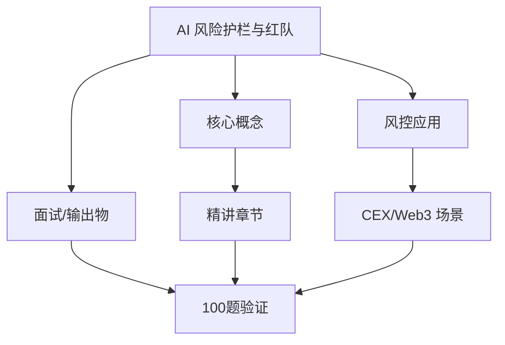
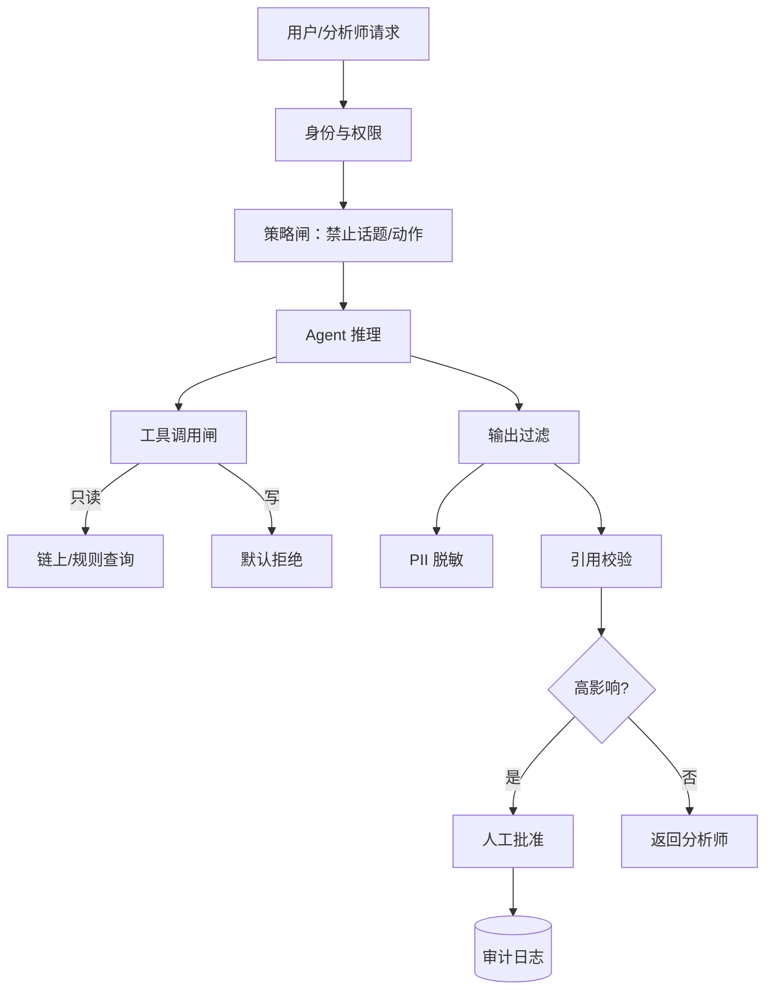
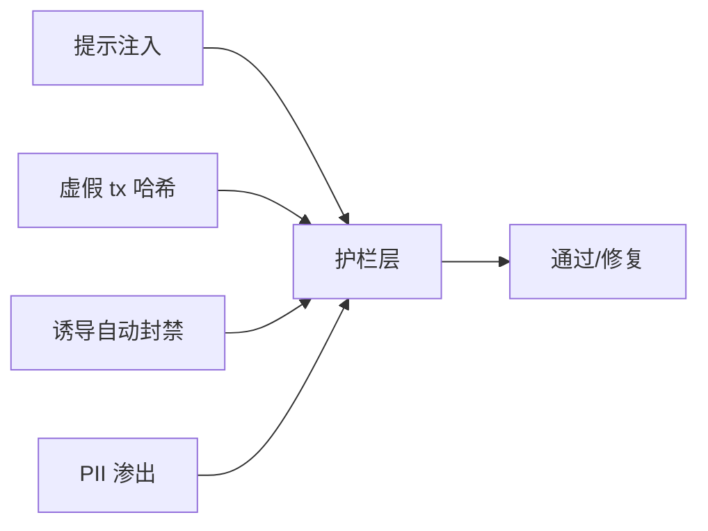

# AI 风险护栏与红队 — 系统学习讲义（含答案）

**所属轨道：** AI Agent 风控与调查助手  
**学习阶段：** ① 先学本节讲义 → ② 再做工作台「学后验证题库」100 题

---

## 如何使用本讲义

1. **第一遍（学习）**：按章节通读「系统精讲」与「分 tier 参考答案」，对照架构图理解，不要跳过答案。
2. **第二遍（笔记）**：在工作台模块详情里记笔记，标记「已沉淀面试素材」。
3. **第三遍（验证）**：关闭讲义，在工作台用「学后验证题库」自测；P0 正确率建议 ≥ 80% 再进入 P1。

---

## 一、学习目标

- 列出 AI Agent 在合规场景下不能直接自动决策的边界。
- 复盘能力要求：说明误伤、幻觉、权限、审计和人工兜底。
- 输出物：护栏清单、红队案例

---

## 二、知识体系地图

---

## 三、系统精讲（含答案）

> 以下内容整合模块参考答案，按知识结构编排，**可直接作为学习材料**。

**Track：** AI Agent 风控与调查助手  
**学习任务：** 列出 AI Agent 在合规场景下不能直接自动决策的边界。  
**复盘问题：** 说明误伤、幻觉、权限、审计和人工兜底。

---

## 一、禁止自动决策清单（红线）

1. **冻结/封禁账户** — 仅建议，人工双签执行  
2. **拒绝提现最终结果** — Agent 可分级建议，不可直接 reject  
3. **报送监管机构** — 草稿可生成，提交需合规官批准  
4. **修改规则阈值** — 只读解释，不可写生产规则  
5. **接触用户 PII 外泄** — 输出脱敏，日志加密  
6. **跨案件推断定罪** — 避免「AI 认定洗钱」法律表述

---

## 二、护栏体系

| 类型 | 措施 |
|------|------|
| **幻觉** | 强制 citation；无链上数据则声明 unknown；RAG 仅可信源 |
| **误伤** | 低置信建议仅「参考」；高影响动作二次确认 |
| **权限** | 工具 RBAC；写操作与读操作 API 分离 |
| **审计** | 全量 prompt/response/tool log；保留 180 天+ |
| **人工兜底** | HITL 闸道；SLA 超时 escalate 人工 |
| **红队** | 注入恶意 case、伪造 tx、诱导越权工具调用 |

---

## 三、架构图

### 红队测试矩阵

---

## 四、输出物

- [x] 护栏清单 + 红线 6 条
- [x] 红队测试矩阵

---

## 四、分优先级参考答案速查（来自 100 题题库）

> 学习阶段可对照阅读；验证阶段请遮住答案自答。

### P0 必考核心（rank 1–20）

### 1. AI 护栏：自动封禁红线（1）

**题目：** Agent 不可自动执行的 6 类动作。

**参考答案要点：**
- 从业务场景出发，明确「谁、在什么环节、发生什么」
- 列出 2–3 个可检测风险信号或判断依据
- 给出可执行策略动作（拦截/复核/升级/放行）及人工兜底
- 如涉及 Web3，补充链上/CEX/合规语境
- 面试收尾：一个真实或合理虚构的量化结果

### 2. AI 护栏：幻觉防护（2）

**题目：** 无数据必须说 unknown。

**参考答案要点：**
- 从业务场景出发，明确「谁、在什么环节、发生什么」
- 列出 2–3 个可检测风险信号或判断依据
- 给出可执行策略动作（拦截/复核/升级/放行）及人工兜底
- 如涉及 Web3，补充链上/CEX/合规语境
- 面试收尾：一个真实或合理虚构的量化结果

### 3. AI 护栏：提示注入（3）

**题目：** 恶意案件描述攻击防护。

**参考答案要点：**
- 从业务场景出发，明确「谁、在什么环节、发生什么」
- 列出 2–3 个可检测风险信号或判断依据
- 给出可执行策略动作（拦截/复核/升级/放行）及人工兜底
- 如涉及 Web3，补充链上/CEX/合规语境
- 面试收尾：一个真实或合理虚构的量化结果

### 4. AI 护栏：工具越权（4）

**题目：** 禁止调用未授权 API。

**参考答案要点：**
- 从业务场景出发，明确「谁、在什么环节、发生什么」
- 列出 2–3 个可检测风险信号或判断依据
- 给出可执行策略动作（拦截/复核/升级/放行）及人工兜底
- 如涉及 Web3，补充链上/CEX/合规语境
- 面试收尾：一个真实或合理虚构的量化结果

### 5. AI 护栏：PII 脱敏（5）

**题目：** 输出与日志脱敏规则。

**参考答案要点：**
- 从业务场景出发，明确「谁、在什么环节、发生什么」
- 列出 2–3 个可检测风险信号或判断依据
- 给出可执行策略动作（拦截/复核/升级/放行）及人工兜底
- 如涉及 Web3，补充链上/CEX/合规语境
- 面试收尾：一个真实或合理虚构的量化结果

### 6. AI 护栏：红队（6）

**题目：** 对抗测试用例设计。

**参考答案要点：**
- 从业务场景出发，明确「谁、在什么环节、发生什么」
- 列出 2–3 个可检测风险信号或判断依据
- 给出可执行策略动作（拦截/复核/升级/放行）及人工兜底
- 如涉及 Web3，补充链上/CEX/合规语境
- 面试收尾：一个真实或合理虚构的量化结果

### 7. AI 护栏：审计（7）

**题目：** prompt/response 全量留存。

**参考答案要点：**
- 从业务场景出发，明确「谁、在什么环节、发生什么」
- 列出 2–3 个可检测风险信号或判断依据
- 给出可执行策略动作（拦截/复核/升级/放行）及人工兜底
- 如涉及 Web3，补充链上/CEX/合规语境
- 面试收尾：一个真实或合理虚构的量化结果

### 8. AI 护栏：降级（8）

**题目：** 模型故障时纯规则模式。

**参考答案要点：**
- 从业务场景出发，明确「谁、在什么环节、发生什么」
- 列出 2–3 个可检测风险信号或判断依据
- 给出可执行策略动作（拦截/复核/升级/放行）及人工兜底
- 如涉及 Web3，补充链上/CEX/合规语境
- 面试收尾：一个真实或合理虚构的量化结果

### 9. AI 护栏：多模型（9）

**题目：** 主备模型切换策略。

**参考答案要点：**
- 从业务场景出发，明确「谁、在什么环节、发生什么」
- 列出 2–3 个可检测风险信号或判断依据
- 给出可执行策略动作（拦截/复核/升级/放行）及人工兜底
- 如涉及 Web3，补充链上/CEX/合规语境
- 面试收尾：一个真实或合理虚构的量化结果

### 10. AI 护栏：合规审批（10）

**题目：** 新工具上线审批流。

**参考答案要点：**
- 从业务场景出发，明确「谁、在什么环节、发生什么」
- 列出 2–3 个可检测风险信号或判断依据
- 给出可执行策略动作（拦截/复核/升级/放行）及人工兜底
- 如涉及 Web3，补充链上/CEX/合规语境
- 面试收尾：一个真实或合理虚构的量化结果

### 11. AI 护栏：自动封禁红线（11）

**题目：** Agent 不可自动执行的 6 类动作。

**参考答案要点：**
- 从业务场景出发，明确「谁、在什么环节、发生什么」
- 列出 2–3 个可检测风险信号或判断依据
- 给出可执行策略动作（拦截/复核/升级/放行）及人工兜底
- 如涉及 Web3，补充链上/CEX/合规语境
- 面试收尾：一个真实或合理虚构的量化结果

### 12. AI 护栏：幻觉防护（12）

**题目：** 无数据必须说 unknown。

**参考答案要点：**
- 从业务场景出发，明确「谁、在什么环节、发生什么」
- 列出 2–3 个可检测风险信号或判断依据
- 给出可执行策略动作（拦截/复核/升级/放行）及人工兜底
- 如涉及 Web3，补充链上/CEX/合规语境
- 面试收尾：一个真实或合理虚构的量化结果

### 13. AI 护栏：提示注入（13）

**题目：** 恶意案件描述攻击防护。

**参考答案要点：**
- 从业务场景出发，明确「谁、在什么环节、发生什么」
- 列出 2–3 个可检测风险信号或判断依据
- 给出可执行策略动作（拦截/复核/升级/放行）及人工兜底
- 如涉及 Web3，补充链上/CEX/合规语境
- 面试收尾：一个真实或合理虚构的量化结果

### 14. AI 护栏：工具越权（14）

**题目：** 禁止调用未授权 API。

**参考答案要点：**
- 从业务场景出发，明确「谁、在什么环节、发生什么」
- 列出 2–3 个可检测风险信号或判断依据
- 给出可执行策略动作（拦截/复核/升级/放行）及人工兜底
- 如涉及 Web3，补充链上/CEX/合规语境
- 面试收尾：一个真实或合理虚构的量化结果

### 15. AI 护栏：PII 脱敏（15）

**题目：** 输出与日志脱敏规则。

**参考答案要点：**
- 从业务场景出发，明确「谁、在什么环节、发生什么」
- 列出 2–3 个可检测风险信号或判断依据
- 给出可执行策略动作（拦截/复核/升级/放行）及人工兜底
- 如涉及 Web3，补充链上/CEX/合规语境
- 面试收尾：一个真实或合理虚构的量化结果

### 16. AI 护栏：红队（16）

**题目：** 对抗测试用例设计。

**参考答案要点：**
- 从业务场景出发，明确「谁、在什么环节、发生什么」
- 列出 2–3 个可检测风险信号或判断依据
- 给出可执行策略动作（拦截/复核/升级/放行）及人工兜底
- 如涉及 Web3，补充链上/CEX/合规语境
- 面试收尾：一个真实或合理虚构的量化结果

### 17. AI 护栏：审计（17）

**题目：** prompt/response 全量留存。

**参考答案要点：**
- 从业务场景出发，明确「谁、在什么环节、发生什么」
- 列出 2–3 个可检测风险信号或判断依据
- 给出可执行策略动作（拦截/复核/升级/放行）及人工兜底
- 如涉及 Web3，补充链上/CEX/合规语境
- 面试收尾：一个真实或合理虚构的量化结果

### 18. AI 护栏：降级（18）

**题目：** 模型故障时纯规则模式。

**参考答案要点：**
- 从业务场景出发，明确「谁、在什么环节、发生什么」
- 列出 2–3 个可检测风险信号或判断依据
- 给出可执行策略动作（拦截/复核/升级/放行）及人工兜底
- 如涉及 Web3，补充链上/CEX/合规语境
- 面试收尾：一个真实或合理虚构的量化结果

### 19. AI 护栏：多模型（19）

**题目：** 主备模型切换策略。

**参考答案要点：**
- 从业务场景出发，明确「谁、在什么环节、发生什么」
- 列出 2–3 个可检测风险信号或判断依据
- 给出可执行策略动作（拦截/复核/升级/放行）及人工兜底
- 如涉及 Web3，补充链上/CEX/合规语境
- 面试收尾：一个真实或合理虚构的量化结果

### 20. AI 护栏：合规审批（20）

**题目：** 新工具上线审批流。

**参考答案要点：**
- 从业务场景出发，明确「谁、在什么环节、发生什么」
- 列出 2–3 个可检测风险信号或判断依据
- 给出可执行策略动作（拦截/复核/升级/放行）及人工兜底
- 如涉及 Web3，补充链上/CEX/合规语境
- 面试收尾：一个真实或合理虚构的量化结果

### P1 岗位常用（rank 21–45）精选

### 21. AI 护栏：自动封禁红线（21）

**题目：** Agent 不可自动执行的 6 类动作。

**参考答案要点：**
- 从业务场景出发，明确「谁、在什么环节、发生什么」
- 列出 2–3 个可检测风险信号或判断依据
- 给出可执行策略动作（拦截/复核/升级/放行）及人工兜底
- 如涉及 Web3，补充链上/CEX/合规语境
- 面试收尾：一个真实或合理虚构的量化结果

### 22. AI 护栏：幻觉防护（22）

**题目：** 无数据必须说 unknown。

**参考答案要点：**
- 从业务场景出发，明确「谁、在什么环节、发生什么」
- 列出 2–3 个可检测风险信号或判断依据
- 给出可执行策略动作（拦截/复核/升级/放行）及人工兜底
- 如涉及 Web3，补充链上/CEX/合规语境
- 面试收尾：一个真实或合理虚构的量化结果

### 23. AI 护栏：提示注入（23）

**题目：** 恶意案件描述攻击防护。

**参考答案要点：**
- 从业务场景出发，明确「谁、在什么环节、发生什么」
- 列出 2–3 个可检测风险信号或判断依据
- 给出可执行策略动作（拦截/复核/升级/放行）及人工兜底
- 如涉及 Web3，补充链上/CEX/合规语境
- 面试收尾：一个真实或合理虚构的量化结果

### 24. AI 护栏：工具越权（24）

**题目：** 禁止调用未授权 API。

**参考答案要点：**
- 从业务场景出发，明确「谁、在什么环节、发生什么」
- 列出 2–3 个可检测风险信号或判断依据
- 给出可执行策略动作（拦截/复核/升级/放行）及人工兜底
- 如涉及 Web3，补充链上/CEX/合规语境
- 面试收尾：一个真实或合理虚构的量化结果

### 25. AI 护栏：PII 脱敏（25）

**题目：** 输出与日志脱敏规则。

**参考答案要点：**
- 从业务场景出发，明确「谁、在什么环节、发生什么」
- 列出 2–3 个可检测风险信号或判断依据
- 给出可执行策略动作（拦截/复核/升级/放行）及人工兜底
- 如涉及 Web3，补充链上/CEX/合规语境
- 面试收尾：一个真实或合理虚构的量化结果

### 26. AI 护栏：红队（26）

**题目：** 对抗测试用例设计。

**参考答案要点：**
- 从业务场景出发，明确「谁、在什么环节、发生什么」
- 列出 2–3 个可检测风险信号或判断依据
- 给出可执行策略动作（拦截/复核/升级/放行）及人工兜底
- 如涉及 Web3，补充链上/CEX/合规语境
- 面试收尾：一个真实或合理虚构的量化结果

### 27. AI 护栏：审计（27）

**题目：** prompt/response 全量留存。

**参考答案要点：**
- 从业务场景出发，明确「谁、在什么环节、发生什么」
- 列出 2–3 个可检测风险信号或判断依据
- 给出可执行策略动作（拦截/复核/升级/放行）及人工兜底
- 如涉及 Web3，补充链上/CEX/合规语境
- 面试收尾：一个真实或合理虚构的量化结果

### 28. AI 护栏：降级（28）

**题目：** 模型故障时纯规则模式。

**参考答案要点：**
- 从业务场景出发，明确「谁、在什么环节、发生什么」
- 列出 2–3 个可检测风险信号或判断依据
- 给出可执行策略动作（拦截/复核/升级/放行）及人工兜底
- 如涉及 Web3，补充链上/CEX/合规语境
- 面试收尾：一个真实或合理虚构的量化结果

### 29. AI 护栏：多模型（29）

**题目：** 主备模型切换策略。

**参考答案要点：**
- 从业务场景出发，明确「谁、在什么环节、发生什么」
- 列出 2–3 个可检测风险信号或判断依据
- 给出可执行策略动作（拦截/复核/升级/放行）及人工兜底
- 如涉及 Web3，补充链上/CEX/合规语境
- 面试收尾：一个真实或合理虚构的量化结果

### 30. AI 护栏：合规审批（30）

**题目：** 新工具上线审批流。

**参考答案要点：**
- 从业务场景出发，明确「谁、在什么环节、发生什么」
- 列出 2–3 个可检测风险信号或判断依据
- 给出可执行策略动作（拦截/复核/升级/放行）及人工兜底
- 如涉及 Web3，补充链上/CEX/合规语境
- 面试收尾：一个真实或合理虚构的量化结果

### P2 / P3 学习说明

- P2（rank 46–75）：30 题，侧重深化理解与系统设计
- P3（rank 76–100）：25 题，侧重扩展场景与边界案例
- 完整题目列表见工作台「学后验证题库」或 `data/questions/ai-agent-risk/guardrails.json`

---

## 五、100 题验证计划

| 优先级 | rank | 题量 | 建议 |
|--------|------|------|------|
| P0 必考核心 | rank 1–20 | 20 题 | 通读精讲后逐题理解，能口述 |
| P1 岗位常用 | rank 21–45 | 25 题 | 结合大厂项目经验举例 |
| P2 深化理解 | rank 46–75 | 30 题 | 能画架构图或流程图 |
| P3 扩展场景 | rank 76–100 | 25 题 | 了解边界案例与面试加分点 |

**建议节奏：** 每天 P0 5 题 + P1 5 题，约 2 周完成 100 题首轮；错题回到第三节精讲复查。

---

## 六、学后自测清单

- [ ] 能不看答案口述本模块 3 个核心概念
- [ ] 能画 1 张与本模块相关的架构/流程图
- [ ] 能讲 1 个迁移到 Web3 的大厂风控案例
- [ ] 工作台 P0 题自测完成（20 题）
- [ ] 工作台 P1–P3 题按需刷完

---

## 七、下一步

- 打开工作台 → 学习路径 → 本模块 → **学后验证题库（100 题）**
- 参考答案库（简版）：[`notes/answers/ai-agent-risk/guardrails.md`](../answers/ai-agent-risk/guardrails.md)
