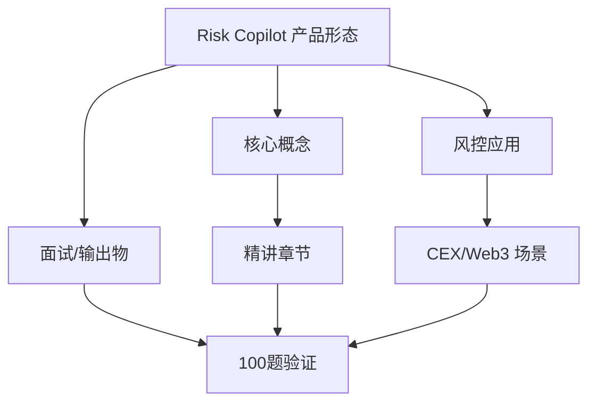
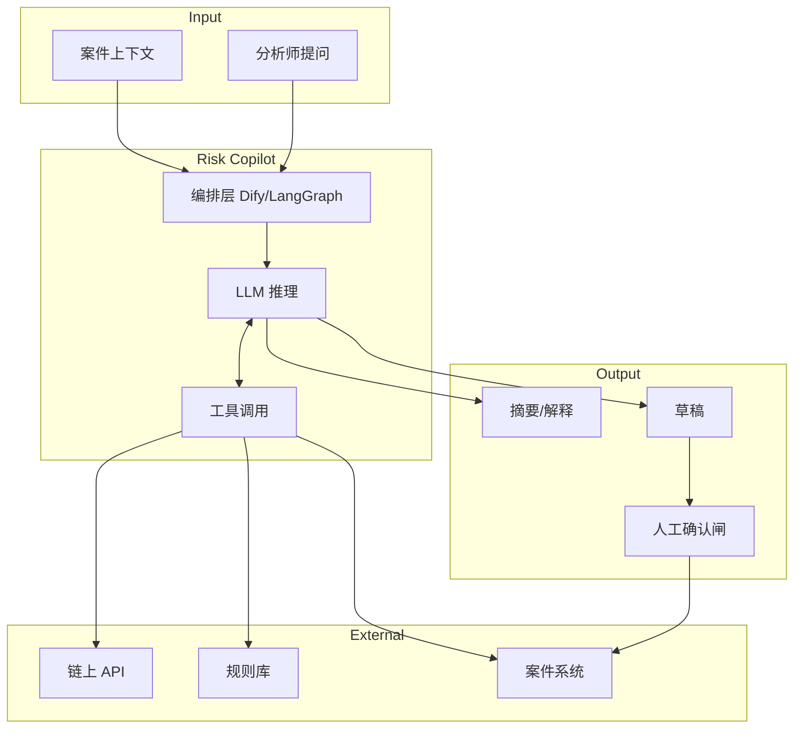
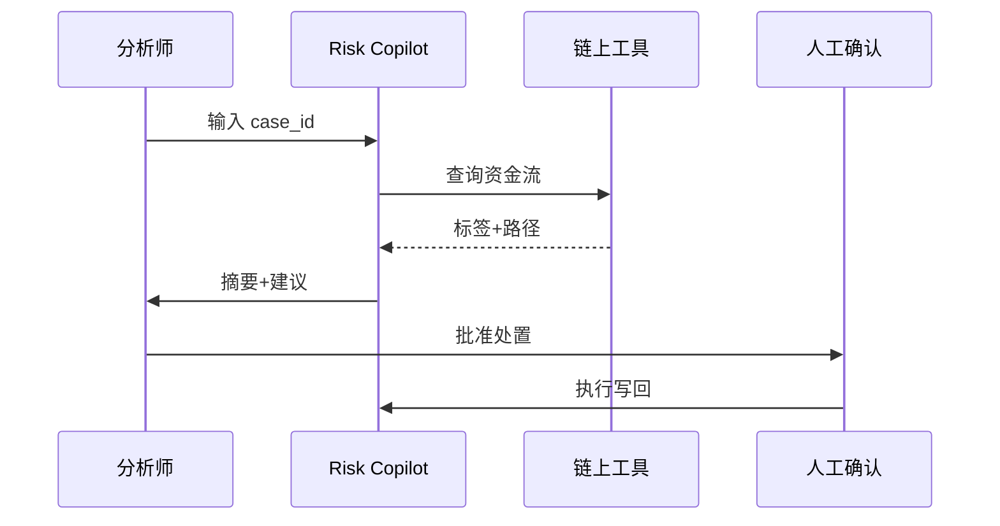

# Risk Copilot 产品形态 — 系统学习讲义（含答案）

**所属轨道：** AI Agent 风控与调查助手  
**学习阶段：** ① 先学本节讲义 → ② 再做工作台「学后验证题库」100 题

---

## 如何使用本讲义

1. **第一遍（学习）**：按章节通读「系统精讲」与「分 tier 参考答案」，对照架构图理解，不要跳过答案。
2. **第二遍（笔记）**：在工作台模块详情里记笔记，标记「已沉淀面试素材」。
3. **第三遍（验证）**：关闭讲义，在工作台用「学后验证题库」自测；P0 正确率建议 ≥ 80% 再进入 P1。

---

## 一、学习目标

- 定义一个合规调查 AI Agent 的输入、工具和输出。
- 复盘能力要求：覆盖案件摘要、链上查询、规则解释、人工确认。
- 输出物：产品定义、作品集 PRD

---

## 二、知识体系地图



---

## 三、系统精讲（含答案）

> 以下内容整合模块参考答案，按知识结构编排，**可直接作为学习材料**。

**Track：** AI Agent 风控与调查助手  
**学习任务：** 定义一个合规调查 AI Agent 的输入、工具和输出。  
**复盘问题：** 覆盖案件摘要、链上查询、规则解释、人工确认。

---

## 一、产品定义

### 1.1 输入（Input Schema）

```json
{
  "case_id": "AML-2026-001",
  "user_id": "U123",
  "trigger": "withdrawal_kyt_alert",
  "tx_hashes": ["0x..."],
  "addresses": ["0xabc..."],
  "amount_usd": 50000,
  "rule_hits": [{"rule_id": "R-42", "signals": ["mixer_near"]}],
  "analyst_notes": ""
}
```

### 1.2 工具（Tools）

| 工具 | 功能 | 权限 |
|------|------|------|
| `chain_lookup` | 查 tx、标签、N-hop 邻居 | 只读 |
| `rule_explainer` | 解释规则逻辑与阈值 | 只读 |
| `case_history` | 拉取用户历史案件 | 只读 |
| `draft_sar` | 生成报送草稿 | 需人工批准 |
| `suggest_action` | 建议冻结/放行/升级 | **不可自动执行** |

### 1.3 输出（Output Schema）

```json
{
  "summary": "案件一句话摘要",
  "timeline": ["T0 充值", "T1 Mixer", "T2 提现"],
  "risk_explanation": "为何命中、关键信号",
  "missing_evidence": ["需确认 UBO", "需链上 3-hop"],
  "suggested_actions": ["人工复核", "延迟提现"],
  "confidence": 0.82,
  "citations": ["tx:0x...", "rule:R-42"]
}
```

**硬约束**：任何账户处置必须 `human_approved: true`。

---

## 二、架构图



### 人机协同序列



---

## 三、输出物

- [x] 产品 PRD 骨架（输入/工具/输出）
- [ ] Dify 最小工作流 POC

---

## 四、分优先级参考答案速查（来自 100 题题库）

> 学习阶段可对照阅读；验证阶段请遮住答案自答。

### P0 必考核心（rank 1–20）

### 1. Risk Copilot：输入 Schema（1）

**题目：** 案件上下文 JSON 字段设计。

**参考答案要点：**
- 从业务场景出发，明确「谁、在什么环节、发生什么」
- 列出 2–3 个可检测风险信号或判断依据
- 给出可执行策略动作（拦截/复核/升级/放行）及人工兜底
- 如涉及 Web3，补充链上/CEX/合规语境
- 面试收尾：一个真实或合理虚构的量化结果

### 2. Risk Copilot：工具清单（2）

**题目：** 链上查询、规则解释、历史案件。

**参考答案要点：**
- 从业务场景出发，明确「谁、在什么环节、发生什么」
- 列出 2–3 个可检测风险信号或判断依据
- 给出可执行策略动作（拦截/复核/升级/放行）及人工兜底
- 如涉及 Web3，补充链上/CEX/合规语境
- 面试收尾：一个真实或合理虚构的量化结果

### 3. Risk Copilot：输出 Schema（3）

**题目：** 摘要、建议、缺失证据结构。

**参考答案要点：**
- 从业务场景出发，明确「谁、在什么环节、发生什么」
- 列出 2–3 个可检测风险信号或判断依据
- 给出可执行策略动作（拦截/复核/升级/放行）及人工兜底
- 如涉及 Web3，补充链上/CEX/合规语境
- 面试收尾：一个真实或合理虚构的量化结果

### 4. Risk Copilot：人工确认闸（4）

**题目：** 写操作必须 HITL。

**参考答案要点：**
- 从业务场景出发，明确「谁、在什么环节、发生什么」
- 列出 2–3 个可检测风险信号或判断依据
- 给出可执行策略动作（拦截/复核/升级/放行）及人工兜底
- 如涉及 Web3，补充链上/CEX/合规语境
- 面试收尾：一个真实或合理虚构的量化结果

### 5. Risk Copilot：权限（5）

**题目：** 工具 RBAC 设计。

**参考答案要点：**
- 从业务场景出发，明确「谁、在什么环节、发生什么」
- 列出 2–3 个可检测风险信号或判断依据
- 给出可执行策略动作（拦截/复核/升级/放行）及人工兜底
- 如涉及 Web3，补充链上/CEX/合规语境
- 面试收尾：一个真实或合理虚构的量化结果

### 6. Risk Copilot：编排（6）

**题目：** Dify/LangGraph 选型。

**参考答案要点：**
- 从业务场景出发，明确「谁、在什么环节、发生什么」
- 列出 2–3 个可检测风险信号或判断依据
- 给出可执行策略动作（拦截/复核/升级/放行）及人工兜底
- 如涉及 Web3，补充链上/CEX/合规语境
- 面试收尾：一个真实或合理虚构的量化结果

### 7. Risk Copilot：多轮对话（7）

**题目：** 调查员追问上下文保持。

**参考答案要点：**
- 从业务场景出发，明确「谁、在什么环节、发生什么」
- 列出 2–3 个可检测风险信号或判断依据
- 给出可执行策略动作（拦截/复核/升级/放行）及人工兜底
- 如涉及 Web3，补充链上/CEX/合规语境
- 面试收尾：一个真实或合理虚构的量化结果

### 8. Risk Copilot：Citation（8）

**题目：** 强制引用 tx/rule。

**参考答案要点：**
- 从业务场景出发，明确「谁、在什么环节、发生什么」
- 列出 2–3 个可检测风险信号或判断依据
- 给出可执行策略动作（拦截/复核/升级/放行）及人工兜底
- 如涉及 Web3，补充链上/CEX/合规语境
- 面试收尾：一个真实或合理虚构的量化结果

### 9. Risk Copilot：延迟（9）

**题目：** SLA 与超时降级。

**参考答案要点：**
- 从业务场景出发，明确「谁、在什么环节、发生什么」
- 列出 2–3 个可检测风险信号或判断依据
- 给出可执行策略动作（拦截/复核/升级/放行）及人工兜底
- 如涉及 Web3，补充链上/CEX/合规语境
- 面试收尾：一个真实或合理虚构的量化结果

### 10. Risk Copilot：成本（10）

**题目：** Token 成本与案件类型关系。

**参考答案要点：**
- 从业务场景出发，明确「谁、在什么环节、发生什么」
- 列出 2–3 个可检测风险信号或判断依据
- 给出可执行策略动作（拦截/复核/升级/放行）及人工兜底
- 如涉及 Web3，补充链上/CEX/合规语境
- 面试收尾：一个真实或合理虚构的量化结果

### 11. Risk Copilot：输入 Schema（11）

**题目：** 案件上下文 JSON 字段设计。

**参考答案要点：**
- 从业务场景出发，明确「谁、在什么环节、发生什么」
- 列出 2–3 个可检测风险信号或判断依据
- 给出可执行策略动作（拦截/复核/升级/放行）及人工兜底
- 如涉及 Web3，补充链上/CEX/合规语境
- 面试收尾：一个真实或合理虚构的量化结果

### 12. Risk Copilot：工具清单（12）

**题目：** 链上查询、规则解释、历史案件。

**参考答案要点：**
- 从业务场景出发，明确「谁、在什么环节、发生什么」
- 列出 2–3 个可检测风险信号或判断依据
- 给出可执行策略动作（拦截/复核/升级/放行）及人工兜底
- 如涉及 Web3，补充链上/CEX/合规语境
- 面试收尾：一个真实或合理虚构的量化结果

### 13. Risk Copilot：输出 Schema（13）

**题目：** 摘要、建议、缺失证据结构。

**参考答案要点：**
- 从业务场景出发，明确「谁、在什么环节、发生什么」
- 列出 2–3 个可检测风险信号或判断依据
- 给出可执行策略动作（拦截/复核/升级/放行）及人工兜底
- 如涉及 Web3，补充链上/CEX/合规语境
- 面试收尾：一个真实或合理虚构的量化结果

### 14. Risk Copilot：人工确认闸（14）

**题目：** 写操作必须 HITL。

**参考答案要点：**
- 从业务场景出发，明确「谁、在什么环节、发生什么」
- 列出 2–3 个可检测风险信号或判断依据
- 给出可执行策略动作（拦截/复核/升级/放行）及人工兜底
- 如涉及 Web3，补充链上/CEX/合规语境
- 面试收尾：一个真实或合理虚构的量化结果

### 15. Risk Copilot：权限（15）

**题目：** 工具 RBAC 设计。

**参考答案要点：**
- 从业务场景出发，明确「谁、在什么环节、发生什么」
- 列出 2–3 个可检测风险信号或判断依据
- 给出可执行策略动作（拦截/复核/升级/放行）及人工兜底
- 如涉及 Web3，补充链上/CEX/合规语境
- 面试收尾：一个真实或合理虚构的量化结果

### 16. Risk Copilot：编排（16）

**题目：** Dify/LangGraph 选型。

**参考答案要点：**
- 从业务场景出发，明确「谁、在什么环节、发生什么」
- 列出 2–3 个可检测风险信号或判断依据
- 给出可执行策略动作（拦截/复核/升级/放行）及人工兜底
- 如涉及 Web3，补充链上/CEX/合规语境
- 面试收尾：一个真实或合理虚构的量化结果

### 17. Risk Copilot：多轮对话（17）

**题目：** 调查员追问上下文保持。

**参考答案要点：**
- 从业务场景出发，明确「谁、在什么环节、发生什么」
- 列出 2–3 个可检测风险信号或判断依据
- 给出可执行策略动作（拦截/复核/升级/放行）及人工兜底
- 如涉及 Web3，补充链上/CEX/合规语境
- 面试收尾：一个真实或合理虚构的量化结果

### 18. Risk Copilot：Citation（18）

**题目：** 强制引用 tx/rule。

**参考答案要点：**
- 从业务场景出发，明确「谁、在什么环节、发生什么」
- 列出 2–3 个可检测风险信号或判断依据
- 给出可执行策略动作（拦截/复核/升级/放行）及人工兜底
- 如涉及 Web3，补充链上/CEX/合规语境
- 面试收尾：一个真实或合理虚构的量化结果

### 19. Risk Copilot：延迟（19）

**题目：** SLA 与超时降级。

**参考答案要点：**
- 从业务场景出发，明确「谁、在什么环节、发生什么」
- 列出 2–3 个可检测风险信号或判断依据
- 给出可执行策略动作（拦截/复核/升级/放行）及人工兜底
- 如涉及 Web3，补充链上/CEX/合规语境
- 面试收尾：一个真实或合理虚构的量化结果

### 20. Risk Copilot：成本（20）

**题目：** Token 成本与案件类型关系。

**参考答案要点：**
- 从业务场景出发，明确「谁、在什么环节、发生什么」
- 列出 2–3 个可检测风险信号或判断依据
- 给出可执行策略动作（拦截/复核/升级/放行）及人工兜底
- 如涉及 Web3，补充链上/CEX/合规语境
- 面试收尾：一个真实或合理虚构的量化结果


### P1 岗位常用（rank 21–45）精选

### 21. Risk Copilot：输入 Schema（21）

**题目：** 案件上下文 JSON 字段设计。

**参考答案要点：**
- 从业务场景出发，明确「谁、在什么环节、发生什么」
- 列出 2–3 个可检测风险信号或判断依据
- 给出可执行策略动作（拦截/复核/升级/放行）及人工兜底
- 如涉及 Web3，补充链上/CEX/合规语境
- 面试收尾：一个真实或合理虚构的量化结果

### 22. Risk Copilot：工具清单（22）

**题目：** 链上查询、规则解释、历史案件。

**参考答案要点：**
- 从业务场景出发，明确「谁、在什么环节、发生什么」
- 列出 2–3 个可检测风险信号或判断依据
- 给出可执行策略动作（拦截/复核/升级/放行）及人工兜底
- 如涉及 Web3，补充链上/CEX/合规语境
- 面试收尾：一个真实或合理虚构的量化结果

### 23. Risk Copilot：输出 Schema（23）

**题目：** 摘要、建议、缺失证据结构。

**参考答案要点：**
- 从业务场景出发，明确「谁、在什么环节、发生什么」
- 列出 2–3 个可检测风险信号或判断依据
- 给出可执行策略动作（拦截/复核/升级/放行）及人工兜底
- 如涉及 Web3，补充链上/CEX/合规语境
- 面试收尾：一个真实或合理虚构的量化结果

### 24. Risk Copilot：人工确认闸（24）

**题目：** 写操作必须 HITL。

**参考答案要点：**
- 从业务场景出发，明确「谁、在什么环节、发生什么」
- 列出 2–3 个可检测风险信号或判断依据
- 给出可执行策略动作（拦截/复核/升级/放行）及人工兜底
- 如涉及 Web3，补充链上/CEX/合规语境
- 面试收尾：一个真实或合理虚构的量化结果

### 25. Risk Copilot：权限（25）

**题目：** 工具 RBAC 设计。

**参考答案要点：**
- 从业务场景出发，明确「谁、在什么环节、发生什么」
- 列出 2–3 个可检测风险信号或判断依据
- 给出可执行策略动作（拦截/复核/升级/放行）及人工兜底
- 如涉及 Web3，补充链上/CEX/合规语境
- 面试收尾：一个真实或合理虚构的量化结果

### 26. Risk Copilot：编排（26）

**题目：** Dify/LangGraph 选型。

**参考答案要点：**
- 从业务场景出发，明确「谁、在什么环节、发生什么」
- 列出 2–3 个可检测风险信号或判断依据
- 给出可执行策略动作（拦截/复核/升级/放行）及人工兜底
- 如涉及 Web3，补充链上/CEX/合规语境
- 面试收尾：一个真实或合理虚构的量化结果

### 27. Risk Copilot：多轮对话（27）

**题目：** 调查员追问上下文保持。

**参考答案要点：**
- 从业务场景出发，明确「谁、在什么环节、发生什么」
- 列出 2–3 个可检测风险信号或判断依据
- 给出可执行策略动作（拦截/复核/升级/放行）及人工兜底
- 如涉及 Web3，补充链上/CEX/合规语境
- 面试收尾：一个真实或合理虚构的量化结果

### 28. Risk Copilot：Citation（28）

**题目：** 强制引用 tx/rule。

**参考答案要点：**
- 从业务场景出发，明确「谁、在什么环节、发生什么」
- 列出 2–3 个可检测风险信号或判断依据
- 给出可执行策略动作（拦截/复核/升级/放行）及人工兜底
- 如涉及 Web3，补充链上/CEX/合规语境
- 面试收尾：一个真实或合理虚构的量化结果

### 29. Risk Copilot：延迟（29）

**题目：** SLA 与超时降级。

**参考答案要点：**
- 从业务场景出发，明确「谁、在什么环节、发生什么」
- 列出 2–3 个可检测风险信号或判断依据
- 给出可执行策略动作（拦截/复核/升级/放行）及人工兜底
- 如涉及 Web3，补充链上/CEX/合规语境
- 面试收尾：一个真实或合理虚构的量化结果

### 30. Risk Copilot：成本（30）

**题目：** Token 成本与案件类型关系。

**参考答案要点：**
- 从业务场景出发，明确「谁、在什么环节、发生什么」
- 列出 2–3 个可检测风险信号或判断依据
- 给出可执行策略动作（拦截/复核/升级/放行）及人工兜底
- 如涉及 Web3，补充链上/CEX/合规语境
- 面试收尾：一个真实或合理虚构的量化结果


### P2 / P3 学习说明

- P2（rank 46–75）：30 题，侧重深化理解与系统设计
- P3（rank 76–100）：25 题，侧重扩展场景与边界案例
- 完整题目列表见工作台「学后验证题库」或 `data/questions/ai-agent-risk/risk-copilot.json`

---

## 五、100 题验证计划

| 优先级 | rank | 题量 | 建议 |
|--------|------|------|------|
| P0 必考核心 | rank 1–20 | 20 题 | 通读精讲后逐题理解，能口述 |
| P1 岗位常用 | rank 21–45 | 25 题 | 结合大厂项目经验举例 |
| P2 深化理解 | rank 46–75 | 30 题 | 能画架构图或流程图 |
| P3 扩展场景 | rank 76–100 | 25 题 | 了解边界案例与面试加分点 |

**建议节奏：** 每天 P0 5 题 + P1 5 题，约 2 周完成 100 题首轮；错题回到第三节精讲复查。

---

## 六、学后自测清单

- [ ] 能不看答案口述本模块 3 个核心概念
- [ ] 能画 1 张与本模块相关的架构/流程图
- [ ] 能讲 1 个迁移到 Web3 的大厂风控案例
- [ ] 工作台 P0 题自测完成（20 题）
- [ ] 工作台 P1–P3 题按需刷完

---

## 七、下一步

- 打开工作台 → 学习路径 → 本模块 → **学后验证题库（100 题）**
- 参考答案库（简版）：[`notes/answers/ai-agent-risk/risk-copilot.md`](../answers/ai-agent-risk/risk-copilot.md)
