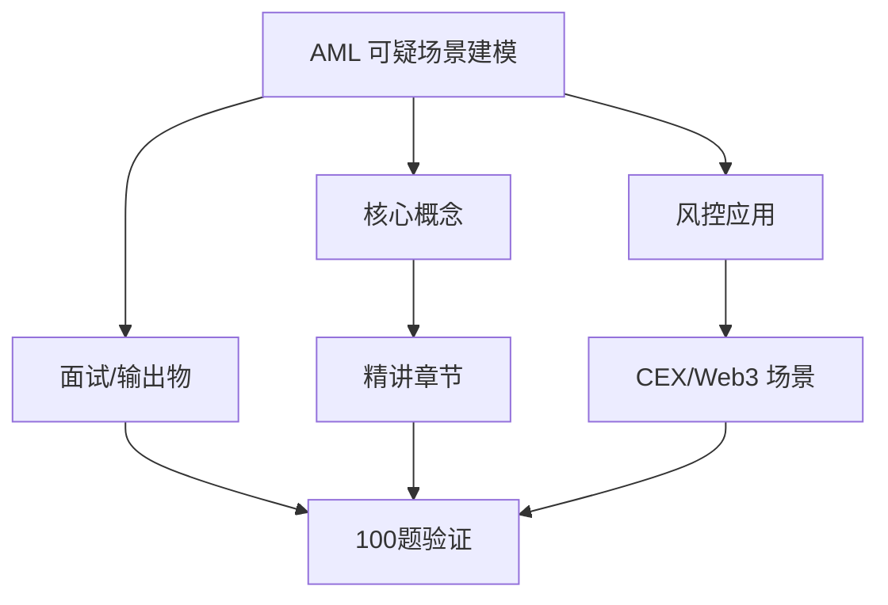
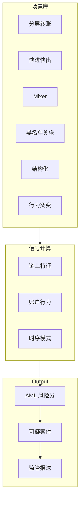
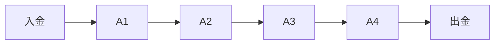

# AML 可疑场景建模 — 系统学习讲义（含答案）

**所属轨道：** 合规 AML / KYC / KYT  
**学习阶段：** ① 先学本节讲义 → ② 再做工作台「学后验证题库」100 题

---

## 如何使用本讲义

1. **第一遍（学习）**：按章节通读「系统精讲」与「分 tier 参考答案」，对照架构图理解，不要跳过答案。
2. **第二遍（笔记）**：在工作台模块详情里记笔记，标记「已沉淀面试素材」。
3. **第三遍（验证）**：关闭讲义，在工作台用「学后验证题库」自测；P0 正确率建议 ≥ 80% 再进入 P1。

---

## 一、学习目标

- 写出 6 类可疑交易模式和对应信号。
- 复盘能力要求：结合分层转账、快速进出、Mixer、黑名单地址。
- 输出物：场景库、信号表

---

## 二、知识体系地图



---

## 三、系统精讲（含答案）

> 以下内容整合模块参考答案，按知识结构编排，**可直接作为学习材料**。

**Track：** 合规 AML / KYC / KYT  
**学习任务：** 写出 6 类可疑交易模式和对应信号。  
**复盘问题：** 结合分层转账、快速进出、Mixer、黑名单地址。

---

## 一、六类可疑模式

| # | 模式 | 描述 | 关键信号 | 风险等级 |
|---|------|------|----------|----------|
| 1 | **分层转账 Layering** | 多跳小额快速转移掩盖来源 | hop>5、单笔均匀拆分、短时间多地址 | 高 |
| 2 | **快进快出** | 充值后极少交易即提现 | 停留时间 < T、金额匹配度高 | 中高 |
| 3 | **Mixer 使用** | 资金进出混币器 | Tornado 等合约交互、前后金额相近 | 高 |
| 4 | **黑名单地址关联** | 与已知盗币/制裁地址 N-hop 内 | 图距离、共同对手方 | 高 |
| 5 | **结构化交易 Smurfing** | 刻意低于申报阈值 | 多笔略低于限额、多子账户 | 中 |
| 6 | **地理/行为突变** | 长期休眠后大额跨境式流转 | IP/VPN 突变 + 大额 + 新地址 | 中 |

### 规则示例（伪代码）

```
IF mixer_interaction AND within_24h(deposit, withdraw) THEN score += 40
IF blacklist_distance <= 2 THEN score += 35
IF peel_chain_detected THEN score += 25
IF score >= 70 THEN create_SAR_case()
```

---

## 二、架构图



### Layering 示意



---

## 三、输出物

- [x] 场景库（6 类）
- [x] 信号表

---

## 四、分优先级参考答案速查（来自 100 题题库）

> 学习阶段可对照阅读；验证阶段请遮住答案自答。

### P0 必考核心（rank 1–20）

### 1. AML 场景：分层转账（1）

**题目：** Layering 模式与 hop 特征。

**参考答案要点：**
- 从业务场景出发，明确「谁、在什么环节、发生什么」
- 列出 2–3 个可检测风险信号或判断依据
- 给出可执行策略动作（拦截/复核/升级/放行）及人工兜底
- 如涉及 Web3，补充链上/CEX/合规语境
- 面试收尾：一个真实或合理虚构的量化结果

### 2. AML 场景：快进快出（2）

**题目：** 停留时间与金额匹配。

**参考答案要点：**
- 从业务场景出发，明确「谁、在什么环节、发生什么」
- 列出 2–3 个可检测风险信号或判断依据
- 给出可执行策略动作（拦截/复核/升级/放行）及人工兜底
- 如涉及 Web3，补充链上/CEX/合规语境
- 面试收尾：一个真实或合理虚构的量化结果

### 3. AML 场景：结构化（3）

**题目：** 略低于阈值的拆分。

**参考答案要点：**
- 从业务场景出发，明确「谁、在什么环节、发生什么」
- 列出 2–3 个可检测风险信号或判断依据
- 给出可执行策略动作（拦截/复核/升级/放行）及人工兜底
- 如涉及 Web3，补充链上/CEX/合规语境
- 面试收尾：一个真实或合理虚构的量化结果

### 4. AML 场景：Mixer 使用（4）

**题目：** 混币前后特征。

**参考答案要点：**
- 从业务场景出发，明确「谁、在什么环节、发生什么」
- 列出 2–3 个可检测风险信号或判断依据
- 给出可执行策略动作（拦截/复核/升级/放行）及人工兜底
- 如涉及 Web3，补充链上/CEX/合规语境
- 面试收尾：一个真实或合理虚构的量化结果

### 5. AML 场景：黑名单（5）

**题目：** 暗网市场关联地址。

**参考答案要点：**
- 从业务场景出发，明确「谁、在什么环节、发生什么」
- 列出 2–3 个可检测风险信号或判断依据
- 给出可执行策略动作（拦截/复核/升级/放行）及人工兜底
- 如涉及 Web3，补充链上/CEX/合规语境
- 面试收尾：一个真实或合理虚构的量化结果

### 6. AML 场景：SAR 报送（6）

**题目：** 可疑活动报告触发条件。

**参考答案要点：**
- 从业务场景出发，明确「谁、在什么环节、发生什么」
- 列出 2–3 个可检测风险信号或判断依据
- 给出可执行策略动作（拦截/复核/升级/放行）及人工兜底
- 如涉及 Web3，补充链上/CEX/合规语境
- 面试收尾：一个真实或合理虚构的量化结果

### 7. AML 场景：场景库（7）

**题目：** 维护 6+ 类可疑场景模板。

**参考答案要点：**
- 从业务场景出发，明确「谁、在什么环节、发生什么」
- 列出 2–3 个可检测风险信号或判断依据
- 给出可执行策略动作（拦截/复核/升级/放行）及人工兜底
- 如涉及 Web3，补充链上/CEX/合规语境
- 面试收尾：一个真实或合理虚构的量化结果

### 8. AML 场景：评分卡（8）

**题目：** AML 分数与人工升级阈值。

**参考答案要点：**
- 从业务场景出发，明确「谁、在什么环节、发生什么」
- 列出 2–3 个可检测风险信号或判断依据
- 给出可执行策略动作（拦截/复核/升级/放行）及人工兜底
- 如涉及 Web3，补充链上/CEX/合规语境
- 面试收尾：一个真实或合理虚构的量化结果

### 9. AML 场景：跨境（9）

**题目：** 多司法辖区规则差异。

**参考答案要点：**
- 从业务场景出发，明确「谁、在什么环节、发生什么」
- 列出 2–3 个可检测风险信号或判断依据
- 给出可执行策略动作（拦截/复核/升级/放行）及人工兜底
- 如涉及 Web3，补充链上/CEX/合规语境
- 面试收尾：一个真实或合理虚构的量化结果

### 10. AML 场景：DeFi 合规（10）

**题目：** 链上匿名性对 KYC 的挑战。

**参考答案要点：**
- 从业务场景出发，明确「谁、在什么环节、发生什么」
- 列出 2–3 个可检测风险信号或判断依据
- 给出可执行策略动作（拦截/复核/升级/放行）及人工兜底
- 如涉及 Web3，补充链上/CEX/合规语境
- 面试收尾：一个真实或合理虚构的量化结果

### 11. AML 场景：分层转账（11）

**题目：** Layering 模式与 hop 特征。

**参考答案要点：**
- 从业务场景出发，明确「谁、在什么环节、发生什么」
- 列出 2–3 个可检测风险信号或判断依据
- 给出可执行策略动作（拦截/复核/升级/放行）及人工兜底
- 如涉及 Web3，补充链上/CEX/合规语境
- 面试收尾：一个真实或合理虚构的量化结果

### 12. AML 场景：快进快出（12）

**题目：** 停留时间与金额匹配。

**参考答案要点：**
- 从业务场景出发，明确「谁、在什么环节、发生什么」
- 列出 2–3 个可检测风险信号或判断依据
- 给出可执行策略动作（拦截/复核/升级/放行）及人工兜底
- 如涉及 Web3，补充链上/CEX/合规语境
- 面试收尾：一个真实或合理虚构的量化结果

### 13. AML 场景：结构化（13）

**题目：** 略低于阈值的拆分。

**参考答案要点：**
- 从业务场景出发，明确「谁、在什么环节、发生什么」
- 列出 2–3 个可检测风险信号或判断依据
- 给出可执行策略动作（拦截/复核/升级/放行）及人工兜底
- 如涉及 Web3，补充链上/CEX/合规语境
- 面试收尾：一个真实或合理虚构的量化结果

### 14. AML 场景：Mixer 使用（14）

**题目：** 混币前后特征。

**参考答案要点：**
- 从业务场景出发，明确「谁、在什么环节、发生什么」
- 列出 2–3 个可检测风险信号或判断依据
- 给出可执行策略动作（拦截/复核/升级/放行）及人工兜底
- 如涉及 Web3，补充链上/CEX/合规语境
- 面试收尾：一个真实或合理虚构的量化结果

### 15. AML 场景：黑名单（15）

**题目：** 暗网市场关联地址。

**参考答案要点：**
- 从业务场景出发，明确「谁、在什么环节、发生什么」
- 列出 2–3 个可检测风险信号或判断依据
- 给出可执行策略动作（拦截/复核/升级/放行）及人工兜底
- 如涉及 Web3，补充链上/CEX/合规语境
- 面试收尾：一个真实或合理虚构的量化结果

### 16. AML 场景：SAR 报送（16）

**题目：** 可疑活动报告触发条件。

**参考答案要点：**
- 从业务场景出发，明确「谁、在什么环节、发生什么」
- 列出 2–3 个可检测风险信号或判断依据
- 给出可执行策略动作（拦截/复核/升级/放行）及人工兜底
- 如涉及 Web3，补充链上/CEX/合规语境
- 面试收尾：一个真实或合理虚构的量化结果

### 17. AML 场景：场景库（17）

**题目：** 维护 6+ 类可疑场景模板。

**参考答案要点：**
- 从业务场景出发，明确「谁、在什么环节、发生什么」
- 列出 2–3 个可检测风险信号或判断依据
- 给出可执行策略动作（拦截/复核/升级/放行）及人工兜底
- 如涉及 Web3，补充链上/CEX/合规语境
- 面试收尾：一个真实或合理虚构的量化结果

### 18. AML 场景：评分卡（18）

**题目：** AML 分数与人工升级阈值。

**参考答案要点：**
- 从业务场景出发，明确「谁、在什么环节、发生什么」
- 列出 2–3 个可检测风险信号或判断依据
- 给出可执行策略动作（拦截/复核/升级/放行）及人工兜底
- 如涉及 Web3，补充链上/CEX/合规语境
- 面试收尾：一个真实或合理虚构的量化结果

### 19. AML 场景：跨境（19）

**题目：** 多司法辖区规则差异。

**参考答案要点：**
- 从业务场景出发，明确「谁、在什么环节、发生什么」
- 列出 2–3 个可检测风险信号或判断依据
- 给出可执行策略动作（拦截/复核/升级/放行）及人工兜底
- 如涉及 Web3，补充链上/CEX/合规语境
- 面试收尾：一个真实或合理虚构的量化结果

### 20. AML 场景：DeFi 合规（20）

**题目：** 链上匿名性对 KYC 的挑战。

**参考答案要点：**
- 从业务场景出发，明确「谁、在什么环节、发生什么」
- 列出 2–3 个可检测风险信号或判断依据
- 给出可执行策略动作（拦截/复核/升级/放行）及人工兜底
- 如涉及 Web3，补充链上/CEX/合规语境
- 面试收尾：一个真实或合理虚构的量化结果


### P1 岗位常用（rank 21–45）精选

### 21. AML 场景：分层转账（21）

**题目：** Layering 模式与 hop 特征。

**参考答案要点：**
- 从业务场景出发，明确「谁、在什么环节、发生什么」
- 列出 2–3 个可检测风险信号或判断依据
- 给出可执行策略动作（拦截/复核/升级/放行）及人工兜底
- 如涉及 Web3，补充链上/CEX/合规语境
- 面试收尾：一个真实或合理虚构的量化结果

### 22. AML 场景：快进快出（22）

**题目：** 停留时间与金额匹配。

**参考答案要点：**
- 从业务场景出发，明确「谁、在什么环节、发生什么」
- 列出 2–3 个可检测风险信号或判断依据
- 给出可执行策略动作（拦截/复核/升级/放行）及人工兜底
- 如涉及 Web3，补充链上/CEX/合规语境
- 面试收尾：一个真实或合理虚构的量化结果

### 23. AML 场景：结构化（23）

**题目：** 略低于阈值的拆分。

**参考答案要点：**
- 从业务场景出发，明确「谁、在什么环节、发生什么」
- 列出 2–3 个可检测风险信号或判断依据
- 给出可执行策略动作（拦截/复核/升级/放行）及人工兜底
- 如涉及 Web3，补充链上/CEX/合规语境
- 面试收尾：一个真实或合理虚构的量化结果

### 24. AML 场景：Mixer 使用（24）

**题目：** 混币前后特征。

**参考答案要点：**
- 从业务场景出发，明确「谁、在什么环节、发生什么」
- 列出 2–3 个可检测风险信号或判断依据
- 给出可执行策略动作（拦截/复核/升级/放行）及人工兜底
- 如涉及 Web3，补充链上/CEX/合规语境
- 面试收尾：一个真实或合理虚构的量化结果

### 25. AML 场景：黑名单（25）

**题目：** 暗网市场关联地址。

**参考答案要点：**
- 从业务场景出发，明确「谁、在什么环节、发生什么」
- 列出 2–3 个可检测风险信号或判断依据
- 给出可执行策略动作（拦截/复核/升级/放行）及人工兜底
- 如涉及 Web3，补充链上/CEX/合规语境
- 面试收尾：一个真实或合理虚构的量化结果

### 26. AML 场景：SAR 报送（26）

**题目：** 可疑活动报告触发条件。

**参考答案要点：**
- 从业务场景出发，明确「谁、在什么环节、发生什么」
- 列出 2–3 个可检测风险信号或判断依据
- 给出可执行策略动作（拦截/复核/升级/放行）及人工兜底
- 如涉及 Web3，补充链上/CEX/合规语境
- 面试收尾：一个真实或合理虚构的量化结果

### 27. AML 场景：场景库（27）

**题目：** 维护 6+ 类可疑场景模板。

**参考答案要点：**
- 从业务场景出发，明确「谁、在什么环节、发生什么」
- 列出 2–3 个可检测风险信号或判断依据
- 给出可执行策略动作（拦截/复核/升级/放行）及人工兜底
- 如涉及 Web3，补充链上/CEX/合规语境
- 面试收尾：一个真实或合理虚构的量化结果

### 28. AML 场景：评分卡（28）

**题目：** AML 分数与人工升级阈值。

**参考答案要点：**
- 从业务场景出发，明确「谁、在什么环节、发生什么」
- 列出 2–3 个可检测风险信号或判断依据
- 给出可执行策略动作（拦截/复核/升级/放行）及人工兜底
- 如涉及 Web3，补充链上/CEX/合规语境
- 面试收尾：一个真实或合理虚构的量化结果

### 29. AML 场景：跨境（29）

**题目：** 多司法辖区规则差异。

**参考答案要点：**
- 从业务场景出发，明确「谁、在什么环节、发生什么」
- 列出 2–3 个可检测风险信号或判断依据
- 给出可执行策略动作（拦截/复核/升级/放行）及人工兜底
- 如涉及 Web3，补充链上/CEX/合规语境
- 面试收尾：一个真实或合理虚构的量化结果

### 30. AML 场景：DeFi 合规（30）

**题目：** 链上匿名性对 KYC 的挑战。

**参考答案要点：**
- 从业务场景出发，明确「谁、在什么环节、发生什么」
- 列出 2–3 个可检测风险信号或判断依据
- 给出可执行策略动作（拦截/复核/升级/放行）及人工兜底
- 如涉及 Web3，补充链上/CEX/合规语境
- 面试收尾：一个真实或合理虚构的量化结果


### P2 / P3 学习说明

- P2（rank 46–75）：30 题，侧重深化理解与系统设计
- P3（rank 76–100）：25 题，侧重扩展场景与边界案例
- 完整题目列表见工作台「学后验证题库」或 `data/questions/compliance-aml/aml-scenarios.json`

---

## 五、100 题验证计划

| 优先级 | rank | 题量 | 建议 |
|--------|------|------|------|
| P0 必考核心 | rank 1–20 | 20 题 | 通读精讲后逐题理解，能口述 |
| P1 岗位常用 | rank 21–45 | 25 题 | 结合大厂项目经验举例 |
| P2 深化理解 | rank 46–75 | 30 题 | 能画架构图或流程图 |
| P3 扩展场景 | rank 76–100 | 25 题 | 了解边界案例与面试加分点 |

**建议节奏：** 每天 P0 5 题 + P1 5 题，约 2 周完成 100 题首轮；错题回到第三节精讲复查。

---

## 六、学后自测清单

- [ ] 能不看答案口述本模块 3 个核心概念
- [ ] 能画 1 张与本模块相关的架构/流程图
- [ ] 能讲 1 个迁移到 Web3 的大厂风控案例
- [ ] 工作台 P0 题自测完成（20 题）
- [ ] 工作台 P1–P3 题按需刷完

---

## 七、下一步

- 打开工作台 → 学习路径 → 本模块 → **学后验证题库（100 题）**
- 参考答案库（简版）：[`notes/answers/compliance-aml/aml-scenarios.md`](../answers/compliance-aml/aml-scenarios.md)
