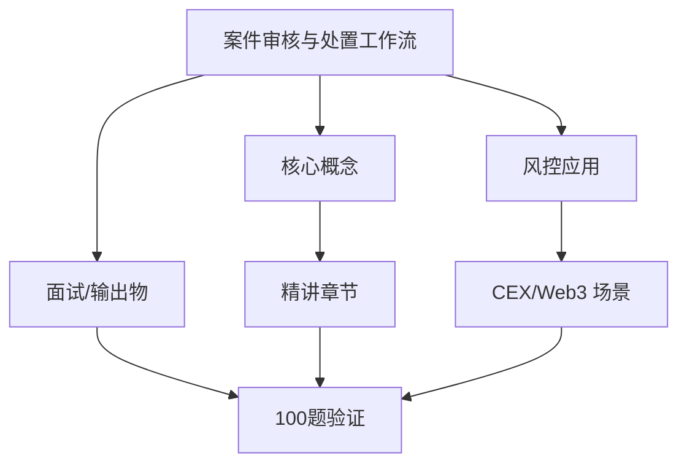
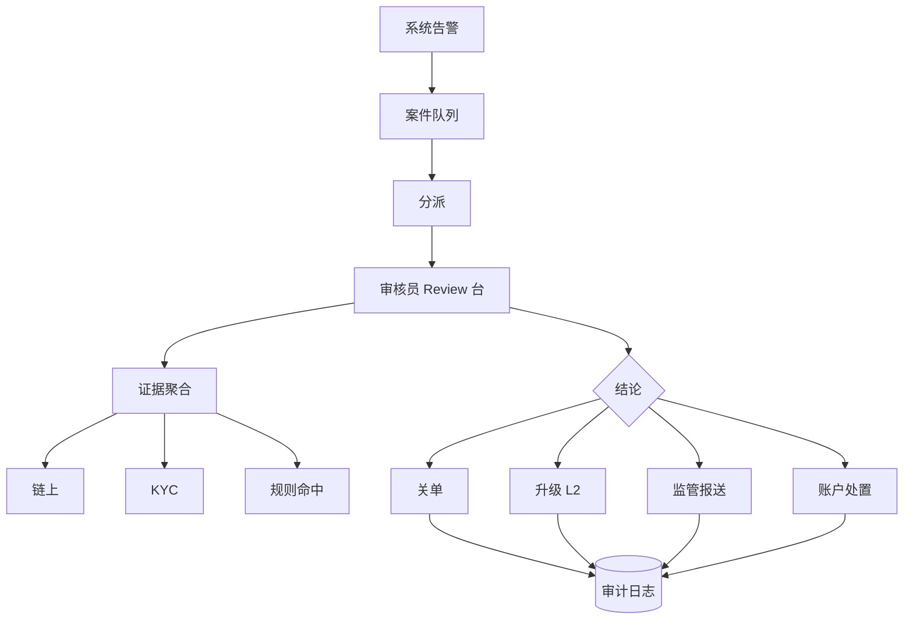
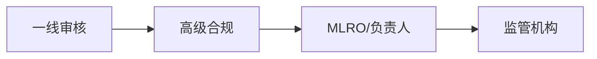

# 案件审核与处置工作流 — 系统学习讲义（含答案）

**所属轨道：** 合规 AML / KYC / KYT  
**学习阶段：** ① 先学本节讲义 → ② 再做工作台「学后验证题库」100 题

---

## 如何使用本讲义

1. **第一遍（学习）**：按章节通读「系统精讲」与「分 tier 参考答案」，对照架构图理解，不要跳过答案。
2. **第二遍（笔记）**：在工作台模块详情里记笔记，标记「已沉淀面试素材」。
3. **第三遍（验证）**：关闭讲义，在工作台用「学后验证题库」自测；P0 正确率建议 ≥ 80% 再进入 P1。

---

## 一、学习目标

- 设计一个合规案件 review 台的字段和操作。
- 复盘能力要求：说明证据、审核结论、升级路径和审计留痕。
- 输出物：Review 台设计、流程图

---

## 二、知识体系地图

---

## 三、系统精讲（含答案）

> 以下内容整合模块参考答案，按知识结构编排，**可直接作为学习材料**。

**Track：** 合规 AML / KYC / KYT  
**学习任务：** 设计一个合规案件 review 台的字段和操作。  
**复盘问题：** 说明证据、审核结论、升级路径和审计留痕。

---

## 一、Review 台核心字段

### 案件头信息

| 字段 | 说明 |
|------|------|
| case_id | 唯一 ID |
| case_type | AML / KYT / 盗币关联 / 制裁 |
| priority | P0–P3 |
| status | OPEN / IN_REVIEW / ESCALATED / CLOSED |
| assignee | 审核员 |
| sla_due | SLA 截止时间 |
| user_id / entity_id | 关联客户 |
| amount_usd | 涉及金额 |
| risk_score | 系统分 |

### 证据面板

- 链上交易列表（hash、from/to、标签、时间）  
- 资金流简图（自动生成）  
- KYC 快照、历史案件  
- 规则命中明细（rule_id、信号、置信度）  
- 用户申诉材料（如有）

### 结论与处置

| 结论 | 后续动作 |
|------|----------|
| FALSE_POSITIVE | 关单 + 白名单建议 |
| SUSPICIOUS | 升级合规官 |
| CONFIRMED | 冻结账户、报送 STR |
| NEED_INFO | 挂起、向用户索取材料 |

**审计**：每次状态变更记录 operator、timestamp、comment、before/after。

---

## 二、架构图

### 升级路径

---

## 三、迁移对照

内容安全 **审核台**（队列、证据、结论、质检）与合规案件台 **同构**；增量是 **链上证据组件** 与 **KYT 图谱嵌入**。

## 四、输出物

- [x] Review 台字段设计
- [x] 流程图

---

## 四、分优先级参考答案速查（来自 100 题题库）

> 学习阶段可对照阅读；验证阶段请遮住答案自答。

### P0 必考核心（rank 1–20）

### 1. 案件审核：案件字段（1）

**题目：** Review 台必备字段清单。

**参考答案要点：**
- 从业务场景出发，明确「谁、在什么环节、发生什么」
- 列出 2–3 个可检测风险信号或判断依据
- 给出可执行策略动作（拦截/复核/升级/放行）及人工兜底
- 如涉及 Web3，补充链上/CEX/合规语境
- 面试收尾：一个真实或合理虚构的量化结果

### 2. 案件审核：证据链（2）

**题目：** 链上证据与链下证据拼接。

**参考答案要点：**
- 从业务场景出发，明确「谁、在什么环节、发生什么」
- 列出 2–3 个可检测风险信号或判断依据
- 给出可执行策略动作（拦截/复核/升级/放行）及人工兜底
- 如涉及 Web3，补充链上/CEX/合规语境
- 面试收尾：一个真实或合理虚构的量化结果

### 3. 案件审核：结论类型（3）

**题目：** 误报、可疑、确认三级。

**参考答案要点：**
- 从业务场景出发，明确「谁、在什么环节、发生什么」
- 列出 2–3 个可检测风险信号或判断依据
- 给出可执行策略动作（拦截/复核/升级/放行）及人工兜底
- 如涉及 Web3，补充链上/CEX/合规语境
- 面试收尾：一个真实或合理虚构的量化结果

### 4. 案件审核：升级路径（4）

**题目：** L1→L2→MLRO。

**参考答案要点：**
- 从业务场景出发，明确「谁、在什么环节、发生什么」
- 列出 2–3 个可检测风险信号或判断依据
- 给出可执行策略动作（拦截/复核/升级/放行）及人工兜底
- 如涉及 Web3，补充链上/CEX/合规语境
- 面试收尾：一个真实或合理虚构的量化结果

### 5. 案件审核：审计日志（5）

**题目：** 不可篡改操作记录。

**参考答案要点：**
- 从业务场景出发，明确「谁、在什么环节、发生什么」
- 列出 2–3 个可检测风险信号或判断依据
- 给出可执行策略动作（拦截/复核/升级/放行）及人工兜底
- 如涉及 Web3，补充链上/CEX/合规语境
- 面试收尾：一个真实或合理虚构的量化结果

### 6. 案件审核：SLA（6）

**题目：** 不同优先级处理时限。

**参考答案要点：**
- 从业务场景出发，明确「谁、在什么环节、发生什么」
- 列出 2–3 个可检测风险信号或判断依据
- 给出可执行策略动作（拦截/复核/升级/放行）及人工兜底
- 如涉及 Web3，补充链上/CEX/合规语境
- 面试收尾：一个真实或合理虚构的量化结果

### 7. 案件审核：协作（7）

**题目：** 风控与合规分工界面。

**参考答案要点：**
- 从业务场景出发，明确「谁、在什么环节、发生什么」
- 列出 2–3 个可检测风险信号或判断依据
- 给出可执行策略动作（拦截/复核/升级/放行）及人工兜底
- 如涉及 Web3，补充链上/CEX/合规语境
- 面试收尾：一个真实或合理虚构的量化结果

### 8. 案件审核：批量结案（8）

**题目：** 误报批量关闭的风险控制。

**参考答案要点：**
- 从业务场景出发，明确「谁、在什么环节、发生什么」
- 列出 2–3 个可检测风险信号或判断依据
- 给出可执行策略动作（拦截/复核/升级/放行）及人工兜底
- 如涉及 Web3，补充链上/CEX/合规语境
- 面试收尾：一个真实或合理虚构的量化结果

### 9. 案件审核：质检（9）

**题目：** 二次抽检比例设计。

**参考答案要点：**
- 从业务场景出发，明确「谁、在什么环节、发生什么」
- 列出 2–3 个可检测风险信号或判断依据
- 给出可执行策略动作（拦截/复核/升级/放行）及人工兜底
- 如涉及 Web3，补充链上/CEX/合规语境
- 面试收尾：一个真实或合理虚构的量化结果

### 10. 案件审核：报表（10）

**题目：** 监管报表从案件系统导出。

**参考答案要点：**
- 从业务场景出发，明确「谁、在什么环节、发生什么」
- 列出 2–3 个可检测风险信号或判断依据
- 给出可执行策略动作（拦截/复核/升级/放行）及人工兜底
- 如涉及 Web3，补充链上/CEX/合规语境
- 面试收尾：一个真实或合理虚构的量化结果

### 11. 案件审核：案件字段（11）

**题目：** Review 台必备字段清单。

**参考答案要点：**
- 从业务场景出发，明确「谁、在什么环节、发生什么」
- 列出 2–3 个可检测风险信号或判断依据
- 给出可执行策略动作（拦截/复核/升级/放行）及人工兜底
- 如涉及 Web3，补充链上/CEX/合规语境
- 面试收尾：一个真实或合理虚构的量化结果

### 12. 案件审核：证据链（12）

**题目：** 链上证据与链下证据拼接。

**参考答案要点：**
- 从业务场景出发，明确「谁、在什么环节、发生什么」
- 列出 2–3 个可检测风险信号或判断依据
- 给出可执行策略动作（拦截/复核/升级/放行）及人工兜底
- 如涉及 Web3，补充链上/CEX/合规语境
- 面试收尾：一个真实或合理虚构的量化结果

### 13. 案件审核：结论类型（13）

**题目：** 误报、可疑、确认三级。

**参考答案要点：**
- 从业务场景出发，明确「谁、在什么环节、发生什么」
- 列出 2–3 个可检测风险信号或判断依据
- 给出可执行策略动作（拦截/复核/升级/放行）及人工兜底
- 如涉及 Web3，补充链上/CEX/合规语境
- 面试收尾：一个真实或合理虚构的量化结果

### 14. 案件审核：升级路径（14）

**题目：** L1→L2→MLRO。

**参考答案要点：**
- 从业务场景出发，明确「谁、在什么环节、发生什么」
- 列出 2–3 个可检测风险信号或判断依据
- 给出可执行策略动作（拦截/复核/升级/放行）及人工兜底
- 如涉及 Web3，补充链上/CEX/合规语境
- 面试收尾：一个真实或合理虚构的量化结果

### 15. 案件审核：审计日志（15）

**题目：** 不可篡改操作记录。

**参考答案要点：**
- 从业务场景出发，明确「谁、在什么环节、发生什么」
- 列出 2–3 个可检测风险信号或判断依据
- 给出可执行策略动作（拦截/复核/升级/放行）及人工兜底
- 如涉及 Web3，补充链上/CEX/合规语境
- 面试收尾：一个真实或合理虚构的量化结果

### 16. 案件审核：SLA（16）

**题目：** 不同优先级处理时限。

**参考答案要点：**
- 从业务场景出发，明确「谁、在什么环节、发生什么」
- 列出 2–3 个可检测风险信号或判断依据
- 给出可执行策略动作（拦截/复核/升级/放行）及人工兜底
- 如涉及 Web3，补充链上/CEX/合规语境
- 面试收尾：一个真实或合理虚构的量化结果

### 17. 案件审核：协作（17）

**题目：** 风控与合规分工界面。

**参考答案要点：**
- 从业务场景出发，明确「谁、在什么环节、发生什么」
- 列出 2–3 个可检测风险信号或判断依据
- 给出可执行策略动作（拦截/复核/升级/放行）及人工兜底
- 如涉及 Web3，补充链上/CEX/合规语境
- 面试收尾：一个真实或合理虚构的量化结果

### 18. 案件审核：批量结案（18）

**题目：** 误报批量关闭的风险控制。

**参考答案要点：**
- 从业务场景出发，明确「谁、在什么环节、发生什么」
- 列出 2–3 个可检测风险信号或判断依据
- 给出可执行策略动作（拦截/复核/升级/放行）及人工兜底
- 如涉及 Web3，补充链上/CEX/合规语境
- 面试收尾：一个真实或合理虚构的量化结果

### 19. 案件审核：质检（19）

**题目：** 二次抽检比例设计。

**参考答案要点：**
- 从业务场景出发，明确「谁、在什么环节、发生什么」
- 列出 2–3 个可检测风险信号或判断依据
- 给出可执行策略动作（拦截/复核/升级/放行）及人工兜底
- 如涉及 Web3，补充链上/CEX/合规语境
- 面试收尾：一个真实或合理虚构的量化结果

### 20. 案件审核：报表（20）

**题目：** 监管报表从案件系统导出。

**参考答案要点：**
- 从业务场景出发，明确「谁、在什么环节、发生什么」
- 列出 2–3 个可检测风险信号或判断依据
- 给出可执行策略动作（拦截/复核/升级/放行）及人工兜底
- 如涉及 Web3，补充链上/CEX/合规语境
- 面试收尾：一个真实或合理虚构的量化结果

### P1 岗位常用（rank 21–45）精选

### 21. 案件审核：案件字段（21）

**题目：** Review 台必备字段清单。

**参考答案要点：**
- 从业务场景出发，明确「谁、在什么环节、发生什么」
- 列出 2–3 个可检测风险信号或判断依据
- 给出可执行策略动作（拦截/复核/升级/放行）及人工兜底
- 如涉及 Web3，补充链上/CEX/合规语境
- 面试收尾：一个真实或合理虚构的量化结果

### 22. 案件审核：证据链（22）

**题目：** 链上证据与链下证据拼接。

**参考答案要点：**
- 从业务场景出发，明确「谁、在什么环节、发生什么」
- 列出 2–3 个可检测风险信号或判断依据
- 给出可执行策略动作（拦截/复核/升级/放行）及人工兜底
- 如涉及 Web3，补充链上/CEX/合规语境
- 面试收尾：一个真实或合理虚构的量化结果

### 23. 案件审核：结论类型（23）

**题目：** 误报、可疑、确认三级。

**参考答案要点：**
- 从业务场景出发，明确「谁、在什么环节、发生什么」
- 列出 2–3 个可检测风险信号或判断依据
- 给出可执行策略动作（拦截/复核/升级/放行）及人工兜底
- 如涉及 Web3，补充链上/CEX/合规语境
- 面试收尾：一个真实或合理虚构的量化结果

### 24. 案件审核：升级路径（24）

**题目：** L1→L2→MLRO。

**参考答案要点：**
- 从业务场景出发，明确「谁、在什么环节、发生什么」
- 列出 2–3 个可检测风险信号或判断依据
- 给出可执行策略动作（拦截/复核/升级/放行）及人工兜底
- 如涉及 Web3，补充链上/CEX/合规语境
- 面试收尾：一个真实或合理虚构的量化结果

### 25. 案件审核：审计日志（25）

**题目：** 不可篡改操作记录。

**参考答案要点：**
- 从业务场景出发，明确「谁、在什么环节、发生什么」
- 列出 2–3 个可检测风险信号或判断依据
- 给出可执行策略动作（拦截/复核/升级/放行）及人工兜底
- 如涉及 Web3，补充链上/CEX/合规语境
- 面试收尾：一个真实或合理虚构的量化结果

### 26. 案件审核：SLA（26）

**题目：** 不同优先级处理时限。

**参考答案要点：**
- 从业务场景出发，明确「谁、在什么环节、发生什么」
- 列出 2–3 个可检测风险信号或判断依据
- 给出可执行策略动作（拦截/复核/升级/放行）及人工兜底
- 如涉及 Web3，补充链上/CEX/合规语境
- 面试收尾：一个真实或合理虚构的量化结果

### 27. 案件审核：协作（27）

**题目：** 风控与合规分工界面。

**参考答案要点：**
- 从业务场景出发，明确「谁、在什么环节、发生什么」
- 列出 2–3 个可检测风险信号或判断依据
- 给出可执行策略动作（拦截/复核/升级/放行）及人工兜底
- 如涉及 Web3，补充链上/CEX/合规语境
- 面试收尾：一个真实或合理虚构的量化结果

### 28. 案件审核：批量结案（28）

**题目：** 误报批量关闭的风险控制。

**参考答案要点：**
- 从业务场景出发，明确「谁、在什么环节、发生什么」
- 列出 2–3 个可检测风险信号或判断依据
- 给出可执行策略动作（拦截/复核/升级/放行）及人工兜底
- 如涉及 Web3，补充链上/CEX/合规语境
- 面试收尾：一个真实或合理虚构的量化结果

### 29. 案件审核：质检（29）

**题目：** 二次抽检比例设计。

**参考答案要点：**
- 从业务场景出发，明确「谁、在什么环节、发生什么」
- 列出 2–3 个可检测风险信号或判断依据
- 给出可执行策略动作（拦截/复核/升级/放行）及人工兜底
- 如涉及 Web3，补充链上/CEX/合规语境
- 面试收尾：一个真实或合理虚构的量化结果

### 30. 案件审核：报表（30）

**题目：** 监管报表从案件系统导出。

**参考答案要点：**
- 从业务场景出发，明确「谁、在什么环节、发生什么」
- 列出 2–3 个可检测风险信号或判断依据
- 给出可执行策略动作（拦截/复核/升级/放行）及人工兜底
- 如涉及 Web3，补充链上/CEX/合规语境
- 面试收尾：一个真实或合理虚构的量化结果

### P2 / P3 学习说明

- P2（rank 46–75）：30 题，侧重深化理解与系统设计
- P3（rank 76–100）：25 题，侧重扩展场景与边界案例
- 完整题目列表见工作台「学后验证题库」或 `data/questions/compliance-aml/case-review.json`

---

## 五、100 题验证计划

| 优先级 | rank | 题量 | 建议 |
|--------|------|------|------|
| P0 必考核心 | rank 1–20 | 20 题 | 通读精讲后逐题理解，能口述 |
| P1 岗位常用 | rank 21–45 | 25 题 | 结合大厂项目经验举例 |
| P2 深化理解 | rank 46–75 | 30 题 | 能画架构图或流程图 |
| P3 扩展场景 | rank 76–100 | 25 题 | 了解边界案例与面试加分点 |

**建议节奏：** 每天 P0 5 题 + P1 5 题，约 2 周完成 100 题首轮；错题回到第三节精讲复查。

---

## 六、学后自测清单

- [ ] 能不看答案口述本模块 3 个核心概念
- [ ] 能画 1 张与本模块相关的架构/流程图
- [ ] 能讲 1 个迁移到 Web3 的大厂风控案例
- [ ] 工作台 P0 题自测完成（20 题）
- [ ] 工作台 P1–P3 题按需刷完

---

## 七、下一步

- 打开工作台 → 学习路径 → 本模块 → **学后验证题库（100 题）**
- 参考答案库（简版）：[`notes/answers/compliance-aml/case-review.md`](../answers/compliance-aml/case-review.md)
