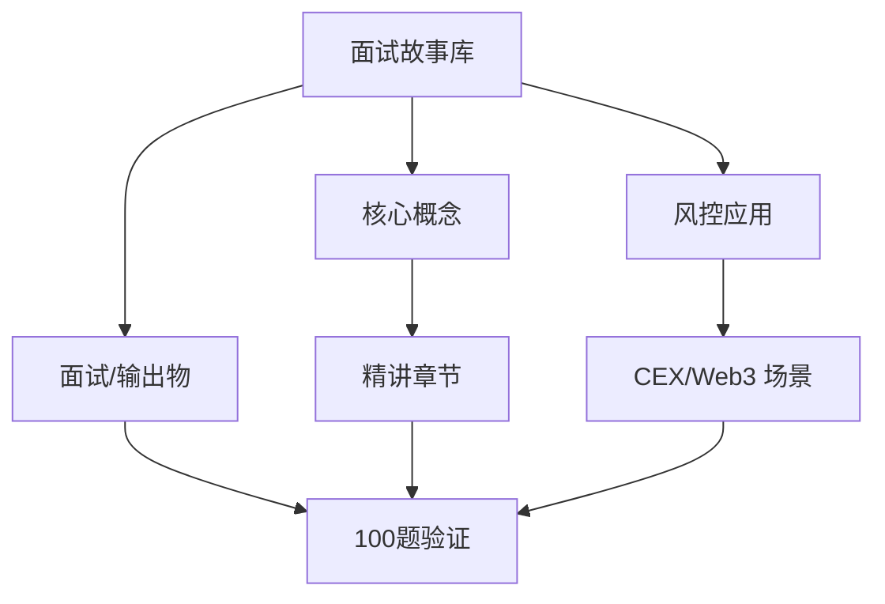
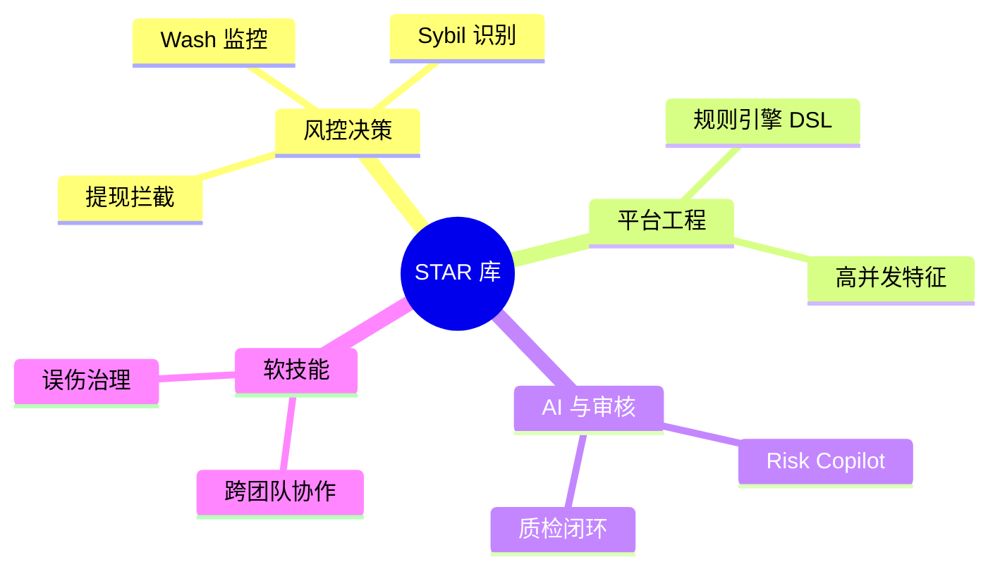
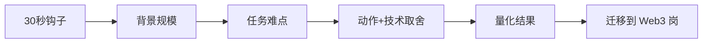

# 面试故事库 — 系统学习讲义（含答案）

**所属轨道：** 作品集与求职转化  
**学习阶段：** ① 先学本节讲义 → ② 再做工作台「学后验证题库」100 题

---

## 如何使用本讲义

1. **第一遍（学习）**：按章节通读「系统精讲」与「分 tier 参考答案」，对照架构图理解，不要跳过答案。
2. **第二遍（笔记）**：在工作台模块详情里记笔记，标记「已沉淀面试素材」。
3. **第三遍（验证）**：关闭讲义，在工作台用「学后验证题库」自测；P0 正确率建议 ≥ 80% 再进入 P1。

---

## 一、学习目标

- 沉淀 8 个 STAR 案例，覆盖风控、内容安全、AI Agent 和系统设计。
- 复盘能力要求：说明背景、动作、技术取舍、结果和可迁移价值。
- 输出物：8 个 STAR、讲述提纲

---

## 二、知识体系地图

---

## 三、系统精讲（含答案）

> 以下内容整合模块参考答案，按知识结构编排，**可直接作为学习材料**。

**Track：** 作品集与求职转化  
**学习任务：** 沉淀 8 个 STAR 案例，覆盖风控、内容安全、AI Agent 和系统设计。  
**复盘问题：** 说明背景、动作、技术取舍、结果和可迁移价值。

---

## 一、8 个 STAR 案例提纲

### 1. 提现/交易高峰风控（阿里系）

- **S**：大促峰值，提现/交易 QPS 翻数倍，误伤投诉上升  
- **T**：在不扩人力前提下保稳定、降资损  
- **A**：分级规则、动态阈值、异步复核队列、热点账户缓存特征  
- **R**：拦截率↑、误伤↓、P99 延迟达标  
- **迁移**：= CEX 提现风控链路设计经验

### 2. 活动 Sybil 团伙识别（小红书/阿里）

- **S**：活动套利团伙多账号刷奖励  
- **T**：识别团伙并控制资损  
- **A**：设备+行为序列相似度+资金归集图；T+1 聚类回扫  
- **R**：追回/阻断金额，规则沉淀 20+ 条  
- **迁移**：= Web3 空投 Sybil 方案

### 3. 内容安全机审+人审协同

- **S**：违规内容变种快，纯人工跟不上  
- **T**：提升审核效率与一致性  
- **A**：多模型 ensemble、优先级队列、质检回流  
- **R**：人效提升 X%，漏放率下降  
- **迁移**：= 合规案件 Review 台与 SLA

### 4. AI 辅助审核/agent 试点

- **S**：审核员需快速理解长上下文案件  
- **T**：引入 AI 但不增加幻觉风险  
- **A**：RAG 限定知识库、仅草稿建议、人工必审、全量审计  
- **R**：单案处理时长下降，质检通过率上升  
- **迁移**：= Risk Copilot 护栏设计

### 5. 规则引擎架构升级

- **S**：规则硬编码，发布慢，冲突难排查  
- **T**：可配置、可灰度、可解释  
- **A**：DSL + 优先级 + 仿真回放 + 影子模式  
- **R**：规则上线从周级到天级  
- **迁移**：= Crypto 提现规则引擎作品集

### 6. 误伤申诉与闭环

- **S**：误拦截引发客诉与监管关注风险  
- **T**：建立可信申诉与策略回写  
- **A**：申诉工单、证据上传、白名单策略、规则降级审批  
- **R**：申诉 SLA、复犯率下降  
- **迁移**：= KYT 误伤处理 SOP

### 7. 跨团队协作（风控+产品+法务）

- **S**：新上业务线风控方案争议  
- **T**：平衡体验与安全  
- **A**：风险评审模板、灰度指标、联合 sign-off  
- **R**：业务上线零重大资损事件  
- **迁移**：= 合规/风控/产品三角协作

### 8. Web3 转型作品集（个人）

- **S**：目标 Web3 Risk AI 岗，缺乏 on-chain 项目  
- **T**：3 个月内建立可演示证据  
- **A**：链上看板 + 规则引擎 MVP + Dify Agent；系统学习 6 Track  
- **R**：完成 Demo 与文档，获面试反馈（待填）  
- **迁移**：展示主动性与学习曲线

---

## 二、架构图：故事 → 岗位能力

### 面试讲述流程

---

## 三、讲述模板（2 分钟）

> 【钩子】我在小红书/阿里负责 XX，峰值日决策 X 万笔。  
> 【难点】问题是 …  
> 【动作】我做了 …（技术：规则/图/Agent）  
> 【结果】指标 …  
> 【迁移】这套方法在 Crypto 场景对应 …

## 四、输出物

- [x] 8 个 STAR 提纲
- [ ] 每个扩展为完整 2 分钟稿并录音练习

---

## 四、分优先级参考答案速查（来自 100 题题库）

> 学习阶段可对照阅读；验证阶段请遮住答案自答。

### P0 必考核心（rank 1–20）

### 1. 面试故事：提现峰值（1）

**题目：** 大促提现风控 STAR。

**参考答案要点：**
- 从业务场景出发，明确「谁、在什么环节、发生什么」
- 列出 2–3 个可检测风险信号或判断依据
- 给出可执行策略动作（拦截/复核/升级/放行）及人工兜底
- 如涉及 Web3，补充链上/CEX/合规语境
- 面试收尾：一个真实或合理虚构的量化结果

### 2. 面试故事：活动 Sybil（2）

**题目：** 多账号团伙识别 STAR。

**参考答案要点：**
- 从业务场景出发，明确「谁、在什么环节、发生什么」
- 列出 2–3 个可检测风险信号或判断依据
- 给出可执行策略动作（拦截/复核/升级/放行）及人工兜底
- 如涉及 Web3，补充链上/CEX/合规语境
- 面试收尾：一个真实或合理虚构的量化结果

### 3. 面试故事：内容审核（3）

**题目：** 机审+人审 STAR。

**参考答案要点：**
- 从业务场景出发，明确「谁、在什么环节、发生什么」
- 列出 2–3 个可检测风险信号或判断依据
- 给出可执行策略动作（拦截/复核/升级/放行）及人工兜底
- 如涉及 Web3，补充链上/CEX/合规语境
- 面试收尾：一个真实或合理虚构的量化结果

### 4. 面试故事：AI 试点（4）

**题目：** Agent 辅助调查 STAR。

**参考答案要点：**
- 从业务场景出发，明确「谁、在什么环节、发生什么」
- 列出 2–3 个可检测风险信号或判断依据
- 给出可执行策略动作（拦截/复核/升级/放行）及人工兜底
- 如涉及 Web3，补充链上/CEX/合规语境
- 面试收尾：一个真实或合理虚构的量化结果

### 5. 面试故事：规则引擎（5）

**题目：** DSL 升级 STAR。

**参考答案要点：**
- 从业务场景出发，明确「谁、在什么环节、发生什么」
- 列出 2–3 个可检测风险信号或判断依据
- 给出可执行策略动作（拦截/复核/升级/放行）及人工兜底
- 如涉及 Web3，补充链上/CEX/合规语境
- 面试收尾：一个真实或合理虚构的量化结果

### 6. 面试故事：误伤治理（6）

**题目：** 申诉闭环 STAR。

**参考答案要点：**
- 从业务场景出发，明确「谁、在什么环节、发生什么」
- 列出 2–3 个可检测风险信号或判断依据
- 给出可执行策略动作（拦截/复核/升级/放行）及人工兜底
- 如涉及 Web3，补充链上/CEX/合规语境
- 面试收尾：一个真实或合理虚构的量化结果

### 7. 面试故事：跨团队协作（7）

**题目：** 风控+产品+法务 STAR。

**参考答案要点：**
- 从业务场景出发，明确「谁、在什么环节、发生什么」
- 列出 2–3 个可检测风险信号或判断依据
- 给出可执行策略动作（拦截/复核/升级/放行）及人工兜底
- 如涉及 Web3，补充链上/CEX/合规语境
- 面试收尾：一个真实或合理虚构的量化结果

### 8. 面试故事：转型项目（8）

**题目：** Web3 学习作品集 STAR。

**参考答案要点：**
- 从业务场景出发，明确「谁、在什么环节、发生什么」
- 列出 2–3 个可检测风险信号或判断依据
- 给出可执行策略动作（拦截/复核/升级/放行）及人工兜底
- 如涉及 Web3，补充链上/CEX/合规语境
- 面试收尾：一个真实或合理虚构的量化结果

### 9. 面试故事：2 分钟版（9）

**题目：** 每个故事压缩口播稿。

**参考答案要点：**
- 从业务场景出发，明确「谁、在什么环节、发生什么」
- 列出 2–3 个可检测风险信号或判断依据
- 给出可执行策略动作（拦截/复核/升级/放行）及人工兜底
- 如涉及 Web3，补充链上/CEX/合规语境
- 面试收尾：一个真实或合理虚构的量化结果

### 10. 面试故事：技术取舍（10）

**题目：** 每个故事一条取舍亮点。

**参考答案要点：**
- 从业务场景出发，明确「谁、在什么环节、发生什么」
- 列出 2–3 个可检测风险信号或判断依据
- 给出可执行策略动作（拦截/复核/升级/放行）及人工兜底
- 如涉及 Web3，补充链上/CEX/合规语境
- 面试收尾：一个真实或合理虚构的量化结果

### 11. 面试故事：提现峰值（11）

**题目：** 大促提现风控 STAR。

**参考答案要点：**
- 从业务场景出发，明确「谁、在什么环节、发生什么」
- 列出 2–3 个可检测风险信号或判断依据
- 给出可执行策略动作（拦截/复核/升级/放行）及人工兜底
- 如涉及 Web3，补充链上/CEX/合规语境
- 面试收尾：一个真实或合理虚构的量化结果

### 12. 面试故事：活动 Sybil（12）

**题目：** 多账号团伙识别 STAR。

**参考答案要点：**
- 从业务场景出发，明确「谁、在什么环节、发生什么」
- 列出 2–3 个可检测风险信号或判断依据
- 给出可执行策略动作（拦截/复核/升级/放行）及人工兜底
- 如涉及 Web3，补充链上/CEX/合规语境
- 面试收尾：一个真实或合理虚构的量化结果

### 13. 面试故事：内容审核（13）

**题目：** 机审+人审 STAR。

**参考答案要点：**
- 从业务场景出发，明确「谁、在什么环节、发生什么」
- 列出 2–3 个可检测风险信号或判断依据
- 给出可执行策略动作（拦截/复核/升级/放行）及人工兜底
- 如涉及 Web3，补充链上/CEX/合规语境
- 面试收尾：一个真实或合理虚构的量化结果

### 14. 面试故事：AI 试点（14）

**题目：** Agent 辅助调查 STAR。

**参考答案要点：**
- 从业务场景出发，明确「谁、在什么环节、发生什么」
- 列出 2–3 个可检测风险信号或判断依据
- 给出可执行策略动作（拦截/复核/升级/放行）及人工兜底
- 如涉及 Web3，补充链上/CEX/合规语境
- 面试收尾：一个真实或合理虚构的量化结果

### 15. 面试故事：规则引擎（15）

**题目：** DSL 升级 STAR。

**参考答案要点：**
- 从业务场景出发，明确「谁、在什么环节、发生什么」
- 列出 2–3 个可检测风险信号或判断依据
- 给出可执行策略动作（拦截/复核/升级/放行）及人工兜底
- 如涉及 Web3，补充链上/CEX/合规语境
- 面试收尾：一个真实或合理虚构的量化结果

### 16. 面试故事：误伤治理（16）

**题目：** 申诉闭环 STAR。

**参考答案要点：**
- 从业务场景出发，明确「谁、在什么环节、发生什么」
- 列出 2–3 个可检测风险信号或判断依据
- 给出可执行策略动作（拦截/复核/升级/放行）及人工兜底
- 如涉及 Web3，补充链上/CEX/合规语境
- 面试收尾：一个真实或合理虚构的量化结果

### 17. 面试故事：跨团队协作（17）

**题目：** 风控+产品+法务 STAR。

**参考答案要点：**
- 从业务场景出发，明确「谁、在什么环节、发生什么」
- 列出 2–3 个可检测风险信号或判断依据
- 给出可执行策略动作（拦截/复核/升级/放行）及人工兜底
- 如涉及 Web3，补充链上/CEX/合规语境
- 面试收尾：一个真实或合理虚构的量化结果

### 18. 面试故事：转型项目（18）

**题目：** Web3 学习作品集 STAR。

**参考答案要点：**
- 从业务场景出发，明确「谁、在什么环节、发生什么」
- 列出 2–3 个可检测风险信号或判断依据
- 给出可执行策略动作（拦截/复核/升级/放行）及人工兜底
- 如涉及 Web3，补充链上/CEX/合规语境
- 面试收尾：一个真实或合理虚构的量化结果

### 19. 面试故事：2 分钟版（19）

**题目：** 每个故事压缩口播稿。

**参考答案要点：**
- 从业务场景出发，明确「谁、在什么环节、发生什么」
- 列出 2–3 个可检测风险信号或判断依据
- 给出可执行策略动作（拦截/复核/升级/放行）及人工兜底
- 如涉及 Web3，补充链上/CEX/合规语境
- 面试收尾：一个真实或合理虚构的量化结果

### 20. 面试故事：技术取舍（20）

**题目：** 每个故事一条取舍亮点。

**参考答案要点：**
- 从业务场景出发，明确「谁、在什么环节、发生什么」
- 列出 2–3 个可检测风险信号或判断依据
- 给出可执行策略动作（拦截/复核/升级/放行）及人工兜底
- 如涉及 Web3，补充链上/CEX/合规语境
- 面试收尾：一个真实或合理虚构的量化结果

### P1 岗位常用（rank 21–45）精选

### 21. 面试故事：提现峰值（21）

**题目：** 大促提现风控 STAR。

**参考答案要点：**
- 从业务场景出发，明确「谁、在什么环节、发生什么」
- 列出 2–3 个可检测风险信号或判断依据
- 给出可执行策略动作（拦截/复核/升级/放行）及人工兜底
- 如涉及 Web3，补充链上/CEX/合规语境
- 面试收尾：一个真实或合理虚构的量化结果

### 22. 面试故事：活动 Sybil（22）

**题目：** 多账号团伙识别 STAR。

**参考答案要点：**
- 从业务场景出发，明确「谁、在什么环节、发生什么」
- 列出 2–3 个可检测风险信号或判断依据
- 给出可执行策略动作（拦截/复核/升级/放行）及人工兜底
- 如涉及 Web3，补充链上/CEX/合规语境
- 面试收尾：一个真实或合理虚构的量化结果

### 23. 面试故事：内容审核（23）

**题目：** 机审+人审 STAR。

**参考答案要点：**
- 从业务场景出发，明确「谁、在什么环节、发生什么」
- 列出 2–3 个可检测风险信号或判断依据
- 给出可执行策略动作（拦截/复核/升级/放行）及人工兜底
- 如涉及 Web3，补充链上/CEX/合规语境
- 面试收尾：一个真实或合理虚构的量化结果

### 24. 面试故事：AI 试点（24）

**题目：** Agent 辅助调查 STAR。

**参考答案要点：**
- 从业务场景出发，明确「谁、在什么环节、发生什么」
- 列出 2–3 个可检测风险信号或判断依据
- 给出可执行策略动作（拦截/复核/升级/放行）及人工兜底
- 如涉及 Web3，补充链上/CEX/合规语境
- 面试收尾：一个真实或合理虚构的量化结果

### 25. 面试故事：规则引擎（25）

**题目：** DSL 升级 STAR。

**参考答案要点：**
- 从业务场景出发，明确「谁、在什么环节、发生什么」
- 列出 2–3 个可检测风险信号或判断依据
- 给出可执行策略动作（拦截/复核/升级/放行）及人工兜底
- 如涉及 Web3，补充链上/CEX/合规语境
- 面试收尾：一个真实或合理虚构的量化结果

### 26. 面试故事：误伤治理（26）

**题目：** 申诉闭环 STAR。

**参考答案要点：**
- 从业务场景出发，明确「谁、在什么环节、发生什么」
- 列出 2–3 个可检测风险信号或判断依据
- 给出可执行策略动作（拦截/复核/升级/放行）及人工兜底
- 如涉及 Web3，补充链上/CEX/合规语境
- 面试收尾：一个真实或合理虚构的量化结果

### 27. 面试故事：跨团队协作（27）

**题目：** 风控+产品+法务 STAR。

**参考答案要点：**
- 从业务场景出发，明确「谁、在什么环节、发生什么」
- 列出 2–3 个可检测风险信号或判断依据
- 给出可执行策略动作（拦截/复核/升级/放行）及人工兜底
- 如涉及 Web3，补充链上/CEX/合规语境
- 面试收尾：一个真实或合理虚构的量化结果

### 28. 面试故事：转型项目（28）

**题目：** Web3 学习作品集 STAR。

**参考答案要点：**
- 从业务场景出发，明确「谁、在什么环节、发生什么」
- 列出 2–3 个可检测风险信号或判断依据
- 给出可执行策略动作（拦截/复核/升级/放行）及人工兜底
- 如涉及 Web3，补充链上/CEX/合规语境
- 面试收尾：一个真实或合理虚构的量化结果

### 29. 面试故事：2 分钟版（29）

**题目：** 每个故事压缩口播稿。

**参考答案要点：**
- 从业务场景出发，明确「谁、在什么环节、发生什么」
- 列出 2–3 个可检测风险信号或判断依据
- 给出可执行策略动作（拦截/复核/升级/放行）及人工兜底
- 如涉及 Web3，补充链上/CEX/合规语境
- 面试收尾：一个真实或合理虚构的量化结果

### 30. 面试故事：技术取舍（30）

**题目：** 每个故事一条取舍亮点。

**参考答案要点：**
- 从业务场景出发，明确「谁、在什么环节、发生什么」
- 列出 2–3 个可检测风险信号或判断依据
- 给出可执行策略动作（拦截/复核/升级/放行）及人工兜底
- 如涉及 Web3，补充链上/CEX/合规语境
- 面试收尾：一个真实或合理虚构的量化结果

### P2 / P3 学习说明

- P2（rank 46–75）：30 题，侧重深化理解与系统设计
- P3（rank 76–100）：25 题，侧重扩展场景与边界案例
- 完整题目列表见工作台「学后验证题库」或 `data/questions/portfolio-career/interview-stories.json`

---

## 五、100 题验证计划

| 优先级 | rank | 题量 | 建议 |
|--------|------|------|------|
| P0 必考核心 | rank 1–20 | 20 题 | 通读精讲后逐题理解，能口述 |
| P1 岗位常用 | rank 21–45 | 25 题 | 结合大厂项目经验举例 |
| P2 深化理解 | rank 46–75 | 30 题 | 能画架构图或流程图 |
| P3 扩展场景 | rank 76–100 | 25 题 | 了解边界案例与面试加分点 |

**建议节奏：** 每天 P0 5 题 + P1 5 题，约 2 周完成 100 题首轮；错题回到第三节精讲复查。

---

## 六、学后自测清单

- [ ] 能不看答案口述本模块 3 个核心概念
- [ ] 能画 1 张与本模块相关的架构/流程图
- [ ] 能讲 1 个迁移到 Web3 的大厂风控案例
- [ ] 工作台 P0 题自测完成（20 题）
- [ ] 工作台 P1–P3 题按需刷完

---

## 七、下一步

- 打开工作台 → 学习路径 → 本模块 → **学后验证题库（100 题）**
- 参考答案库（简版）：[`notes/answers/portfolio-career/interview-stories.md`](../answers/portfolio-career/interview-stories.md)
