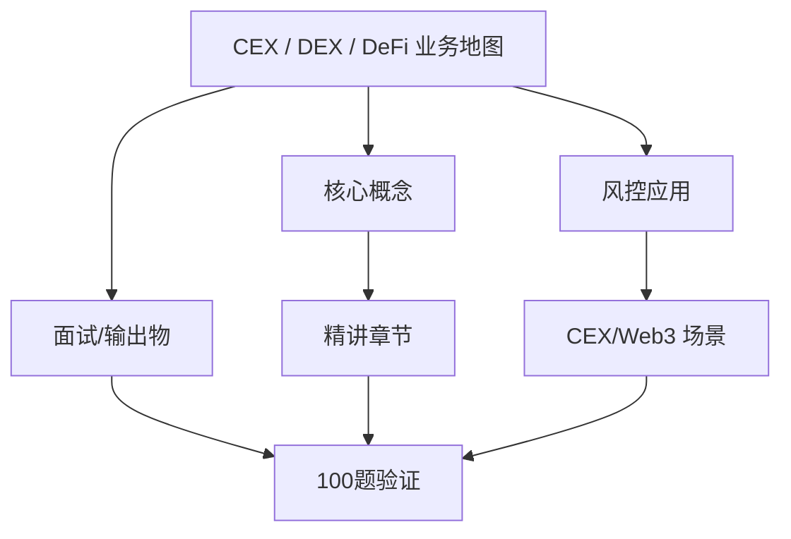
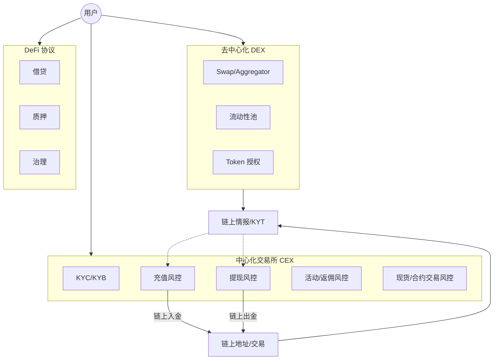
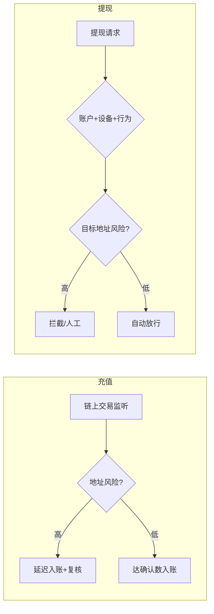

# CEX / DEX / DeFi 业务地图 — 系统学习讲义（含答案）

**所属轨道：** Web3 基础与交易所语境  
**学习阶段：** ① 先学本节讲义 → ② 再做工作台「学后验证题库」100 题

---

## 如何使用本讲义

1. **第一遍（学习）**：按章节通读「系统精讲」与「分 tier 参考答案」，对照架构图理解，不要跳过答案。
2. **第二遍（笔记）**：在工作台模块详情里记笔记，标记「已沉淀面试素材」。
3. **第三遍（验证）**：关闭讲义，在工作台用「学后验证题库」自测；P0 正确率建议 ≥ 80% 再进入 P1。

---

## 一、学习目标

- 对比 CEX 充值提现风控与 DEX 交易风险的差异。
- 复盘能力要求：说明中心化账户风控和链上协议风险的边界。
- 输出物：业务地图、系统设计草图

---

## 二、知识体系地图

---

## 三、系统精讲（含答案）

> 以下内容整合模块参考答案，按知识结构编排，**可直接作为学习材料**。

**Track：** Web3 基础与交易所语境  
**学习任务：** 对比 CEX 充值提现风控与 DEX 交易风险的差异。  
**复盘问题：** 说明中心化账户风控和链上协议风险的边界。

---

## 一、完整解答

### 1.1 三类业态一句话

| 业态 | 账户模型 | 风控主战场 |
|------|----------|------------|
| **CEX** | 中心化账本，用户余额在平台 | 开户 KYC、充值溯源、提现拦截、内部账本欺诈 |
| **DEX** | 非托管，用户自签 swap | 恶意合约、滑点/MEV、授权钓鱼、假池子 |
| **DeFi 协议** | 智能合约托管资产 | 合约漏洞、治理攻击、闪电贷、预言机操纵 |

### 1.2 CEX 充值 / 提现 vs DEX 交易风险对比

| 维度 | CEX 充值 | CEX 提现 | DEX Swap |
|------|----------|----------|----------|
| **身份** | 已知用户 ID | 已知用户 ID | 通常仅地址 |
| **主要风险** | 黑钱入金、假充值 | 盗号提现、洗钱出金 | 合约恶意、MEV、授权盗币 |
| **关键信号** | 来源地址标签、确认数 | 设备/IP、行为、目标地址 | 合约审计、池子深度、价格偏离 |
| **处置** | 延迟入账、人工复核 | 拦截、限额、二次验证 | 钱包提示、链上监控（平台外） |
| **合规** | KYT/AML 强 | KYT/旅行规则 | 弱身份，依赖链上分析 |

### 1.3 中心化 vs 链上风险边界

- **CEX 风控**：管的是「平台账户 + 法币/加密货币出入金」— 有 KYC、有客服、可冻结。
- **链上协议风险**：发生在链上合约层 — CEX 无法直接「封合约」，只能通过 **不上币、警告用户、地址标记** 间接处置。
- **交界场景**：CEX 上架 DeFi 代币、提供 Web3 钱包、Launchpad — 需 **产品风控 + 链上情报** 双线。

---

## 二、架构图

### 2.1 Web3 风控业务地图

### 2.2 CEX 充值 vs 提现风控决策流对比

---

## 三、面试要点

- 用一张图说清 **用户资金在哪一层被谁控制**。
- 强调你从 **阿里/小红书账户风控** 迁移到 **CEX 账本 + 链上地址** 的双层模型。
- DeFi 风险不要讲成「CEX 能封禁合约」— 讲 **情报、上架策略、用户教育**。

## 四、输出物

- [x] 业务地图（架构图 2.1）
- [x] CEX vs DEX 对比表
- [ ] 手绘一版带自己项目标注的地图

---

## 四、分优先级参考答案速查（来自 100 题题库）

> 学习阶段可对照阅读；验证阶段请遮住答案自答。

### P0 必考核心（rank 1–20）

### 1. CEX 订单簿 vs DEX AMM 定价差异

**题目：** 说明价格发现机制不同带来的操纵面差异。

**参考答案要点：**
- 从业务场景出发，明确「谁、在什么环节、发生什么」
- 列出 2–3 个可检测风险信号或判断依据
- 给出可执行策略动作（拦截/复核/升级/放行）及人工兜底
- 如涉及 Web3，补充链上/CEX/合规语境
- 面试收尾：一个真实或合理虚构的量化结果

### 2. 托管与非托管的本质边界

**题目：** 用户资产在法律与技术层面分别由谁控制。

**参考答案要点：**
- 从业务场景出发，明确「谁、在什么环节、发生什么」
- 列出 2–3 个可检测风险信号或判断依据
- 给出可执行策略动作（拦截/复核/升级/放行）及人工兜底
- 如涉及 Web3，补充链上/CEX/合规语境
- 面试收尾：一个真实或合理虚构的量化结果

### 3. 充值提现为何是 CEX 风控核心

**题目：** 对比链上 swap 的风控责任主体。

**参考答案要点：**
- 从业务场景出发，明确「谁、在什么环节、发生什么」
- 列出 2–3 个可检测风险信号或判断依据
- 给出可执行策略动作（拦截/复核/升级/放行）及人工兜底
- 如涉及 Web3，补充链上/CEX/合规语境
- 面试收尾：一个真实或合理虚构的量化结果

### 4. DeFi 借贷清算流程

**题目：** 说明清算 bot 与连锁风险。

**参考答案要点：**
- 从业务场景出发，明确「谁、在什么环节、发生什么」
- 列出 2–3 个可检测风险信号或判断依据
- 给出可执行策略动作（拦截/复核/升级/放行）及人工兜底
- 如涉及 Web3，补充链上/CEX/合规语境
- 面试收尾：一个真实或合理虚构的量化结果

### 5. 稳定币在 CEX 与 DeFi 的角色

**题目：** 说明脱锚事件的风控响应。

**参考答案要点：**
- 从业务场景出发，明确「谁、在什么环节、发生什么」
- 列出 2–3 个可检测风险信号或判断依据
- 给出可执行策略动作（拦截/复核/升级/放行）及人工兜底
- 如涉及 Web3，补充链上/CEX/合规语境
- 面试收尾：一个真实或合理虚构的量化结果

### 6. CEX 内部账本欺诈与链上透明性

**题目：** 说明各自调查手段。

**参考答案要点：**
- 从业务场景出发，明确「谁、在什么环节、发生什么」
- 列出 2–3 个可检测风险信号或判断依据
- 给出可执行策略动作（拦截/复核/升级/放行）及人工兜底
- 如涉及 Web3，补充链上/CEX/合规语境
- 面试收尾：一个真实或合理虚构的量化结果

### 7. DEX 滑点保护与用户教育

**题目：** 产品如何提示 impermanent loss 与滑点。

**参考答案要点：**
- 从业务场景出发，明确「谁、在什么环节、发生什么」
- 列出 2–3 个可检测风险信号或判断依据
- 给出可执行策略动作（拦截/复核/升级/放行）及人工兜底
- 如涉及 Web3，补充链上/CEX/合规语境
- 面试收尾：一个真实或合理虚构的量化结果

### 8. 上币流程中的合约审计作用

**题目：** 风控在 listing 中的职责。

**参考答案要点：**
- 从业务场景出发，明确「谁、在什么环节、发生什么」
- 列出 2–3 个可检测风险信号或判断依据
- 给出可执行策略动作（拦截/复核/升级/放行）及人工兜底
- 如涉及 Web3，补充链上/CEX/合规语境
- 面试收尾：一个真实或合理虚构的量化结果

### 9. Launchpad 与 IEO 套利风险

**题目：** 关联活动风控经验。

**参考答案要点：**
- 从业务场景出发，明确「谁、在什么环节、发生什么」
- 列出 2–3 个可检测风险信号或判断依据
- 给出可执行策略动作（拦截/复核/升级/放行）及人工兜底
- 如涉及 Web3，补充链上/CEX/合规语境
- 面试收尾：一个真实或合理虚构的量化结果

### 10. OTC 台与订单簿交易合规差异

**题目：** 说明场外交易监控难点。

**参考答案要点：**
- 从业务场景出发，明确「谁、在什么环节、发生什么」
- 列出 2–3 个可检测风险信号或判断依据
- 给出可执行策略动作（拦截/复核/升级/放行）及人工兜底
- 如涉及 Web3，补充链上/CEX/合规语境
- 面试收尾：一个真实或合理虚构的量化结果

### 11. 衍生品 业务的风控关注点（11）

**题目：** 说明 衍生品 在 CEX/DEX/DeFi 中对应的风险信号与调查入口。

**参考答案要点：**
- 从业务场景出发，明确「谁、在什么环节、发生什么」
- 列出 2–3 个可检测风险信号或判断依据
- 给出可执行策略动作（拦截/复核/升级/放行）及人工兜底
- 如涉及 Web3，补充链上/CEX/合规语境
- 面试收尾：一个真实或合理虚构的量化结果

### 12. 期权 业务的风控关注点（12）

**题目：** 说明 期权 在 CEX/DEX/DeFi 中对应的风险信号与调查入口。

**参考答案要点：**
- 从业务场景出发，明确「谁、在什么环节、发生什么」
- 列出 2–3 个可检测风险信号或判断依据
- 给出可执行策略动作（拦截/复核/升级/放行）及人工兜底
- 如涉及 Web3，补充链上/CEX/合规语境
- 面试收尾：一个真实或合理虚构的量化结果

### 13. 永续 业务的风控关注点（13）

**题目：** 说明 永续 在 CEX/DEX/DeFi 中对应的风险信号与调查入口。

**参考答案要点：**
- 从业务场景出发，明确「谁、在什么环节、发生什么」
- 列出 2–3 个可检测风险信号或判断依据
- 给出可执行策略动作（拦截/复核/升级/放行）及人工兜底
- 如涉及 Web3，补充链上/CEX/合规语境
- 面试收尾：一个真实或合理虚构的量化结果

### 14. 网格 业务的风控关注点（14）

**题目：** 说明 网格 在 CEX/DEX/DeFi 中对应的风险信号与调查入口。

**参考答案要点：**
- 从业务场景出发，明确「谁、在什么环节、发生什么」
- 列出 2–3 个可检测风险信号或判断依据
- 给出可执行策略动作（拦截/复核/升级/放行）及人工兜底
- 如涉及 Web3，补充链上/CEX/合规语境
- 面试收尾：一个真实或合理虚构的量化结果

### 15. 做市 业务的风控关注点（15）

**题目：** 说明 做市 在 CEX/DEX/DeFi 中对应的风险信号与调查入口。

**参考答案要点：**
- 从业务场景出发，明确「谁、在什么环节、发生什么」
- 列出 2–3 个可检测风险信号或判断依据
- 给出可执行策略动作（拦截/复核/升级/放行）及人工兜底
- 如涉及 Web3，补充链上/CEX/合规语境
- 面试收尾：一个真实或合理虚构的量化结果

### 16. 跨链桥 业务的风控关注点（16）

**题目：** 说明 跨链桥 在 CEX/DEX/DeFi 中对应的风险信号与调查入口。

**参考答案要点：**
- 从业务场景出发，明确「谁、在什么环节、发生什么」
- 列出 2–3 个可检测风险信号或判断依据
- 给出可执行策略动作（拦截/复核/升级/放行）及人工兜底
- 如涉及 Web3，补充链上/CEX/合规语境
- 面试收尾：一个真实或合理虚构的量化结果

### 17. 包装资产 业务的风控关注点（17）

**题目：** 说明 包装资产 在 CEX/DEX/DeFi 中对应的风险信号与调查入口。

**参考答案要点：**
- 从业务场景出发，明确「谁、在什么环节、发生什么」
- 列出 2–3 个可检测风险信号或判断依据
- 给出可执行策略动作（拦截/复核/升级/放行）及人工兜底
- 如涉及 Web3，补充链上/CEX/合规语境
- 面试收尾：一个真实或合理虚构的量化结果

### 18. LP 业务的风控关注点（18）

**题目：** 说明 LP 在 CEX/DEX/DeFi 中对应的风险信号与调查入口。

**参考答案要点：**
- 从业务场景出发，明确「谁、在什么环节、发生什么」
- 列出 2–3 个可检测风险信号或判断依据
- 给出可执行策略动作（拦截/复核/升级/放行）及人工兜底
- 如涉及 Web3，补充链上/CEX/合规语境
- 面试收尾：一个真实或合理虚构的量化结果

### 19. 治理 业务的风控关注点（19）

**题目：** 说明 治理 在 CEX/DEX/DeFi 中对应的风险信号与调查入口。

**参考答案要点：**
- 从业务场景出发，明确「谁、在什么环节、发生什么」
- 列出 2–3 个可检测风险信号或判断依据
- 给出可执行策略动作（拦截/复核/升级/放行）及人工兜底
- 如涉及 Web3，补充链上/CEX/合规语境
- 面试收尾：一个真实或合理虚构的量化结果

### 20. 闪电贷 业务的风控关注点（20）

**题目：** 说明 闪电贷 在 CEX/DEX/DeFi 中对应的风险信号与调查入口。

**参考答案要点：**
- 从业务场景出发，明确「谁、在什么环节、发生什么」
- 列出 2–3 个可检测风险信号或判断依据
- 给出可执行策略动作（拦截/复核/升级/放行）及人工兜底
- 如涉及 Web3，补充链上/CEX/合规语境
- 面试收尾：一个真实或合理虚构的量化结果

### P1 岗位常用（rank 21–45）精选

### 21. 衍生品 业务的风控关注点（21）

**题目：** 说明 衍生品 在 CEX/DEX/DeFi 中对应的风险信号与调查入口。

**参考答案要点：**
- 从业务场景出发，明确「谁、在什么环节、发生什么」
- 列出 2–3 个可检测风险信号或判断依据
- 给出可执行策略动作（拦截/复核/升级/放行）及人工兜底
- 如涉及 Web3，补充链上/CEX/合规语境
- 面试收尾：一个真实或合理虚构的量化结果

### 22. 期权 业务的风控关注点（22）

**题目：** 说明 期权 在 CEX/DEX/DeFi 中对应的风险信号与调查入口。

**参考答案要点：**
- 从业务场景出发，明确「谁、在什么环节、发生什么」
- 列出 2–3 个可检测风险信号或判断依据
- 给出可执行策略动作（拦截/复核/升级/放行）及人工兜底
- 如涉及 Web3，补充链上/CEX/合规语境
- 面试收尾：一个真实或合理虚构的量化结果

### 23. 永续 业务的风控关注点（23）

**题目：** 说明 永续 在 CEX/DEX/DeFi 中对应的风险信号与调查入口。

**参考答案要点：**
- 从业务场景出发，明确「谁、在什么环节、发生什么」
- 列出 2–3 个可检测风险信号或判断依据
- 给出可执行策略动作（拦截/复核/升级/放行）及人工兜底
- 如涉及 Web3，补充链上/CEX/合规语境
- 面试收尾：一个真实或合理虚构的量化结果

### 24. 网格 业务的风控关注点（24）

**题目：** 说明 网格 在 CEX/DEX/DeFi 中对应的风险信号与调查入口。

**参考答案要点：**
- 从业务场景出发，明确「谁、在什么环节、发生什么」
- 列出 2–3 个可检测风险信号或判断依据
- 给出可执行策略动作（拦截/复核/升级/放行）及人工兜底
- 如涉及 Web3，补充链上/CEX/合规语境
- 面试收尾：一个真实或合理虚构的量化结果

### 25. 做市 业务的风控关注点（25）

**题目：** 说明 做市 在 CEX/DEX/DeFi 中对应的风险信号与调查入口。

**参考答案要点：**
- 从业务场景出发，明确「谁、在什么环节、发生什么」
- 列出 2–3 个可检测风险信号或判断依据
- 给出可执行策略动作（拦截/复核/升级/放行）及人工兜底
- 如涉及 Web3，补充链上/CEX/合规语境
- 面试收尾：一个真实或合理虚构的量化结果

### 26. 跨链桥 业务的风控关注点（26）

**题目：** 说明 跨链桥 在 CEX/DEX/DeFi 中对应的风险信号与调查入口。

**参考答案要点：**
- 从业务场景出发，明确「谁、在什么环节、发生什么」
- 列出 2–3 个可检测风险信号或判断依据
- 给出可执行策略动作（拦截/复核/升级/放行）及人工兜底
- 如涉及 Web3，补充链上/CEX/合规语境
- 面试收尾：一个真实或合理虚构的量化结果

### 27. 包装资产 业务的风控关注点（27）

**题目：** 说明 包装资产 在 CEX/DEX/DeFi 中对应的风险信号与调查入口。

**参考答案要点：**
- 从业务场景出发，明确「谁、在什么环节、发生什么」
- 列出 2–3 个可检测风险信号或判断依据
- 给出可执行策略动作（拦截/复核/升级/放行）及人工兜底
- 如涉及 Web3，补充链上/CEX/合规语境
- 面试收尾：一个真实或合理虚构的量化结果

### 28. LP 业务的风控关注点（28）

**题目：** 说明 LP 在 CEX/DEX/DeFi 中对应的风险信号与调查入口。

**参考答案要点：**
- 从业务场景出发，明确「谁、在什么环节、发生什么」
- 列出 2–3 个可检测风险信号或判断依据
- 给出可执行策略动作（拦截/复核/升级/放行）及人工兜底
- 如涉及 Web3，补充链上/CEX/合规语境
- 面试收尾：一个真实或合理虚构的量化结果

### 29. 治理 业务的风控关注点（29）

**题目：** 说明 治理 在 CEX/DEX/DeFi 中对应的风险信号与调查入口。

**参考答案要点：**
- 从业务场景出发，明确「谁、在什么环节、发生什么」
- 列出 2–3 个可检测风险信号或判断依据
- 给出可执行策略动作（拦截/复核/升级/放行）及人工兜底
- 如涉及 Web3，补充链上/CEX/合规语境
- 面试收尾：一个真实或合理虚构的量化结果

### 30. 闪电贷 业务的风控关注点（30）

**题目：** 说明 闪电贷 在 CEX/DEX/DeFi 中对应的风险信号与调查入口。

**参考答案要点：**
- 从业务场景出发，明确「谁、在什么环节、发生什么」
- 列出 2–3 个可检测风险信号或判断依据
- 给出可执行策略动作（拦截/复核/升级/放行）及人工兜底
- 如涉及 Web3，补充链上/CEX/合规语境
- 面试收尾：一个真实或合理虚构的量化结果

### P2 / P3 学习说明

- P2（rank 46–75）：30 题，侧重深化理解与系统设计
- P3（rank 76–100）：25 题，侧重扩展场景与边界案例
- 完整题目列表见工作台「学后验证题库」或 `data/questions/web3-foundation/cex-dex-map.json`

---

## 五、100 题验证计划

| 优先级 | rank | 题量 | 建议 |
|--------|------|------|------|
| P0 必考核心 | rank 1–20 | 20 题 | 通读精讲后逐题理解，能口述 |
| P1 岗位常用 | rank 21–45 | 25 题 | 结合大厂项目经验举例 |
| P2 深化理解 | rank 46–75 | 30 题 | 能画架构图或流程图 |
| P3 扩展场景 | rank 76–100 | 25 题 | 了解边界案例与面试加分点 |

**建议节奏：** 每天 P0 5 题 + P1 5 题，约 2 周完成 100 题首轮；错题回到第三节精讲复查。

---

## 六、学后自测清单

- [ ] 能不看答案口述本模块 3 个核心概念
- [ ] 能画 1 张与本模块相关的架构/流程图
- [ ] 能讲 1 个迁移到 Web3 的大厂风控案例
- [ ] 工作台 P0 题自测完成（20 题）
- [ ] 工作台 P1–P3 题按需刷完

---

## 七、下一步

- 打开工作台 → 学习路径 → 本模块 → **学后验证题库（100 题）**
- 参考答案库（简版）：[`notes/answers/web3-foundation/cex-dex-map.md`](../answers/web3-foundation/cex-dex-map.md)
