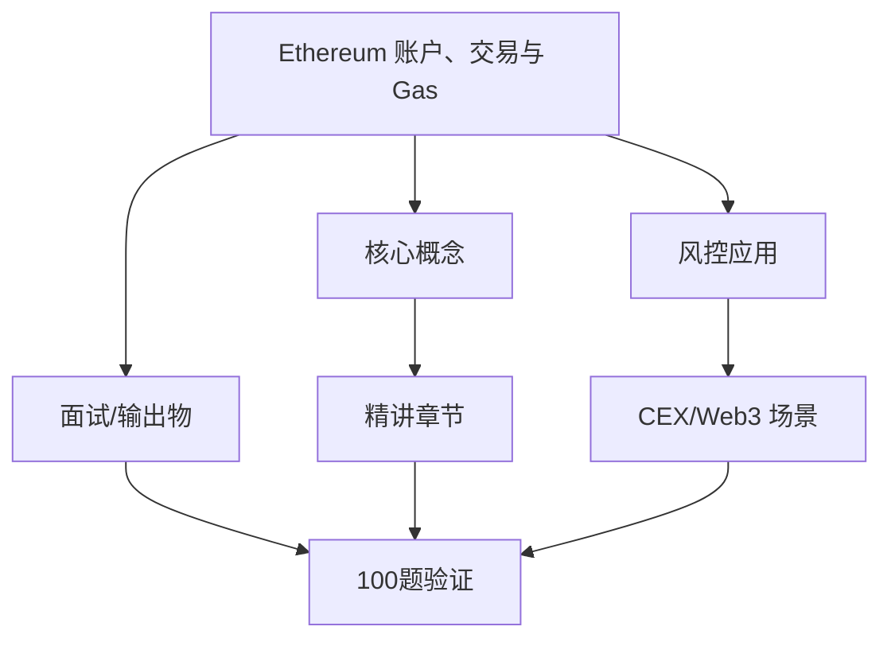
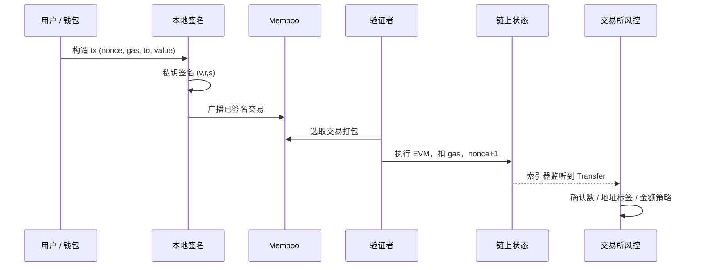
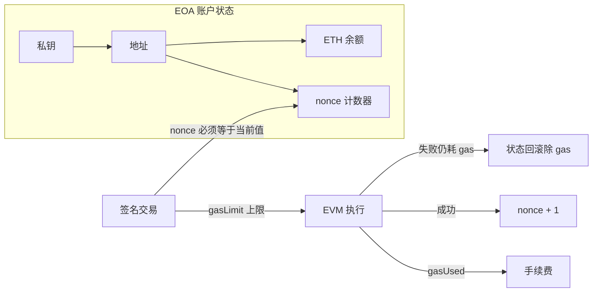

# Ethereum 账户、交易与 Gas — 系统学习讲义（含答案）

**所属轨道：** Web3 基础与交易所语境  
**学习阶段：** ① 先学本节讲义 → ② 再做工作台「学后验证题库」100 题

---

## 如何使用本讲义

1. **第一遍（学习）**：按章节通读「系统精讲」与「分 tier 参考答案」，对照架构图理解，不要跳过答案。
2. **第二遍（笔记）**：在工作台模块详情里记笔记，标记「已沉淀面试素材」。
3. **第三遍（验证）**：关闭讲义，在工作台用「学后验证题库」自测；P0 正确率建议 ≥ 80% 再进入 P1。

---

## 一、学习目标

- 用自己的话画出 EOA 发起一笔交易到链上确认的流程。
- 复盘能力要求：解释账户、nonce、gas、签名、区块确认之间的关系。
- 输出物：流程笔记、面试口述稿

---

## 二、知识体系地图

---

## 三、系统精讲（含答案）

> 以下内容整合模块参考答案，按知识结构编排，**可直接作为学习材料**。

**Track：** Web3 基础与交易所语境  
**学习任务：** 用自己的话画出 EOA 发起一笔交易到链上确认的流程。  
**复盘问题：** 解释账户、nonce、gas、签名、区块确认之间的关系。

---

## 一、完整解答

### 1.1 核心概念关系

| 概念 | 含义 | 风控关联 |
|------|------|----------|
| **账户（Account）** | EOA 由私钥控制；合约账户由代码控制 | 链上实体 ID，地址画像的基础 |
| **Nonce** | 某 EOA 已发出交易计数，必须严格递增 | 防重放；异常 nonce 跳变可能是被盗或脚本攻击 |
| **Gas** | 执行计算与存储的资源单位；`gasUsed × gasPrice` 为手续费 | 异常高 gas 竞价可能是抢跑（MEV）或紧急转出 |
| **签名** | 私钥对交易哈希签名，证明授权 | 无私钥签名不能动账；钓鱼骗取签名是主要盗币路径 |
| **区块确认** | 交易被打包进区块，后续区块叠加形成最终性 | 充值确认数不足时入账 = CEX 经典风控点 |

### 1.2 EOA 发起交易到确认的逐步流程

1. **构造交易**：`from`（EOA）、`to`、`value`、`data`（调用合约时）、`nonce`、`gasLimit`、`gasPrice` 或 EIP-1559 的 `maxFeePerGas` / `maxPriorityFeePerGas`。
2. **本地签名**：钱包用私钥对 RLP 编码后的交易哈希签名，得到 `v, r, s`。
3. **广播**：签名交易进入 mempool，由节点传播。
4. **矿工/验证者打包**：按 gas 竞价等策略选入区块。
5. **执行**：EVM 执行转账或合约调用；消耗 gas，更新状态（余额、nonce、存储）。
6. **确认**：每多 1 个后续区块，重组概率下降；CEX 通常要求 N 个确认后才入账。

### 1.3 面试口述稿（2 分钟版）

> 以太坊上有 EOA 和合约账户。用户用 EOA 发起转账时，钱包用私钥对交易签名，交易里带 nonce 防重放，带 gas 限制和费率作为执行成本。交易进入 mempool 后被验证者打包，执行后 nonce 加一、状态更新。交易所风控关心的是：充值交易是否达到足够确认数、转出地址是否有风险标签、以及是否存在异常 gas 或合约调用（如授权）。

---

## 二、架构图

### 2.1 EOA 交易生命周期

### 2.2 账户、Nonce、Gas 与状态机

---

## 三、输出物清单

- [x] 流程笔记（上文 1.2）
- [x] 面试口述稿（上文 1.3）
- [ ] 自绘手绘图（建议临摹架构图加深记忆）

## 四、迁移对照

阿里/小红书**交易风控**中的「订单状态机 + 幂等键」≈ 链上 **nonce + 交易哈希**；**实时入账前的 pending 审核** ≈ CEX 对确认数与链上风险的充值 gate。

---

## 四、分优先级参考答案速查（来自 100 题题库）

> 学习阶段可对照阅读；验证阶段请遮住答案自答。

### P0 必考核心（rank 1–20）

### 1. EOA 与合约账户的本质区别

**题目：** 从资产控制、签名主体、风控调查入口三个角度对比 EOA 与 Contract Account。

**参考答案要点：**
- 从业务场景出发，明确「谁、在什么环节、发生什么」
- 列出 2–3 个可检测风险信号或判断依据
- 给出可执行策略动作（拦截/复核/升级/放行）及人工兜底
- 如涉及 Web3，补充链上/CEX/合规语境
- 面试收尾：一个真实或合理虚构的量化结果

### 2. 私钥、公钥、地址的推导关系

**题目：** 说明三者关系，并解释为何链上风控主要追踪地址而非私钥。

**参考答案要点：**
- 从业务场景出发，明确「谁、在什么环节、发生什么」
- 列出 2–3 个可检测风险信号或判断依据
- 给出可执行策略动作（拦截/复核/升级/放行）及人工兜底
- 如涉及 Web3，补充链上/CEX/合规语境
- 面试收尾：一个真实或合理虚构的量化结果

### 3. Nonce 如何防止重放攻击

**题目：** 解释账户 nonce 递增规则，以及异常 nonce 可能意味什么风险。

**参考答案要点：**
- 从业务场景出发，明确「谁、在什么环节、发生什么」
- 列出 2–3 个可检测风险信号或判断依据
- 给出可执行策略动作（拦截/复核/升级/放行）及人工兜底
- 如涉及 Web3，补充链上/CEX/合规语境
- 面试收尾：一个真实或合理虚构的量化结果

### 4. 一笔以太坊交易的完整生命周期

**题目：** 从构造、签名、广播、mempool、打包到确认，画出时序。

**参考答案要点：**
- 从业务场景出发，明确「谁、在什么环节、发生什么」
- 列出 2–3 个可检测风险信号或判断依据
- 给出可执行策略动作（拦截/复核/升级/放行）及人工兜底
- 如涉及 Web3，补充链上/CEX/合规语境
- 面试收尾：一个真实或合理虚构的量化结果

### 5. Gas Limit 与 Gas Used 的区别

**题目：** 说明为何失败交易仍消耗 gas，以及对用户资损分析的意义。

**参考答案要点：**
- 从业务场景出发，明确「谁、在什么环节、发生什么」
- 列出 2–3 个可检测风险信号或判断依据
- 给出可执行策略动作（拦截/复核/升级/放行）及人工兜底
- 如涉及 Web3，补充链上/CEX/合规语境
- 面试收尾：一个真实或合理虚构的量化结果

### 6. EIP-1559 基础费与小费机制

**题目：** 解释 base fee、priority fee 如何影响交易确认速度与成本。

**参考答案要点：**
- 从业务场景出发，明确「谁、在什么环节、发生什么」
- 列出 2–3 个可检测风险信号或判断依据
- 给出可执行策略动作（拦截/复核/升级/放行）及人工兜底
- 如涉及 Web3，补充链上/CEX/合规语境
- 面试收尾：一个真实或合理虚构的量化结果

### 7. CEX 充值为何需要确认数

**题目：** 从链重组概率、双花风险解释不同币种/链的确认数策略。

**参考答案要点：**
- 从业务场景出发，明确「谁、在什么环节、发生什么」
- 列出 2–3 个可检测风险信号或判断依据
- 给出可执行策略动作（拦截/复核/升级/放行）及人工兜底
- 如涉及 Web3，补充链上/CEX/合规语境
- 面试收尾：一个真实或合理虚构的量化结果

### 8. 异常高 Gas 竞价的可能风险含义

**题目：** 列举抢跑、紧急转出、被勒索付款等场景及检测思路。

**参考答案要点：**
- 从业务场景出发，明确「谁、在什么环节、发生什么」
- 列出 2–3 个可检测风险信号或判断依据
- 给出可执行策略动作（拦截/复核/升级/放行）及人工兜底
- 如涉及 Web3，补充链上/CEX/合规语境
- 面试收尾：一个真实或合理虚构的量化结果

### 9. 交易哈希能证明什么、不能证明什么

**题目：** 说明 tx hash 在审计、报案、交易所申诉中的作用与局限。

**参考答案要点：**
- 从业务场景出发，明确「谁、在什么环节、发生什么」
- 列出 2–3 个可检测风险信号或判断依据
- 给出可执行策略动作（拦截/复核/升级/放行）及人工兜底
- 如涉及 Web3，补充链上/CEX/合规语境
- 面试收尾：一个真实或合理虚构的量化结果

### 10. calldata 在合约调用中的作用

**题目：** 解释 data 字段与函数选择器，为何授权类攻击常出现在 calldata。

**参考答案要点：**
- 从业务场景出发，明确「谁、在什么环节、发生什么」
- 列出 2–3 个可检测风险信号或判断依据
- 给出可执行策略动作（拦截/复核/升级/放行）及人工兜底
- 如涉及 Web3，补充链上/CEX/合规语境
- 面试收尾：一个真实或合理虚构的量化结果

### 11. pending 交易对提现风控的影响

**题目：** 说明未确认交易、内存池可见性带来的抢跑与风控窗口。

**参考答案要点：**
- 从业务场景出发，明确「谁、在什么环节、发生什么」
- 列出 2–3 个可检测风险信号或判断依据
- 给出可执行策略动作（拦截/复核/升级/放行）及人工兜底
- 如涉及 Web3，补充链上/CEX/合规语境
- 面试收尾：一个真实或合理虚构的量化结果

### 12. 链重组对入账业务的影响

**题目：** 解释 reorg 如何导致充值回滚，风控应如何处理。

**参考答案要点：**
- 从业务场景出发，明确「谁、在什么环节、发生什么」
- 列出 2–3 个可检测风险信号或判断依据
- 给出可执行策略动作（拦截/复核/升级/放行）及人工兜底
- 如涉及 Web3，补充链上/CEX/合规语境
- 面试收尾：一个真实或合理虚构的量化结果

### 13. 如何向面试官口述 EOA 转账流程

**题目：** 用 2 分钟口述，包含签名、gas、nonce、确认。

**参考答案要点：**
- 从业务场景出发，明确「谁、在什么环节、发生什么」
- 列出 2–3 个可检测风险信号或判断依据
- 给出可执行策略动作（拦截/复核/升级/放行）及人工兜底
- 如涉及 Web3，补充链上/CEX/合规语境
- 面试收尾：一个真实或合理虚构的量化结果

### 14. Legacy 与 Type-2 交易差异

**题目：** 对比传统 gasPrice 与 EIP-1559 交易结构。

**参考答案要点：**
- 从业务场景出发，明确「谁、在什么环节、发生什么」
- 列出 2–3 个可检测风险信号或判断依据
- 给出可执行策略动作（拦截/复核/升级/放行）及人工兜底
- 如涉及 Web3，补充链上/CEX/合规语境
- 面试收尾：一个真实或合理虚构的量化结果

### 15. 大额转账与历史基线偏离

**题目：** 设计如何基于地址历史行为识别异常转出。

**参考答案要点：**
- 从业务场景出发，明确「谁、在什么环节、发生什么」
- 列出 2–3 个可检测风险信号或判断依据
- 给出可执行策略动作（拦截/复核/升级/放行）及人工兜底
- 如涉及 Web3，补充链上/CEX/合规语境
- 面试收尾：一个真实或合理虚构的量化结果

### 16. 状态根与 Merkle Patricia Trie 直觉

**题目：** 不用数学推导，说明状态如何在区块头中承诺。

**参考答案要点：**
- 从业务场景出发，明确「谁、在什么环节、发生什么」
- 列出 2–3 个可检测风险信号或判断依据
- 给出可执行策略动作（拦截/复核/升级/放行）及人工兜底
- 如涉及 Web3，补充链上/CEX/合规语境
- 面试收尾：一个真实或合理虚构的量化结果

### 17. 合约执行为何比转账更耗 gas

**题目：** 解释 SSTORE、LOG、CALL 的成本直觉。

**参考答案要点：**
- 从业务场景出发，明确「谁、在什么环节、发生什么」
- 列出 2–3 个可检测风险信号或判断依据
- 给出可执行策略动作（拦截/复核/升级/放行）及人工兜底
- 如涉及 Web3，补充链上/CEX/合规语境
- 面试收尾：一个真实或合理虚构的量化结果

### 18. 内部交易与外部交易的调查差异

**题目：** 说明 trace 在资金追踪中的必要性。

**参考答案要点：**
- 从业务场景出发，明确「谁、在什么环节、发生什么」
- 列出 2–3 个可检测风险信号或判断依据
- 给出可执行策略动作（拦截/复核/升级/放行）及人工兜底
- 如涉及 Web3，补充链上/CEX/合规语境
- 面试收尾：一个真实或合理虚构的量化结果

### 19. 交易失败常见原因分类

**题目：** 列举 revert、out of gas、nonce 错误等及用户侧表现。

**参考答案要点：**
- 从业务场景出发，明确「谁、在什么环节、发生什么」
- 列出 2–3 个可检测风险信号或判断依据
- 给出可执行策略动作（拦截/复核/升级/放行）及人工兜底
- 如涉及 Web3，补充链上/CEX/合规语境
- 面试收尾：一个真实或合理虚构的量化结果

### 20. 热钱包运营方的链上监控要点

**题目：** 说明交易所热钱包余额、出金频率、异常合约交互监控。

**参考答案要点：**
- 从业务场景出发，明确「谁、在什么环节、发生什么」
- 列出 2–3 个可检测风险信号或判断依据
- 给出可执行策略动作（拦截/复核/升级/放行）及人工兜底
- 如涉及 Web3，补充链上/CEX/合规语境
- 面试收尾：一个真实或合理虚构的量化结果

### P1 岗位常用（rank 21–45）精选

### 21. 创世账户与预分配是否影响风控

**题目：** 说明早期地址标签在调查中的参考价值。

**参考答案要点：**
- 从业务场景出发，明确「谁、在什么环节、发生什么」
- 列出 2–3 个可检测风险信号或判断依据
- 给出可执行策略动作（拦截/复核/升级/放行）及人工兜底
- 如涉及 Web3，补充链上/CEX/合规语境
- 面试收尾：一个真实或合理虚构的量化结果

### 22. L2 上 gas 费与 L1 的差异

**题目：** 解释 Rollup 场景下 gas 组成及对账要点。

**参考答案要点：**
- 从业务场景出发，明确「谁、在什么环节、发生什么」
- 列出 2–3 个可检测风险信号或判断依据
- 给出可执行策略动作（拦截/复核/升级/放行）及人工兜底
- 如涉及 Web3，补充链上/CEX/合规语境
- 面试收尾：一个真实或合理虚构的量化结果

### 23. 把 nonce 机制类比到传统幂等设计

**题目：** 用你熟悉的风控/支付系统经验做类比。

**参考答案要点：**
- 从业务场景出发，明确「谁、在什么环节、发生什么」
- 列出 2–3 个可检测风险信号或判断依据
- 给出可执行策略动作（拦截/复核/升级/放行）及人工兜底
- 如涉及 Web3，补充链上/CEX/合规语境
- 面试收尾：一个真实或合理虚构的量化结果

### 24. 区块时间戳可信度与风控

**题目：** 说明矿工可操纵范围及对时间敏感策略的影响。

**参考答案要点：**
- 从业务场景出发，明确「谁、在什么环节、发生什么」
- 列出 2–3 个可检测风险信号或判断依据
- 给出可执行策略动作（拦截/复核/升级/放行）及人工兜底
- 如涉及 Web3，补充链上/CEX/合规语境
- 面试收尾：一个真实或合理虚构的量化结果

### 25. 如何设计充值延迟入账规则

**题目：** 给出基于确认数+地址风险分的组合策略框架。

**参考答案要点：**
- 从业务场景出发，明确「谁、在什么环节、发生什么」
- 列出 2–3 个可检测风险信号或判断依据
- 给出可执行策略动作（拦截/复核/升级/放行）及人工兜底
- 如涉及 Web3，补充链上/CEX/合规语境
- 面试收尾：一个真实或合理虚构的量化结果

### 26. EIP-7702 对账户抽象的潜在影响

**题目：** 简述未来账户模型变化可能对风控入口的影响。

**参考答案要点：**
- 从业务场景出发，明确「谁、在什么环节、发生什么」
- 列出 2–3 个可检测风险信号或判断依据
- 给出可执行策略动作（拦截/复核/升级/放行）及人工兜底
- 如涉及 Web3，补充链上/CEX/合规语境
- 面试收尾：一个真实或合理虚构的量化结果

### 27. MEV 与交易排序对用户的风险

**题目：** 说明 sandwich、frontrun 与风控可见性。

**参考答案要点：**
- 从业务场景出发，明确「谁、在什么环节、发生什么」
- 列出 2–3 个可检测风险信号或判断依据
- 给出可执行策略动作（拦截/复核/升级/放行）及人工兜底
- 如涉及 Web3，补充链上/CEX/合规语境
- 面试收尾：一个真实或合理虚构的量化结果

### 28. 批量交易 batch 在交易所归集场景

**题目：** 说明 batch transfer 在资金链上的识别特征。

**参考答案要点：**
- 从业务场景出发，明确「谁、在什么环节、发生什么」
- 列出 2–3 个可检测风险信号或判断依据
- 给出可执行策略动作（拦截/复核/升级/放行）及人工兜底
- 如涉及 Web3，补充链上/CEX/合规语境
- 面试收尾：一个真实或合理虚构的量化结果

### 29. JSON-RPC 常用查询在调查中的用法

**题目：** 列举 eth_getTransaction、getReceipt、getBalance 场景。

**参考答案要点：**
- 从业务场景出发，明确「谁、在什么环节、发生什么」
- 列出 2–3 个可检测风险信号或判断依据
- 给出可执行策略动作（拦截/复核/升级/放行）及人工兜底
- 如涉及 Web3，补充链上/CEX/合规语境
- 面试收尾：一个真实或合理虚构的量化结果

### 30. 事件日志 Logs 在风控中的价值

**题目：** 说明如何通过 Transfer 事件构建资金链。

**参考答案要点：**
- 从业务场景出发，明确「谁、在什么环节、发生什么」
- 列出 2–3 个可检测风险信号或判断依据
- 给出可执行策略动作（拦截/复核/升级/放行）及人工兜底
- 如涉及 Web3，补充链上/CEX/合规语境
- 面试收尾：一个真实或合理虚构的量化结果

### P2 / P3 学习说明

- P2（rank 46–75）：30 题，侧重深化理解与系统设计
- P3（rank 76–100）：25 题，侧重扩展场景与边界案例
- 完整题目列表见工作台「学后验证题库」或 `data/questions/web3-foundation/ethereum-basics.json`

---

## 五、100 题验证计划

| 优先级 | rank | 题量 | 建议 |
|--------|------|------|------|
| P0 必考核心 | rank 1–20 | 20 题 | 通读精讲后逐题理解，能口述 |
| P1 岗位常用 | rank 21–45 | 25 题 | 结合大厂项目经验举例 |
| P2 深化理解 | rank 46–75 | 30 题 | 能画架构图或流程图 |
| P3 扩展场景 | rank 76–100 | 25 题 | 了解边界案例与面试加分点 |

**建议节奏：** 每天 P0 5 题 + P1 5 题，约 2 周完成 100 题首轮；错题回到第三节精讲复查。

---

## 六、学后自测清单

- [ ] 能不看答案口述本模块 3 个核心概念
- [ ] 能画 1 张与本模块相关的架构/流程图
- [ ] 能讲 1 个迁移到 Web3 的大厂风控案例
- [ ] 工作台 P0 题自测完成（20 题）
- [ ] 工作台 P1–P3 题按需刷完

---

## 七、下一步

- 打开工作台 → 学习路径 → 本模块 → **学后验证题库（100 题）**
- 参考答案库（简版）：[`notes/answers/web3-foundation/ethereum-basics.md`](../answers/web3-foundation/ethereum-basics.md)
